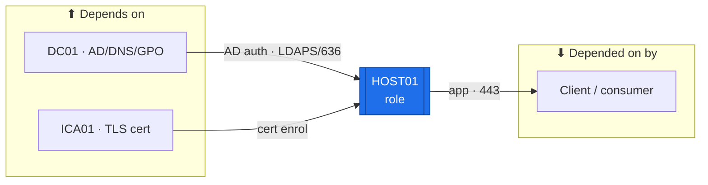

# Atlas Documentation Standard

<!-- provenance -->
> **Estate convention.** The canonical shape of a device/service documentation folder. Lab-01 (frozen) already follows most of this; Lab-02 adopts it going forward. New labs inherit it. This standard is *how we document*, not *what we build*.

## Why this exists

Two failure modes this estate keeps hitting, both named in the session history:

1. **Decisions get made but documents don't get updated** — a fact lives in three places, one gets changed, two rot. The fix is `POL-0008` (**one source of truth per fact**) made concrete: every fact has exactly one *owner document*; every other mention **links** to it rather than restating it.
2. **Every device is documented a little differently** — so a reader (or a future you) never knows which page answers which question. The fix is a **fixed folder shape**: the same document types, named the same way, answering the same questions, on every device.

This standard also encodes the operator's build workflow: **checklist first, build-guide as you build, show-commands eventually.** The document set below is ordered by *when it is authored*, not alphabetically.

## The document lifecycle — author in this order

Each document answers one question and is authored at one point in the build. Nothing is authored before it can be real ([`POL-0001`](../Policies/POL-0001-Atlas-Audit-Policy.md): the device is the source of truth; a doc claiming built state before the read-back exists is marked 🟡 until proven).

| # | Document | Answers | Authored **when** | Typical status path |
|---|---|---|---|---|
| 1 | `README.md` | "What is this device, what does it connect to, and what docs cover it?" | **At planning** (now) | ✅ living index |
| 2 | `Roadmap.md` | "In what order do this host's roles/services build, and what does each depend on / unblock?" | **At planning** (now) | 🟢 living roadmap |
| 3 | `Build-Checklist.md` | "What, in order, do I do to build it?" | **At planning** (now) | 📋 → ✅ as steps land |
| 4 | `Considerations.md` | "What decisions, risks, and open holes shape it?" | **At planning**, updated ongoing | living |
| 5 | `Build-Guide.md` | "*How* — the **phased, gated** executable path, mirroring the `Roadmap` ([`ADR-0043`](../Decisions/ADR-0043-Scalable-Phased-Dependency-Gated-Build-Guides.md))." | **During/after the build** | 📋 → 🟡 → ✅ |
| 6 | `Build-Record.md` | "What is the verified as-built state right now?" | **As-built** (after the build) | 🟡 → ✅ (device-verified) |
| 7 | `Diagnostics.md` | "Is it built/connected right? (show/verify commands)" | authored as you build; verified at read-back | 🟡 lab-unverified → ✅ |
| 8 | `Troubleshooting.md` | "It's broken — symptom → fix." | ongoing, as issues occur | living |
| 9 | `Changes/CM-####-*.md` | "What changed after it was built, and why?" | per change event | one file per change |
| 10 | `Automation/` | "How do I do this repeatably — the scripts/playbooks + how-tos ([`ADR-0048`](../Decisions/ADR-0048-Automation-and-IaC-Model.md))?" | **after the manual first pass** (automate what you've learned by hand) | 🟡 → ✅ (idempotent) |

> **The set you author at planning is #1–#4 (README, Roadmap, Build-Checklist, Considerations).** Build-Guide / Build-Record / Diagnostics get authored at the bench as each device is actually built — which is exactly why checklists-first is easier: you plan the *what* now and capture the *how* while your hands are on the device.

## Canonical per-device folder

```
Devices/<HOSTID-Role>/
├── README.md            # front-door: metadata + CONNECTIONS map + document index + role summary
├── Roadmap.md           # per-role build path (sequence) + Needs/Unblocks dependency graph
├── Build-Checklist.md   # ordered, terse, decision-free action list + acceptance gate
├── Considerations.md    # decisions affecting this device, risks, open holes, "for next build"
├── Build-Guide.md       # single guide: the phased, gated executable (mirrors Roadmap; ADR-0043) — OR ↓
├── Build-Guide/         # multi-phase: the spine + nested per-phase sub-guides (e.g. GPO/OU/Tiered builds)
├── Build-Record.md      # verified as-built state — the POL-0001 evidence home
├── Diagnostics.md       # show/verify command battery; links UP to Academy Command-Library
├── Troubleshooting.md    # symptom → cause → fix
├── Changes/             # CM-####-*.md — one file per post-build change
├── Automation/          # per-device automation scripts + how-tos (ADR-0048) — see below
└── Roles/               # ONLY for multi-service hosts — see below
```

Not every device needs every file on day one. A simple device (a switch) may fold Build-Record into Build-Guide. The **required-from-the-start** set is `README` + `Roadmap` + `Build-Checklist` + `Considerations`; the rest are added as the build progresses. (`Roadmap` may fold into `README` on a simple single-role device.) The **connections map** — what the host depends on, what depends on it, and which services it touches — lives in `README` (the front-door reference); `Roadmap` shows those same dependencies *as a build sequence* (Needs/Unblocks per step). `README.md` always lists which of these exist so nothing is orphaned.

## The `Roles/` pattern — multi-service hosts

A host that runs more than one service documents **each service as its own unit** under `Roles/<Service>/`, mirroring Lab-01's PI01 (which ran Lab-CA, Vaultwarden, Pi-hole, FreeRADIUS as four separate role folders). This is what "a build checklist **for each service**" means in practice.

```
Devices/SRV01-Network-Services/
├── README.md            # host front-door: lists the roles + host-level build (OS, IP, hardening)
├── Build-Checklist.md   # HOST build only (golden-image clone, cloud-init identity, patch, harden)
├── Considerations.md
└── Roles/
    ├── nginx-CRL/       # each role folder gets its own Build-Checklist (now),
    │   └── Build-Checklist.md   #   then Build-Guide + Diagnostics as it's built
    ├── Oxidized/
    ├── rsyslog/
    └── SFTP-TFTP/
```

The **host** folder owns everything true of the box (OS, identity, IP, hardening, backup). Each **role** folder owns everything true of that one service (packages, config, its own acceptance read-backs). A fact lives in exactly one of them — never both.

**Multi-service hosts in Lab-02** (each gets a `Roles/` breakdown): `DC-Domain-Controllers` (AD DS · DNS · DHCP · GPO/tiering), `SRV01-Network-Services` (nginx-CRL · Oxidized · rsyslog · SFTP/TFTP), `MON01-Monitoring` (Suricata-IDS · LibreNMS · Grafana), `BKP01-Backup` (PBS · Vaultwarden), `NETBOX01-Source-of-Truth` (NetBox · PostgreSQL · Redis), `RCA01-ICA01-ADCS` (RCA01 offline root · ICA01 issuing — already effectively split).

## Elements every document carries

Consistency is what makes the set navigable. Every doc includes:

- **YAML frontmatter** — `Title`, `Path`, `Status`, `Version`, `Date`. (ADRs and design docs also carry `Scope`, per [`ADR-0033`](../Decisions/ADR-0033-ADR-Scope-Field-and-Index.md).)
- **Provenance banner** — a blockquote directly under the H1 naming the era, host, and role, so a page is never mistaken for a different lab:
  > **Lab-02 · Cisco-Core (ACTIVE)** — Host: SRV01 · Role: Network Services
  (Lab-01 pages say `FROZEN <date>`; Lab-02 pages say `ACTIVE`.)
- **Document Control table** — Owner, Evidence Status (📋 planned / 🟡 lab-unverified / ✅ device-verified).
- **Change Log** — a table at the foot; every edit adds a row (`Version | Date | Change`).
- **Status markers**, used identically everywhere: **✅** device-verified · **🟡** authored but lab-unverified · **📋** planned/not-started · **🔴** blocker/risk/must-fix.
- **Source-of-truth links, not copies** — when a doc needs a fact owned elsewhere (an IP, a decision, a command), it **links** to the owner ([`IP-Addressing-Plan-VLSM`](../../Labs/Lab-02-Cisco-Core/Architecture/IP-Addressing-Plan-VLSM.md), the ADR, the Academy Command-Library) instead of restating it. This is the single most important rule for preventing drift.

## Per-device analytical elements (added v1.2; +Connections diagram v1.5; +edge labels v1.6; +Services map v1.7)

Beyond the core document set, every device carries a few small, high-leverage elements — they are what a successor uses to *understand and trust* a device without touching it. Each is a **slice** that links up to an estate-level owner (`POL-0008`); it never restates the owner.

- **📸 Capture markers (Build-Guide) — a first-class element.** At every **decision point, confirmation screen, and acceptance/read-back**, the Build-Guide carries an explicit **📸** naming *what to capture* — the screen and the value that proves the step (GUI-primary house rule). The screenshot is **rebuild evidence**; store it alongside the guide (or an `images/` subfolder) and reference it inline. **Never capture a live secret** ([`POL-0002`](../Policies/POL-0002-Secrets-and-Credentials.md)). *(The Workflow's "📸 at each decision point" is now required, not a nicety.)*
- **Certification alignment (in `Roadmap.md`).** A table mapping each role/stage → the **exam objective** it exercises → the **cert**, plus a **learning-focus** note for the operator's weak areas (e.g., GPO depth, firewall-log reading). It is the device's **slice** of the estate device×cert matrix (owner in [`Atlas-Academy/`](../../Atlas-Academy/)), which it links to. Exemplars: the DC / PKI / SRV01 Roadmaps.
- **Traffic-flow diagram (staged).** A visual of the host's **allowed vs blocked** flows, drawn in **stages** — baseline-blocked → each *tested unit* applied (an east-west rule, a GPO, an ACL) → the resulting allow/deny — so it mirrors the incremental discipline ([`ADR-0041`](../Decisions/ADR-0041-Incremental-Test-Gated-Implementation.md)) and *teaches* the access cell by cell. It **visualizes** the [`Architecture/Atlas-East-West-Allowed-Flows-Matrix`](../../Labs/Lab-02-Cisco-Core/Architecture/Atlas-East-West-Allowed-Flows-Matrix.md) (the fact owner); it never invents a flow. The **estate-wide** diagram is an `Architecture/`-owned artifact the device diagram links to. Same pattern extends to Intune (unmanaged → enrolled → compliant → conditional-access allow/deny).
- **Validation link.** A pointer from the device to **its rows** in [`Operations/Validation-and-Adversarial-Testing.md`](../../Labs/Lab-02-Cisco-Core/Operations/Validation-and-Adversarial-Testing.md) (control → attack → evidence) and to its `Diagnostics.md` — so the question of how to prove it works, and that the wrong thing is blocked, is one click away. Verification is owned centrally ([`POL-0006`](../Policies/POL-0006-Evidence-and-Verification.md) + the Validation matrix); the device links to it.
- **Connections diagram (Mermaid) — in the `README.md` (v1.5).** A small **`mermaid` fenced code block** directly under the README's prose Connections map, rendering the same **Depends-on → [this host] → Depended-on-by** picture as a graph (GitHub renders it inline). It is the *visual* of the connections map, not a new fact source — it must match the prose (`POL-0008`). Keep it to the **load-bearing** connections (not every port), consistent across devices via the canonical template below. It complements the **staged traffic-flow** element (which is about *allowed/blocked flows over time*); this one is about *what depends on what*. **(v1.6) Each edge carries its service/protocol+port** (`LDAPS/636`, `RDP/3389`, …); nodes keep role labels, no IPs (`POL-0008`).

- **Services map (README) — a first-class element (v1.7, operator ask).** A compact **table** in the README (under the Connections map / diagram) making explicit **what services run on the box and how each is used**: **Service · Purpose · Consumed by · port · Depends on · Status**. It complements the Connections map (device→device) with a **service→consumer** view, and aligns with `Roles/` on multi-service hosts (≈ one row per role) — on a single-service device it is still a 1–3 row table. It answers *"how are this device's services actually used?"* (`POL-0001`: Status = built/verified, not merely installed). Debuted on KALI01/SIEM01 (2026-07-30); **backfill into existing device READMEs is a high-priority Backlog item.**

### Canonical Connections-diagram template (copy, then adapt)

`flowchart LR`, two grouping subgraphs (upstream / downstream), the host highlighted with the `me` class + a `[[double-box]]`. Keep node labels short (`HOST · what it gives/needs`); link up to the owners in the prose, not in the graph. Copy this and swap the nodes:

````markdown

````

Rules: **`flowchart LR`**; the host node uses `:::me` + the `classDef me fill:#1f6feb,stroke:#0b3d91,color:#fff;` line (one consistent highlight estate-wide); group upstream in `up[⬆ Depends on]` and downstream in `down[⬇ Depended on by]`; **≤ ~8 nodes** (fold "MKT01 · SW01 · 1941" into one node where they act as a set); no secrets, no IPs the IP-plan owns (a role label is enough). **Label each edge with the service/protocol+port it carries** (v1.6 — e.g. `LDAPS/636`, `RDP/3389`, `RADIUS/1812`, `HTTPS/443`); keep edge labels short — the *how connected* story lives on the picture. The **networking variant** points edges the way traffic/among-devices flows; hypervisors (Backlog #21) show the VMs they host as downstream.

Not every device needs all four on day one (a switch may skip the cert slice); they are added per wave as the device is built, and `README.md` lists which exist.

## The Build-Guide — a phased, gated, scalable executable (v1.3)

Per `ADR-0043`, a device's Build-Guide is **the complete executable path for that device**, not just its initial stand-up. It is what makes building mechanical: read the estate order, open the guide, execute **gate-by-gate**.

- **Phases mirror the device's `Roadmap.md` 1:1** — same phases, same order. The Roadmap owns the sequence + dependency graph; the Build-Guide is the *how* for each phase. Never a second sequence (`POL-0008`).
- **Every phase opens with a 🔴 GATE** — *do not start until: [dependencies healthy] + [these machines exist] + [prior phase ✅]*. This fences off phases that aren't ready (especially cloud/hybrid) and makes `ADR-0041`'s test-gate explicit at phase granularity.
- **Standard recurring sections**, wherever the device needs them:
  - **Certificate application (from ICA01 / AD CS)** — request → enroll → install → verify the device's cert(s) (LDAPS / RADIUS / TLS / computer-auth).
  - **Service setup** — per service (the `Roles/` pattern on multi-service hosts).
  - **Automation onboarding** — the Oxidized / Ansible / config-management hook for this phase; it **links down to the device's `Automation/` folder** (`ADR-0048`), which holds the actual scripts + how-tos.
- **Future/cloud phases are gated stubs** — the gate + a step outline + the cert/service hooks *now*; the full click-by-click steps when the phase is reached (the tenant/hardware exists). You see the whole path; you can't jump ahead; nothing speculative rots.
- **Append-only scaling** — a new capability (Ansible, a WLC from an autonomous AP, a new service) is a **new gated phase**, not a rewrite.
- **Nesting** — a single guide stays a top-level `Build-Guide.md`; a device whose guide is a **spine + multiple detailed phase sub-guides** (the DC's OU / GPO / Tiered-Admin builds) puts them in a **`Build-Guide/` subfolder** (the spine indexes the phases; each sub-guide is one phase's *how*). Mirrors the `Roles/` rule — flat when one, subfolder when many.

## The `Automation/` doc-type — per-device scripts + how-tos (v1.4, `ADR-0048`)

Every device carries an **`Automation/`** folder: its **slice** of the estate's automation — the how-to pages + the device-specific scripts/playbooks + which shared estate modules it consumes. This is the "a page or two of automation per device" the operator asked for, and it makes rebuild mechanical.

```
Devices/<HOSTID-Role>/Automation/
├── README.md            # index: what's automated here, what's still hand-typed, links to estate modules
├── <task>-howto.md      # per task: purpose → what it automates → how to run → expected result → what it does NOT automate
└── <script/playbook>    # the device-specific artifact (bash / cloud-init / Ansible playbook / Bicep / DSC)
```

Load-bearing rules (`ADR-0048`):

- **Two layers, two homes (`POL-0008`).** The device `Automation/` holds the **slice + how-to**; the **runnable shared code** — the self-hosted Git server, CI runner, shared Ansible roles / Terraform modules / DSC configs, Oxidized — is the **estate capability**, owned centrally (`Operations/Automation/` + the self-hosted git repo; Backlog #19 / **Phase 10**). The device folder **links** to shared modules, never copies them.
- **The Learning Rule holds (Charter 16/17).** **Plumbing/provisioning is automated + in-repo** (golden images, cloud-init, onboarding, Oxidized backup, teardown/rebuild, IaC). **Learning-target config is hand-typed the first time** (the cert skill) and **then** captured here — *automate what you've already learned to do by hand.* The **Build-Guide still teaches the manual first pass**; `Automation/` is the repeatable follow-on. So `Automation/` is authored **after** the manual build, and each how-to states **what it deliberately does NOT automate**.
- **Test-gated on idempotency (`ADR-0041`).** An artifact is ✅ only when it builds the intended thing **and** a re-run is a no-op (no drift). 🟡 until proven on a real device (`POL-0001`).
- **Phased, cert-matched tooling ([`ADR-0044`](../Decisions/ADR-0044-Enterprise-Model-Standard-Certs-Anchor-Skills.md)/`ADR-0048`).** Oxidized (config-backup, first) → cloud-init/bash → Ansible → Terraform/Bicep/ARM → PowerShell DSC → self-hosted git/CI, each introduced as its cert/phase lands. An early device may carry only the Oxidized hook as a **gated stub** (`ADR-0043`) — designed, not empty.
- **Config commands still feed the Academy Command-Library** (`POL-0008`); how-tos link up rather than restating commands.

## Where each *kind* of fact is owned (so nothing is documented twice)

| Fact | Single owner | Devices link to it, don't restate |
|---|---|---|
| Addresses / VLANs / scopes | `Architecture/IP-Addressing-Plan-VLSM` (+ NetBox as it comes online) | ✅ |
| A decision + its rationale | the relevant **ADR** (`Decisions/`, indexed in [`ADR-Index.md`](../Decisions/ADR-Index.md)) | ✅ |
| Allowed east-west flows | `Architecture/Atlas-East-West-Allowed-Flows-Matrix` | ✅ |
| CIS hardening baselines | `Architecture/CIS-Hardening-<device>.md` (current central home) | ✅ |
| Reusable verify commands | [`Atlas-Academy/Command-Library/<platform>.md`](../../Atlas-Academy/Command-Library/README.md) | Diagnostics links up |
| "Why it works" concepts | [`Atlas-Academy/Concepts/`](../../Atlas-Academy/Concepts/README.md) | Diagnostics/Troubleshooting link up |
| Where we are right now | [`Labs/Lab-02-Cisco-Core/SESSION-HANDOFF.md`](../../Labs/Lab-02-Cisco-Core/SESSION-HANDOFF.md) | ✅ |
| Adversarial / negative tests + control validation | `Operations/Validation-and-Adversarial-Testing.md` | device links to its rows |
| Estate build order + cross-device dependencies | [`Operations/Build-Order-and-Dependencies.md`](../../Labs/Lab-02-Cisco-Core/Operations/Build-Order-and-Dependencies.md) (Lab-01 model; register E2, to build) | device `Roadmap` links |
| Backup / restore / DR procedure | [`Operations/Device-Backup-Runbook.md`](../../Labs/Lab-02-Cisco-Core/Operations/Device-Backup-Runbook.md) | device links |
| Verification requirement (the read-back rule) | `POL-0006` + per-device `Diagnostics.md` | device links up |
| Which device exercises which cert objective | the estate device×cert matrix (`Atlas-Academy/`) | device `Roadmap` carries its slice |
| Estate traffic-flow picture | `Architecture/` (visualizes the flows matrix) | device carries its staged slice |
| Shared automation code + CI (runnable) | `Operations/Automation/` + the self-hosted git repo (`ADR-0048`; Backlog #19 / Phase 10) | device `Automation/` links up |
| Per-device automation scripts + how-tos | the device's `Automation/` folder (`ADR-0048`) | Build-Guide's Automation-onboarding links down |

> **Estate-level operational artifacts live in `Operations/`** — validation/pentest, evidence run-sheets, backup/DR runbooks, device-confirmation commands, and the build-order/dependency map. They are **cross-device**, so they get an estate home in `Operations/` (not a single device folder); each device holds the **per-device slice** that links up. This is the fact-ownership rule applied to *operations* — one estate home, per-device links — and it is what makes `Operations/` the estate's operations index rather than a scratch folder.

> CIS-Hardening currently lives centrally in `Architecture/` (not per-device as in Lab-01). This standard keeps it central for now to avoid a bulk move; a per-device `CIS-Hardening.md` is an *optional* future reconciliation, not required.

## Naming conventions

- **Device folder:** `HOSTID-Role` — e.g. `SRV01-Network-Services`, `1941-Core-Router`. Uppercase host ID, hyphenated role.
- **Role folder:** the service's common name — `nginx-CRL`, `Oxidized`, `Pi-hole-DNS`.
- **Documents:** the fixed names above, verbatim (so a reader always knows where to look).
- **Change entries:** `CM-####-Short-Kebab-Title.md`, `####` continuing the estate's existing CM sequence.

## How this rolls out (small-waves, not a bulk rename)

This standard is applied **one device (or service group) at a time**, as each checklist wave runs — never as a mass restructure (the estate's own rule: bulk changes leave docs behind). Existing Lab-02 devices already have `Build-Checklist` / `Build-Guide` / `Diagnostics` / `Troubleshooting`; those conform as-is. Each wave adds the missing pieces (`README`, `Considerations`, `Roles/`, `Build-Record`) for the device it touches. Lab-01 is **frozen** and is not restructured to match — it's already close, and the freeze is deliberate.

## Related

- [`POL-0014`](../Policies/POL-0014-Documentation-and-Knowledge-Management.md) (the governing policy — its R3 makes this Standard binding) · [`POL-0008`](../Policies/POL-0008-Naming-and-Addressing.md) (one source of truth) · [`POL-0001`](../Policies/POL-0001-Atlas-Audit-Policy.md) (device is the source of truth) · [`ADR-0037`](../Decisions/ADR-0037-Atlas-Documentation-Standard.md) (adopts this Standard) · [`ADR-0032`](../Decisions/ADR-0032-Diagnostics-and-Verification-Doc-Architecture.md) (Diagnostics/Troubleshooting split + Command-Library) · [`ADR-0033`](../Decisions/ADR-0033-ADR-Scope-Field-and-Index.md) (ADR Scope field) · [`Atlas-Documentation-Workflow.md`](./Atlas-Documentation-Workflow.md) (the *how & when* companion) · [`Atlas-Academy/Atlas-Teaching-Patterns-and-House-Style.md`](../../Atlas-Academy/Atlas-Teaching-Patterns-and-House-Style.md) (writing *voice*; this doc is *structure*).
- **Templates for the doc-types above:** [`Build-Guide-Template`](../Templates/Build-Guide-Template.md) · [`Build-Record-Template`](../Templates/Build-Record-Template.md) · [`Device-Considerations-and-Risks-Template`](../Templates/Device-Considerations-and-Risks-Template.md) · [`Device-Verification-Procedure-Template`](../Templates/Device-Verification-Procedure-Template.md) · [`Diagnostics-Show-Commands-Template`](../Templates/Diagnostics-Show-Commands-Template.md) · [`Troubleshooting-Guide-Template`](../Templates/Troubleshooting-Guide-Template.md) · [`ADR-Template`](../Templates/ADR-Template.md).
- Exemplars to copy: [`Labs/Lab-01-Mikrotik-Core/Devices/PI01-Services/`](../../Labs/Lab-01-Mikrotik-Core/Devices/PI01-Services/) (the `Roles/` pattern) and [`.../MKT01-Core-Router/`](../../Labs/Lab-01-Mikrotik-Core/Devices/MKT01-Core-Router/) (single-device set).

## Change Log

| Version | Date | Change |
|---|---|---|
| 1.8 | 2026-08-04 | **Wired the bare governance references into links (#43 Pass A)** — `ADR-0037/0043/0033/0032/0048/0041/0044`, `POL-0008/0001/0002/0006`, `ADR-Index`, the fact-ownership-table owners (IP-plan · flows matrix · Validation · Build-Order · Backup-Runbook · Command-Library · Concepts · SESSION-HANDOFF), and the exemplar folders; rebuilt the Related section (+`POL-0014` + the Workflow companion + a Templates line). `Operations/Automation/` left bare (not built). No content change. |
| 1.7 | 2026-07-30 | **Added the per-device Services map element** (operator ask — "each page should have a services map"). A README table (Service · Purpose · Consumed by+port · Depends on · Status) making *how each service is used* explicit — complements the Connections map with a service→consumer view; aligns with `Roles/`. Debuted on KALI01 + SIEM01; backfill into existing READMEs is a high-priority Backlog item. Amends `ADR-0037`. |
| 1.6 | 2026-07-30 | **Connections-diagram edges now labelled with protocol/port** (`ADR-0049`; operator — the *how connected* story belongs on the picture). Canonical template + element description + rules updated (e.g. `u1 -->|LDAPS/636| host`); nodes keep role labels, no IPs. Existing device diagrams gain edge labels as each is next touched / in the #22 audit. |
| 1.5 | 2026-07-30 | **Added the per-device Connections diagram (Mermaid)** as a README element (operator ask) — a `mermaid` fenced block under the prose Connections map rendering **Depends-on → [host] → Depended-on-by**, with a **canonical copy-paste template** (flowchart LR · `up`/`down` subgraphs · the host `:::me`-highlighted · ≤~8 load-bearing nodes · role labels not IPs) for estate-wide consistency. It's the *visual* of the connections map (must match the prose, `POL-0008`), distinct from the staged traffic-flow element. Applied going forward + **backfilled into the existing device READMEs** (DC · MON01 · NPS01 · PAW01 · FS01 · WSUS01 · SQL01 · RCA01/ICA01). |
| 1.4 | 2026-07-29 | **Added the per-device `Automation/` doc-type** (`ADR-0048`) — a folder of automation scripts + how-tos (the device's *slice*), authored **after the manual first pass** (automate what you've learned by hand; Learning Rule Charter 16/17). Folder tree + lifecycle row (#10) + fact-ownership rows added; the Build-Guide **Automation-onboarding** section now links **down** to it. Two-layer split: device `Automation/` = slice + how-to; **runnable shared code + CI = estate capability** (`Operations/Automation/` + self-hosted git, Backlog #19 / Phase 10). Phased, cert-matched tooling; test-gated on idempotency (`ADR-0041`). |
| 1.3 | 2026-07-29 | **Added the phased, gated Build-Guide doc-type** (`ADR-0043`) — the Build-Guide is now the device's complete executable path: phases mirror the `Roadmap` 1:1, each opens with a 🔴 GATE (deps + machines + prior-phase), standard **Certificate-application / Service-setup / Automation-onboarding** sections, future/cloud phases as **gated stubs**, append-only scaling, and **`Build-Guide/` nesting** for spine + phase sub-guides (mirrors `Roles/`). Folder tree + lifecycle row updated. |
| 1.2 | 2026-07-29 | **Added the four per-device analytical elements** — 📸 **capture markers** (Build-Guide, first-class), **Certification alignment** table (`Roadmap`, links to the estate cert matrix), **staged Traffic-flow diagram** (visualizes the flows matrix; drawn stage-by-stage per `ADR-0041`), and a **Validation link** (to `Operations/Validation-and-Adversarial-Testing` + `Diagnostics`). Extended the **fact-ownership map** to name `Operations/` as the home for estate-level operational artifacts, with device folders holding linking slices. ADR-0037 amended → v1.2. |
| 1.1 | 2026-07-29 | **Added the `Roadmap.md` doc-type + the connections-map requirement** (from the DC-Domain-Controllers exemplar). Roadmap = the per-role build path (Needs/Unblocks) at planning; README now explicitly owns the connections map (depends-on / depended-on-by / services-touched). Lifecycle table + folder tree + required-from-start set updated. ADR-0037 amendment pending (register/handoff). |
| 1.0 | 2026-07-28 | **Adopted** (operator; `ADR-0037`). No content change from 0.1 — promoted from draft after review. |
| 0.1 | 2026-07-28 | Created — DRAFT for operator review. Codifies the per-device/per-service folder shape (adapting Lab-01), the author-in-this-order document lifecycle, the `Roles/` pattern for multi-service hosts, the standard per-doc elements, the fact-ownership map, naming, and the small-waves rollout. Pending: formalize as `ADR-0037` + wire into `ADR-Index`/register/handoff once approved. |
