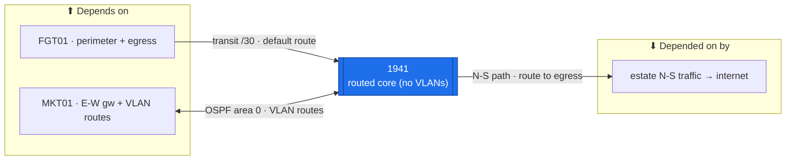

# 1941 — Core Router (routed N-S backbone)  ·  folder front-door

> **How to read this folder.** Front door for the estate's **core router**: what it is, what it connects to, and which document answers which question. This is the **networking variant** of the page-set — it foregrounds interfaces / OSPF / routing / hardening + `show`-command verification, not the server template. Live status: **`Roadmap.md`** (the config path) + **`Build-Checklist.md`** (line-item design/why) + the `show`-read-backs in **`Diagnostics.md`** (`POL-0001`).

| Item | Value |
|---|---|
| Lab / Era | Lab-02 · Cisco-Core — ACTIVE (Phase-2 core ✅ device-verified) |
| Host · Role | **1941** (Cisco 1941 ISR G2, IOS 15.5(3)M4 universalk9) · **the routed north-south backbone** between MKT01 and FGT01 (`ADR-0023`) — routes; **holds no VLANs**; does **not** filter east-west |
| Placement / reach | Physical rack device · reached over **loopback `10.255.0.1`** or the transit /30s (`10.255.255.2` FGT side · `10.255.255.5` MKT side). Two routed /30s + Lo0; **no SVI, no VLANs** |
| Silo | 🔵 Network (routing core) |
| Status | **Phase 2 base + hardening + routing ✅ device-verified** (07-21/07-22) · Pass-2 AD-RADIUS ⬜ gated · mgmt telemetry (NTP/SNMPv3/syslog/NetFlow) 📋 Phase 4/6. See **`Roadmap.md`** |
| Governs / related | [`ADR-0023`](../../../../00-Atlas-Foundation/Decisions/ADR-0023-1941-Core-MKT01-East-West-Firewall-Topology.md) (routed core, no VLANs) · [`ADR-0029`](../../../../00-Atlas-Foundation/Decisions/ADR-0029-Drop-FreeRADIUS-Windows-NPS.md) (admin auth → RADIUS/NPS01) · [`ADR-0020`](../../../../00-Atlas-Foundation/Decisions/ADR-0020-NTP-Time-Source-Architecture.md) (NTP) · [`ADR-0005`](../../../../00-Atlas-Foundation/Decisions/ADR-0005-FGT01-Firewall-Policy-Scope-Deferred.md) (FGT egress) · [`CIS-Hardening-1941`](../../Architecture/CIS-Hardening-1941.md) |

## Role this era

The 1941 is the estate's **routed core** (`ADR-0023`): it carries **north-south** traffic between the **MKT01** east-west firewall (the inter-VLAN gateway) and the **FGT01** perimeter, and it **routes only** — it holds **no VLANs / SVIs** and does **no east-west filtering** (that is MKT01's job). Two routed **/30** transit links + a **loopback** (OSPF router-id); **OSPF area 0** peers with MKT01 (which owns + advertises the VLAN SVIs), and a **static default** toward FGT01 is redistributed (`default-information originate`) so MKT01 learns the way out. Cisco-CLI managed, SSHv2-only, CIS-hardened.

> 🔴 **The one rule that keeps this box correct (`ADR-0023`):** the 1941 **learns** the VLAN routes from MKT01 — it never originates them. No VLAN `network` statement, no subinterface, no `switchport`. Adding a VLAN SVI "to help" steals the inter-VLAN gateway role from MKT01 and breaks the segmentation design.

## Connections — what this host touches (the map)

**Depends on (upstream — must be healthy first):**
- **FGT01** — the transit /30 (`10.255.255.0/30`; FGT `.1`, 1941 `.2`) + the **egress default route** (`ADR-0005`). 1941 → internet rides FGT01.
- **MKT01** — the transit /30 (`10.255.255.4/30`; 1941 `.5`, MKT `.6`) + the **OSPF adjacency** that delivers every VLAN route.
- **Power + console + cabling** (`../../Architecture/Cabling-and-Port-Map.md`). Later: an **NTP source** (`ADR-0020`) + **NPS01** (RADIUS admin auth, Pass-2).

**Depended on by (downstream — these break if the 1941 is down):**
- **All inter-VLAN → internet traffic** — the N-S path is host → MKT01 → **1941** → FGT01 → out. No 1941, no internet for the estate.
- **MKT01** — learns the **default route** from the 1941 via OSPF (`default-information originate`); without it internal traffic blackholes toward the internet.

**Services this host provides:** IP routing (two /30s + Lo0) · OSPF area 0 (peer MKT01) · static default → FGT01 redistributed into OSPF · SSHv2 management plane.

## Connections diagram

> Edges are the routing relationships: the 1941 peers OSPF with MKT01 (bidirectional) and takes a static default toward FGT01; VLAN SVIs live on MKT01, not here.

## Services map — what runs here and how it's used

> 🆕 **Services map (Standard v1.7), networking variant.** A router's "services" are its **routing/control-plane functions**, so the "Consumed by" cell names the **peer + interface** (not a TCP port). Status mirrors `Build-Record.md` (`POL-0001`).

| Service | Purpose | Consumed by · port/interface | Depends on | Status |
|---|---|---|---|---|
| **IP routing** (2× /30 + Lo0) | The routed N-S backbone between MKT01 and FGT01 | estate N-S traffic · `Gi0/0`, `Gi0/1`, `Lo0` | interfaces up | ✅ core (07-21/22); iface up/up 🟡 read-back |
| **OSPF area 0** | Learns every VLAN route from MKT01 (never originates them) | MKT01 · `Gi0/0` transit /30 (adjacency FULL) | MKT01 up | ✅ FULL with MKT01 (07-21) |
| **Static default → FGT01** (redistributed) | The egress path; `default-information originate` so MKT01 learns the way out | MKT01 (via OSPF) · `Gi0/1` → FGT01 `10.255.255.1` | FGT01 up | 🟡 read-back pending |
| **SSHv2 management** | Admin plane (vty `MGMT-SSH` access-class) | admins / PAW · `Lo0` `10.255.0.1`:22 | mgmt reachability | ✅ (07-22) |
| **NTP client** | Time sync (converging) | NTP source · UDP 123 | `ADR-0020` source | ✅ converging (07-22) |
| **RADIUS admin auth** (Pass-2) | AD-backed admin login | NPS01 · UDP 1812 | NPS01 + AD CS | ⬜ gated (`ADR-0029`) |
| **SNMPv3 / syslog / NetFlow → MON01** | Management telemetry + the Phase-7 flow evidence | MON01 · 161 / 514 / NetFlow | MON01 (Phase 4/6) | 📋 Phase 4/6 |

## Documents in this folder (what answers what)

**Config path & status**
- **`Roadmap.md`** — the **config path** (base+hardening → interfaces → OSPF+default → mgmt telemetry) as build stages, with Needs/Unblocks + cert alignment. *Start here.*
- **`Build-Checklist.md`** *(existing)* — the line-item design/why + failure modes.

**Build (the how — existing, referenced)**
- **`Build-Guide.md`** *(existing, v1.2)* — the executable, staged CLI procedure (device-verified on the physical 1941) + the consolidated paste-in.

**Verify & fix**
- **`Diagnostics.md`** *(existing)* — the `show`-command battery (SSH/OSPF/routes/NTP), ✅ where read back.
- **`Troubleshooting.md`** *(existing)* — OSPF-adjacency / asymmetric-route / default-blackhole symptoms → fixes.
- **`Build-Record.md`** — the verified as-built state (records outrank guides, `POL-0001`).
- **`Considerations.md`** — open risks & decisions (Pass-2 gate, OSPF/RouterOS MTU interop, symmetric routing, ZBF/CCNP, legacy-crypto client).
- **`Automation/`** — the `ADR-0048` slice: Oxidized config-backup + Ansible network automation (config-as-record; **not** DSC).
- **`Changes/`** — the `CM-####` ledger.

**Hardening:** central — `../../Architecture/CIS-Hardening-1941.md` (Pass-1 ✅) + `../../Operations/Device-Hardening-Standard.md`.

## Single source
- Estate index: [`Service-Server-Build-Plan`](../../Service-Server-Build-Plan.md). Addressing (transit /30s + loopback): [`IP-Addressing-Plan-VLSM`](../../Architecture/IP-Addressing-Plan-VLSM.md). Cabling: [`Cabling-and-Port-Map`](../../Architecture/Cabling-and-Port-Map.md). Build order: [`Build-Order-and-Dependencies`](../../Operations/Build-Order-and-Dependencies.md) (Phase 2/2.5). Decisions: [`ADR-Index`](../../../../00-Atlas-Foundation/Decisions/ADR-Index.md).

## Learn it — the Academy (the why + the read-backs)

- 🎓 **Concept (why it works):** [Out-of-Band-Recovery](../../../../Atlas-Academy/Concepts/Out-of-Band-Recovery.md) — build and prove a recovery path *before* hardening removes the way in (the 1941 console break-glass is one of its worked examples). *(Gap: the core OSPF learn-vs-originate lesson has no dedicated Concept yet — see the [`Concepts/` index](../../../../Atlas-Academy/Concepts/README.md).)*
- 🔧 **Playbooks:** [Recover-a-Locked-Out-Router-Out-of-Band](../../../../Atlas-Academy/Playbooks/Recover-a-Locked-Out-Router-Out-of-Band.md) · [Confirm-a-Config-Change-Actually-Took](../../../../Atlas-Academy/Playbooks/Confirm-a-Config-Change-Actually-Took.md).
- 🏅 **Cert objective:** CCNA (OSPF · IPv4 addressing · secure device access) · CCNP ENARSI/ENCOR (OSPF depth · ZBF) — [Certification-Lab-Map](../../../../Atlas-Academy/Certification/Atlas-Certification-Lab-Map.md) · [CCNP-Lab-Map](../../../../Atlas-Academy/Certification/Atlas-CCNP-Lab-Map.md).
- 📚 **Reference:** reusable commands → [`Command-Library/Cisco-IOS`](../../../../Atlas-Academy/Command-Library/Cisco-IOS.md) · estate twin → [`Directory/Network-and-Addressing`](../../../../Atlas-Academy/Directory/Network-and-Addressing.md).
