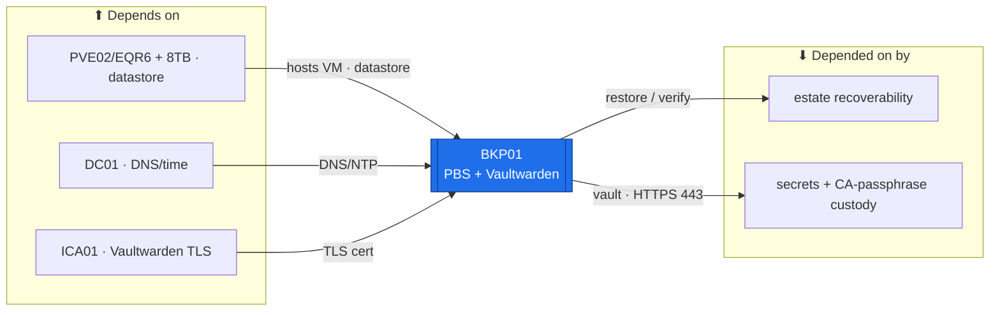

# BKP01 — Backup & Secrets (PBS + Vaultwarden)  ·  folder front-door

> **How to read this folder.** Front door: *what this host is*, *what it connects to*, *which doc answers which question*. Live status: **`Roadmap.md`** (build path) + **`Build-Checklist.md`** (host, line-item) + **`Roles/<svc>/`** (per-service). Nothing here duplicates them.

| Item | Value |
|---|---|
| Lab / Era | Lab-02 · Cisco-Core — ACTIVE (📋 not built) |
| Host · Role | **BKP01** (Linux appliance) · **Proxmox Backup Server** (dedup/verify/prune backup target; **"PBS01 = BKP01"** — same host) **+ Vaultwarden** (standalone secrets vault, co-located) |
| Placement | **PVE02/EQR6 — the always-on critical/recovery tier** (`ADR-0036` v1.2). PBS **datastore on the 8 TB external** (shared with FS01's shares). VLAN 20 (Servers), gw `10.20.0.1`. Host `10.20.0.18` · Vaultwarden web `10.20.0.13` — 📋 *proposed; the IP plan owns* |
| Silo | 🟢 Systems (backup) / 🔴 Security (the vault) |
| Status | 📋 **not built** — **Phase 9 (Resilience)**, 🔴 the top live risk. See **`Roadmap.md`** |
| Governs / related | `ADR-0036` v1.2 (placement) · `ADR-0009` (CA/secret custody · **off-site mandatory**) · `ADR-0031` (retire OpenSSL CA → **Vaultwarden standalone**) · `ADR-0011` (restore Game Day) · `ADR-0013` (off-site) · `POL-0005` (3-2-1 / restore-real) · `POL-0002` (secrets offline) |

## Role this era

Two genuinely-separate services on one Linux box. **Proxmox Backup Server** is the estate's backup target — a deduplicating datastore on the **8 TB external**, with **verify** jobs, **prune/retention**, and an **encrypted off-site copy** (restic/borg). **Vaultwarden** is the estate's **secrets vault** — the standalone console every credential and the **CA-passphrase custody** rides on (`ADR-0009`, `ADR-0031`, `POL-0002`). It is **not** a hypervisor, **not** a DC, and **not** a Windows server — no SMB/AGDLP/OU/GPO here.

> 🔴 **A backup isn't real until a restore succeeds (`POL-0005`/`ADR-0011`).** The **restore Game Day has NEVER been run** in Atlas — the single most load-bearing open item here.
> 🔴 **Backup independence is MANDATORY (`ADR-0009`/`ADR-0013`).** An **encrypted off-site copy** with its **key kept offline** (`POL-0002`) is hard-required — a datastore on the same tier as what it protects is not backup.

## Connections — what this host touches (the map)

**Depends on (upstream):**
- **PVE02/EQR6 + the 8 TB external** — hosts the VM + holds the PBS datastore (`ADR-0036` v1.2). → SW01 → MKT01 (VLAN-20 gw `10.20.0.1`).
- **DC01** — DNS + time.
- **ICA01** — the **Vaultwarden TLS cert**.
- **An off-site target** — external drive / cloud (restic/borg), encrypted, key offline.
- Addressing: `../../Architecture/IP-Addressing-Plan-VLSM.md` (`POL-0008`).

**Depended on by (downstream):**
- **The whole estate's recoverability** — AD system-state (**KDS root key**, SYSVOL), the golden templates, device configs; the PVE hosts push their VM backups here.
- **Every credential + CA-passphrase custody** — via **Vaultwarden** (`ADR-0009`, `POL-0002`). Vaultwarden must stand up **before any CA-passphrase handling**.

**Services provided:** PBS backup datastore (dedup · verify · prune/retention) · encrypted off-site copy · Vaultwarden secrets vault.

## Connections diagram

> 🔴 Off-site is a fourth upstream (restic/borg to external/cloud) — mandatory (`ADR-0009`), omitted from the ≤8-node map; see `Roadmap.md`.

## Services map — what runs here and how it's used

> 🆕 **Services map (Standard v1.7).** Two genuinely-separate services (the `Roles/` split). Status mirrors `Build-Record.md` (`POL-0001`) — 📋 not built, so every row is ⬜.

| Service | Purpose | Consumed by · port | Depends on | Status |
|---|---|---|---|---|
| **PBS backup datastore** | Deduplicating backup target (verify · prune/retention) on the 8 TB | PVE hosts push VM backups · PBS/8007 | the 8 TB external | ⬜ not built |
| **Encrypted off-site copy** | The mandatory independent copy (restic/borg; key offline) | off-site target · restic/borg | off-site medium + offline key | ⬜ not built (🔴 mandatory, `ADR-0009`) |
| **Vaultwarden** (secrets vault) | The estate secrets vault + CA-passphrase custody | admins / services · HTTPS/443 | ICA01 TLS cert | ⬜ not built (🔴 `049` recovery open) |

## Documents in this folder (what answers what)
- **`Roadmap.md`** — build path + connections + cert alignment + future. *Start here.*
- **`Build-Checklist.md`** — host line-item status (`POL-0001`). **`Build-Guide.md`** — the phased/gated host spine.
- **`Considerations.md`** — open gates (049 recovery · restore never-run · off-site mandatory) + standing risks + open decisions.
- **`Build-Record.md`** — as-built (⬜ until built). **`Diagnostics.md`** — verify battery. **`Troubleshooting.md`** — symptom→fix.
- **`Roles/`** — the two separate services: **`PBS/`** + **`Vaultwarden/`**. **`Automation/`** — the `ADR-0048` slice. **`Changes/`** — the `CM-####` ledger.

## Single source
- Estate index: `../../Service-Server-Build-Plan.md`. Addressing: `../../Architecture/IP-Addressing-Plan-VLSM.md`. Backup runbook: `../../Operations/Device-Backup-Runbook.md`. Build order: `../../Operations/Build-Order-and-Dependencies.md`. Flows: `../../Architecture/Atlas-East-West-Allowed-Flows-Matrix.md`. Decisions: `00-Atlas-Foundation/Decisions/ADR-Index.md`.
