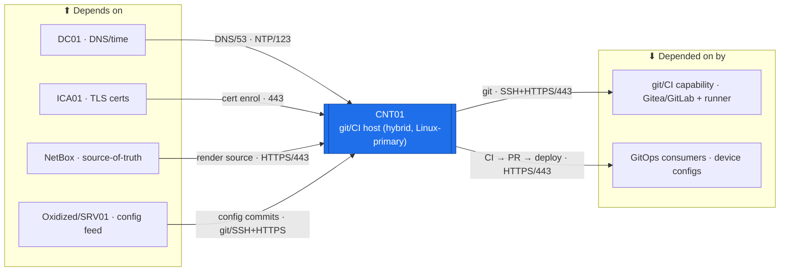

# CNT01 — Container Host  ·  folder front-door

> **How to read this folder.** Front door: *what this host is (proposed)*, *what it would connect to*, *which doc answers which question*. Live status: **`Roadmap.md`** + **`Build-Checklist.md`** (`POL-0001`). This is an **`ADR-0045` proposal** — the folder + designed stubs exist; the machine does not. Platform + primary purpose are now **decided (operator 2026-07-30)**; the **`ADR-0048` / Backlog #19 estate-capability ADR** + placement are the remaining gate.

| Item | Value |
|---|---|
| Lab / Era | Lab-02 · Cisco-Core — ACTIVE (📋 proposed, ⬜ not built) |
| Host · Role | **CNT01 — Container Host.** Introduced by **`ADR-0045`** (the AZ-800/801 sweep: WAC01 + a **container host** + the RODC; `ADR-0045` extends `ADR-0036`). Platform is **decided: HYBRID** — **Linux (Docker/Podman) is the PRIMARY runtime** (it hosts the estate's self-hosted git + CI/CD stack) **plus a Windows Server containers slice** to exercise the AZ-800/801 "containers" objective. Primary purpose is **decided: the estate's self-hosted Git + CI/CD capability** — the estate-capability half of **`ADR-0048`** (**Backlog #19**): self-hosted **Gitea/GitLab** as the internal source-of-truth + CI/CD host, **GitOps for device configs** (Oxidized → git → PR → deploy), **Ansible/Terraform pipelines**, a **CI runner**. Enterprise-real: internal git ≠ public GitHub. |
| Placement | 📋 **proposed** — the **Linux git/CI runtime → PVE02/EQR6 (always-on)** (the estate's internal source-of-truth + CI must stay up); the **Windows-container AZ slice → PVE01/R410 (spin-up, non-critical)**. Final sizing → **Backlog #20**. Not asserted. |
| Silo | ⚪ **Platform** (proposed). |
| Status | **📋 PROPOSED — not built · scoped stub** (platform + purpose decided 2026-07-30; the **#19 estate-capability ADR** + placement still owed). See **`Roadmap.md`**. |
| Governs / related | `ADR-0045` (introduces CNT01) · `ADR-0036` (compute placement it extends) · **`ADR-0048`** (the estate-automation/CI capability — the estate-capability half, **Backlog #19**) · `ADR-0044` (enterprise-first; the container objective comes from AZ-800/801). Cert anchor: **AZ-400 (DevOps) + CCNA Dom-6 (automation)** primary, **AZ-800/801** for the Windows-container slice. Decisions index: `00-Atlas-Foundation/Decisions/ADR-Index.md`. |

## Role this era

CNT01 is the **home of the estate's self-hosted git + CI/CD capability** — the estate-capability half of **`ADR-0048`** (**Backlog #19**). On a **hybrid runtime** (**Linux Docker/Podman primary** + a **Windows-container AZ-800/801 slice**), it hosts: self-hosted **Gitea/GitLab** as the internal source-of-truth + CI/CD host; **GitOps for device configs** (Oxidized → git → review/PR → deploy); **Ansible/Terraform pipelines** (Phase 10 Automation/IaC); a **CI runner**. Enterprise-real: internal git ≠ public GitHub. The **platform (hybrid, Linux-primary)** and the **primary purpose (git/CI)** are **decided (operator 2026-07-30)** — this is no longer an unscoped stub. What remains is the **Backlog #19 estate-capability ADR** — *self-host-vs-GitHub · the GitOps model · where the CI runner lives* — plus placement/sizing firming (**#20**). Those two are the remaining gate (**GATE-0**). It is **not yet built** — treat every line here as 📋 proposed / ⬜ not-built.

## Connections — what this host touches (the map)

**Depends on (upstream):**
- **A PVE host** (proposed) → **SW01** → **MKT01** (VLAN-20 gateway). Placement/VLAN are proposed — see `../../Architecture/IP-Addressing-Plan-VLSM.md` (`POL-0008`).
- **DC01** — DNS + time; domain-join for the Windows-container slice.
- **ICA01** — TLS certs for the published git/CI endpoints (Gitea/GitLab).
- **NetBox** — the estate source-of-truth the rendered device configs reference (GitOps input).
- **Oxidized / SRV01** — the device-config feed into git (Oxidized → git).

**Depended on by (downstream):**
- **The estate self-hosted git + CI/CD capability** (Gitea/GitLab + CI runner) and its **GitOps consumers** — device configs flow **Oxidized → git → PR → deploy**; Ansible/Terraform pipelines run against the estate. This is now the **committed purpose** (Backlog #19 / `ADR-0048`), not a candidate.

**Services this host provides:** 📋 self-hosted **git (Gitea/GitLab) + CI/CD + a CI runner** over ICA01 TLS, plus GitOps device-config delivery; a Windows-container slice for the AZ-800/801 objective — all 📋 proposed until built.

## Connections diagram

> CNT01 would sit on **VLAN 20 (Servers)** (proposed) reached via a PVE host → SW01 → MKT01 (VLAN-20 gw). Flows are owned by `../../Architecture/Atlas-East-West-Allowed-Flows-Matrix.md`; the downstream is now the **committed git/CI capability + its GitOps consumers** (Backlog #19).

## Services map — what runs here and how it's used

> 🆕 **Services map (Standard v1.7).** The estate git/CI capability CNT01 will host. Status mirrors reality (`POL-0001`) — 📋 **proposed / not built** (GATE-0 = the #19 ADR + placement), so every row is 📋.

| Service | Purpose | Consumed by · port | Depends on | Status |
|---|---|---|---|---|
| **Self-hosted Git** (Gitea/GitLab) | The estate's internal source-of-truth + CI/CD host (internal git ≠ public GitHub) | devs / GitOps · SSH + HTTPS/443 | ICA01 TLS + the #19 ADR | 📋 proposed (Backlog #19) |
| **CI runner + pipelines** | Ansible/Terraform build/test/deploy pipelines (Phase 10) | GitOps flows · CI | Git + the #19 ADR | 📋 proposed |
| **GitOps device-config delivery** | Oxidized → git → review/PR → deploy to the estate | device configs · git/deploy | NetBox + Oxidized/SRV01 | 📋 proposed |
| **Windows-container slice** | Exercise the AZ-800/801 "containers" objective | the AZ lab · containers | R410 slice (sizing → #20) | 📋 proposed (#20) |

## Documents in this folder (what answers what)
- **`Roadmap.md`** — the gated build path (🔴 GATE-0 = the #19 ADR + placement) + connections-at-a-glance + cert alignment.
- **`Build-Checklist.md`** — line-item status, all ⬜; opens on the "not started — gated" note (`POL-0001`).
- **`Considerations.md`** — what's decided (platform + purpose) vs the open decisions (the #19 ADR · placement/sizing #20 · Windows-slice scope).
- **`Build-Guide.md`** — a designed gated stub (`ADR-0043`): gate + phase outline + cert/service/automation section headers, detail deferred until the #19 ADR + the manual first build.
- **`Automation/`** — the `ADR-0048` slice: CNT01 **is** the estate automation-capability home (CI runner + shared Ansible/Terraform + self-hosted git) — every other device's `Automation/` links up to it.
- **`Changes/`** — the `CM-####` ledger (empty).

## Single source
- Estate index: `../../Service-Server-Build-Plan.md`. Addressing: `../../Architecture/IP-Addressing-Plan-VLSM.md`. Flows: `../../Architecture/Atlas-East-West-Allowed-Flows-Matrix.md`. Build order: `../../Operations/Build-Order-and-Dependencies.md`. Decisions: `00-Atlas-Foundation/Decisions/ADR-Index.md`. Cert map: `Atlas-Academy/AZ-800-801-Windows-Server-Hybrid-Lab-Map.md`.
