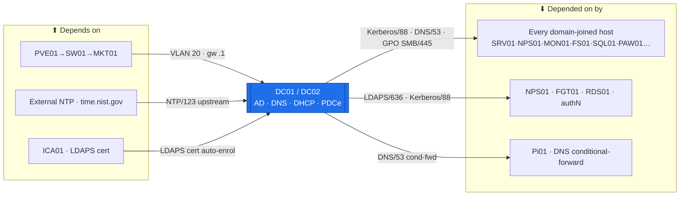

# DC01 / DC02 — Domain Controllers (Tier 0)  ·  folder front-door

> **How to read this folder.** This README is the front door: *what this host is*, *what it connects to*, and *which document answers which question*. Start here, then follow the one link you need. Live status lives in exactly two places — **`Roadmap.md`** (the build path) and **`Build-Checklist.md`** (line-item, dated, evidence-backed). Nothing here duplicates them; it points to them.

| Item | Value |
|---|---|
| Lab / Era | Lab-02 · Cisco-Core — ACTIVE (in build) |
| Host(s) · Role | **DC01 + DC02** (Windows Server 2025) · **Tier-0 identity core** — AD DS, AD-DNS, DHCP, PDCe/NTP authority |
| Placement | PVE01 (DC01) / PVE02 (DC02, `ADR-0036`) · VLAN 20 Tier-0 · DC01 `10.20.0.2`, DC02 `10.20.0.3`, gw `10.20.0.1` |
| Silo | 🔴 Security (identity) / 🟡 Services |
| Status | DC01 ✅ promoted + baselined · DC02 🟡 promoted (read-back pending) · tier accounts + DHCP + 7d ⬜ — see **`Roadmap.md`** |
| Governs | `ADR-0021` (tiered identity) · `ADR-0025` (permanent) · `ADR-0007` (`atlas.lab`) · `ADR-0020` (time) · `ADR-0030` (DHCP on DC01) |

## Role this era

DC01/DC02 are the **identity backbone the whole estate authenticates against** — Active Directory (AD DS), AD-integrated DNS for `atlas.lab`, DHCP (on DC01, `ADR-0030`), and the **PDC-emulator as the lab's time authority** (`ADR-0020`). Tier-0, built tiered from day one (`ADR-0021`). It does **not** do perimeter security, and it is **not** a throwaway — this is permanent (`ADR-0025`).

## Connections — what this host touches (the map)

The DC is the most-connected host in the estate; understand this before any change.

**Depends on (upstream — must be healthy first):**
- **PVE01** hypervisor (the VM runs here; VLAN-20 tag on the wire) → **SW01** (L2) → **MKT01** (VLAN-20 gateway `10.20.0.1`) for reachability.
- **External NTP** (`time.nist.gov`) — the PDCe's upstream clock (`ADR-0020`); the DC is the authority *below* that.
- **ICA01** (AD CS issuing CA) — issues the DC's **LDAPS** certificate via auto-enrollment. Sequence: DC promoted → AD CS installs into AD → DC gets its LDAPS cert.
- Addressing source of truth: `../../Architecture/IP-Addressing-Plan-VLSM.md` → NetBox.

**Depended on by (downstream — these break if the DC is down):**
- **Every domain-joined host** — SRV01, NPS01, MON01, FS01, WSUS01, SQL01, RDS01, PAW01, ICA01, DC02.
- **DNS:** `atlas.lab` resolution; **Pi01** conditional-forwards `atlas.lab` → the DCs (`ADR-0003`/`ADR-0007`).
- **Time:** all members sync down the `ADR-0020` hierarchy from the DC.
- **AuthN/AuthZ:** **NPS01** validates RADIUS against AD · **FGT01** admin auth via **LDAPS** (`ADR-0028`) · **RDS01** gateway auth · **SQL01** Windows-auth + **gMSA** (KDS) · **FS01** AGDLP share access.
- **Policy:** GPO/SYSVOL to every member — baseline, LAPS, tiering, **drive maps** (Academy: `Windows-Logon-Scripts-and-Drive-Mapping`).

**Services this host provides:** AD DS · AD-integrated DNS · DHCP (DC01) · PDCe = NTP authority · LDAP/**LDAPS** · Kerberos/NTLM · GPO + SYSVOL · **KDS** (gMSA) · **Windows LAPS** store · certificate auto-enrollment (with ICA01).

## Connections diagram

> Edges carry the protocol/port (Standard v1.6). Nodes keep role labels; addresses are owned by the IP plan (`POL-0008`).

## Services map — what runs here and how it's used

> 🆕 **Services map (Standard v1.7).** What the Tier-0 core runs + how each service is consumed. One row per load-bearing service; Status mirrors `Build-Record.md` (`POL-0001`: built/verified vs not-built — DC01 device-verified, DC02 🟡 read-back pending).

| Service | Purpose | Consumed by · port | Depends on | Status |
|---|---|---|---|---|
| **AD DS** (directory) | The estate's identity + authZ backbone | every domain-joined host · LDAP/389, LDAPS/636 | DC promoted | ✅ DC01; DC02 🟡 read-back |
| **AD-integrated DNS** (`atlas.lab`) | Name resolution for the domain | all members + Pi01 cond-fwd · DNS/53 | AD DS | ✅ DC01; DC02 🟡 |
| **Kerberos / NTLM authN** | Domain logon + service auth | all members · Kerberos/88, kpasswd/464 | AD DS | ✅ DC01 |
| **PDCe = NTP authority** | The lab's time authority (`ADR-0020`) | all members · NTP/123 | external NTP (`time.nist.gov`) | ✅ DC01 (external source) |
| **GPO + SYSVOL** | Baseline / LAPS / tiering / drive-maps to every member | all members · SMB/445 | AD DS | ✅ 7a/7b/7c; **7d tier-deny ⬜** |
| **KDS** (gMSA root key) | Group-managed service accounts (SQL01 first) | gMSA consumers · LDAP | AD DS | ✅ KDS root key present |
| **Windows LAPS store** | Per-machine local-admin password vault (+ DSRM) | admins / PAW · AD-stored (LDAP) | AD DS + schema | ✅ schema + `LAPS`→Devices |
| **Certificate auto-enrollment** | DC LDAPS cert + member certs (with ICA01) | DCs + members · RPC/DCOM | ICA01 issuing CA | ✅ DC LDAPS auto-enrol |
| **DHCP** (on DC01, `ADR-0030`) | Client/clone addressing (relayed via MKT01) | DHCP clients · UDP 67/68 | AD DS | ⬜ not built |
| **RADIUS backing** (via NPS01) | AD is the identity NPS validates against | NPS01 · LDAP / Kerberos | AD DS + NPS01 | ✅ AD side (NPS01 gated) |

## Documents in this folder (what answers what)

**Roadmap & status**
- **`Roadmap.md`** — 🆕 the per-role build path + the connections above, sequenced with what each role unblocks. *Start here for "what's next and why."*
- **`Build-Checklist.md`** — the line-item, **dated, evidence-backed** checklist (`POL-0001`). *The authoritative status.*

**Build (the rebuild contract — how a successor does it from scratch)**
- `Build-Guide/DC01/DC01-Build-Guide.md` — promote the forest `atlas.lab` (DC01).
- `Build-Guide/DC02/DC02-Build-Guide.md` — the replica DC (add-to-existing-domain).

**Role & stage builds** — the identity build is documented as **flat staged role-docs** (below), *not* a `Roles/` subfolder. Deliberate template call: the DC's 'roles' (OU · GPO · tiering) are **stages of one identity service**, so flat staged docs read better than service silos. Reserve `Roles/` for hosts running **genuinely separate services** (e.g. SRV01: nginx-CRL / Oxidized / rsyslog). When DHCP is built on DC01 it becomes a flat `DHCP-Build.md` here.
- `Build-Guide/DC01/OU-Design-and-Build.md` — the OU skeleton (authoritative).
- `Build-Guide/DC01/GPO-Design-and-Build.md` — the GPO baseline + Wave-A / PSO / LAPS / DSRM.
- `Build-Guide/DC01/Tiered-Admin-and-Groups-Build.md` — AGDLP tier groups + the `t0/t1/t2` accounts.

**Verify & fix**
- `Diagnostics-DC01.md` / `Diagnostics-DC02.md` — the read-only health battery (link up into Academy `Command-Library`).
- `Troubleshooting.md` — real incidents + fixes.
- `Build-Record.md` — the **verified as-built state** (records outrank guides, `POL-0001`).
- `Considerations.md` — the open risks & decisions still live on this host.

**Standard slots (now complete):**
- `Build-Record.md` ✅ — the verified as-built state (DC01 device-verified; DC02 🟡 pending read-back).
- `Changes/` ✅ — the change ledger (`Changes/README.md`; empty, ready for `CM-####` records).
- `CIS-Hardening` — covered centrally by `../../Operations/Device-Hardening-Standard.md` + the GPO baseline (§7a); no separate per-device doc unless it grows.

## Single source
- Estate index (all devices + status): `../../Service-Server-Build-Plan.md`. Role/silo catalog: `../../Architecture/Lab-02-Device-Role-Assignments.md`. Addressing: `../../Architecture/IP-Addressing-Plan-VLSM.md` / NetBox (`POL-0008`).
