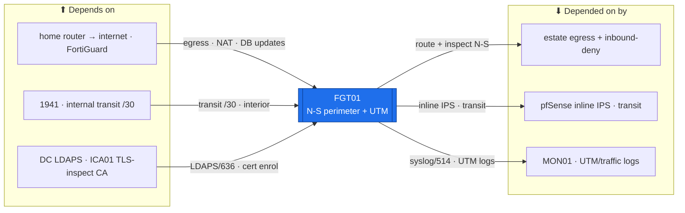

# FGT01 — Perimeter Firewall (FortiGate, N-S)  ·  folder front-door

> **How to read this folder.** Front door for the estate's **north-south perimeter firewall**: what it is, what it connects to, which doc answers which question. **Networking/security variant** — foregrounds egress/NAT/UTM/TLS-inspection + `get`-command verification, not the server template. Live status: **`Roadmap.md`** + **`Build-Checklist.md`** + the `get`-read-backs in **`Diagnostics.md`** (`POL-0001`). How to *read* the logs/flows: **`Logging-and-Flow-Tracing-Field-Guide.md`**.

| Item | Value |
|---|---|
| Lab / Era | Lab-02 · Cisco-Core — ACTIVE (Pass-1 core ✅ device-verified; UTM/TLS-inspection gated) |
| Host · Role | **FGT01** (FortiGate-60E, FortiOS 7.4.5) · **the north-south perimeter firewall** — egress + NAT + inbound-deny; **FortiGuard UTM** content inspection (`ADR-0047`) |
| Placement / reach | Physical rack device · **`wan1`** → home router (DHCP); **`internal`** → 1941 transit `10.255.255.0/30` (FGT `.1`, 1941 `.2`). Break-glass mgmt **`192.168.1.99`** / console |
| Silo | 🔴 Security (perimeter / N-S inspection) / 🔵 Network (egress + NAT) |
| Status | **Pass-1 core ✅ device-verified** (07-21: egress+NAT, 1941 transit, internet egress, named admin/trusthost, no-WAN-mgmt) · UTM/TLS-inspection ⬜ **gated** (ICA01 cert + live subscription) · LDAPS admin auth 📋 gated · syslog→MON01 📋 Phase 6. See **`Roadmap.md`** |
| Governs / related | `ADR-0047` (runs FortiGuard UTM) · `ADR-0028` (admin auth via **direct LDAPS**, not RADIUS) · `ADR-0038` (pfSense complementary inline IPS on the transit) · `ADR-0005` (egress) · Section K **K1** (TLS deep-inspection) · **K2** (DNS filter) · **K3** (FSSO) · `CIS-Hardening-FGT01` |

## Role this era

FGT01 is the estate's **north-south perimeter** — every packet to/from the internet crosses it. It does **egress + NAT + inbound-deny** (the Pass-1 core, device-verified), and it runs **FortiGuard UTM** as the estate's **N-S content-inspection layer** (`ADR-0047`, reversing the old no-UTM stance): **web filtering · antivirus · IPS · application control**. It authenticates admins by **direct LDAPS to the DCs** (`ADR-0028` — the deliberate exception to the RADIUS/NPS pattern the Cisco/MikroTik devices use). The complementary **free inline IPS is pfSense** on the FGT↔1941 transit (`ADR-0038`), and **network *detection*** is MON01's Suricata — FGT01 is N-S *prevention/content*, not the only inspector.

> 🔴 **The confidence trap (survives from `ADR-0035` into `ADR-0047`):** a UTM profile is only as good as its **live, updated databases + an active subscription**. **`get system status`** must confirm the subscription + signature freshness **before any profile is trusted**; a lapsed subscription reverts to *detach the profile, don't run it stale*. 🔴 **UTM + TLS deep-inspection are gated** on the **ICA01 CA cert** (K1) + a verified live subscription (`Build-Guide-3`, Phase 8).

## Connections — what this host touches (the map)

**Depends on (upstream — must be healthy first):**
- **`wan1` → the home router → internet** (DHCP) — the estate's only egress; **FortiGuard** DB/subscription updates ride this.
- **1941** — the `internal` transit /30 (`10.255.255.0/30`; FGT `.1`, 1941 `.2`) — the interior side.
- **DC (LDAPS)** — admin authentication (`ADR-0028`, `Build-Guide-2b`), gated on the DC LDAPS cert. **ICA01** — the **TLS-inspection subordinate CA cert** (K1) + FGT's own cert.
- **Console / `192.168.1.99` break-glass** — recovery if a local-in policy or UTM change locks mgmt out.

**Depended on by (downstream — these break if FGT01 is down):**
- **All estate internet access + the inbound perimeter** — no FGT01, no egress; it is the single N-S chokepoint.
- **N-S content inspection** — the UTM profiles applied to egress; **pfSense inline IPS** sits on the FGT↔1941 transit as the complementary free IPS (`ADR-0038`).
- **MON01** — FGT01 traffic/UTM logs → syslog (Phase 6); the perimeter's view of what crossed.

**Services this host provides:** N-S egress + NAT + inbound-deny · FortiGuard UTM (web/AV/IPS/app-control) · selective TLS deep-inspection (ICA01 CA) · direct-LDAPS admin auth + FortiToken MFA · (future) FSSO identity layer + S2S VPN (H4).

## Connections diagram

> FGT01 is the single N-S chokepoint. UTM + selective TLS deep-inspection (ICA01 CA, K1) run on egress; pfSense is the complementary free IPS on the transit; DNS filtering stays on Pi-hole (K2), not FortiGuard.

## Services map — what runs here and how it's used

> 🆕 **Services map (Standard v1.7), networking/security variant.** FGT01's "services" are its **perimeter inspection / egress / auth functions**, so the "Consumed by" cell names the consumer + protocol/interface. Status mirrors `Build-Record.md` (`POL-0001`: gated ⬜ until the CA + live subscription exist — the confidence trap).

| Service | Purpose | Consumed by · port/interface | Depends on | Status |
|---|---|---|---|---|
| **N-S egress + NAT + inbound-deny** | The estate's single internet chokepoint | all estate egress · `internal` ↔ `wan1` | `wan1` up; 1941 transit | ✅ core (07-21); iface 🟡 read-back |
| **FortiGuard UTM** (web/AV/IPS/app-control) | N-S content inspection (`ADR-0047`) | egress traffic · UTM profiles | ICA01 cert + **live subscription** | ⬜ gated (confidence trap) |
| **Selective TLS deep-inspection** (K1) | Decrypt-inspect selected egress; FGT re-sign CA issued by ICA01, GPO-pushed | client/user-zone egress · inspection CA | ICA01 inspection CA + GPO trust | ⬜ gated (K1) |
| **Direct-LDAPS admin auth + FortiToken MFA** | Admin login straight to the DCs (`ADR-0028` — the deliberate RADIUS exception) | admins · LDAPS/636 → DC | DC LDAPS cert | MFA ✅ core (07-21); LDAPS 📋 gated |
| **DNS filtering** | *Off on FGT* — Pi-hole owns DNS control (K2, one filter home) | — (delegated to `../Pi01-DNS-NTP/`) | — | ✅ decided off (K2) |
| **NTP client** | Time sync | NTP source · UDP 123 | `ADR-0020` source | 🟡 read-back pending |
| **FSSO identity layer** (K3) | User/group-aware policy + usernames in logs (proposed, both-together) | egress policy · AD logon events | DC + client fleet + FGT past Pass-1 | 🔎 proposed (Backlog #26) |
| **syslog → MON01** | Perimeter / UTM logs into the SIEM pipeline | MON01 · syslog/514 | MON01 (Phase 6) | 📋 Phase 6 |

## Documents in this folder (what answers what)

**Config path & status**
- **`Roadmap.md`** — the config path (base+hardening → egress/NAT → LDAPS admin → UTM/TLS-inspection (gated) → identity/FSSO (proposed) → telemetry) + Needs/Unblocks + cert alignment. *Start here.*
- **`Build-Checklist.md`** *(existing)* — line-item design/why + failure modes.

**Build (the how — existing, referenced)**
- **`Build-Guide-Index.md`** *(existing)* — the phased guide map. **`Build-Guide-1-Networking.md`** · **`Build-Guide-2-Hardening.md`** · **`Build-Guide-2b-AD-LDAPS-Admin.md`** (`ADR-0028`). *(Build-Guide-3 Security-Profiles is the gated UTM/TLS phase — re-enabled by `ADR-0047`.)*
- **`Logging-and-Flow-Tracing-Field-Guide.md`** *(existing)* — how to read the logs + `diagnose debug flow`.

**Verify & fix**
- **`Diagnostics.md`** *(existing)* — the `get`-command battery, ✅ where read back.
- **`Troubleshooting.md`** *(existing)* — FortiOS gotchas → fixes.
- **`Build-Record.md`** — the verified as-built state (records outrank guides, `POL-0001`).
- **`Considerations.md`** — open risks & decisions (the confidence trap; K1/K2/K3 dispositions; UTM/TLS gates; Pass-2 LDAPS).
- **`Automation/`** — the `ADR-0048` slice: Oxidized/FortiManager-style config-backup + Ansible (`fortios_*`); **not** DSC.
- **`Changes/`** — the `CM-####` ledger.

**Hardening:** central — `../../Architecture/CIS-Hardening-FGT01.md` (Pass-1 ✅) + `../../Operations/Device-Hardening-Standard.md`.

## Single source
- Estate index: `../../Service-Server-Build-Plan.md`. Addressing: `../../Architecture/IP-Addressing-Plan-VLSM.md`. Firewall architecture / inspection division of labor: `00-Atlas-Foundation/Atlas-Firewall-Architecture.md` + `ADR-0047`/`ADR-0038`. Build order: `../../Operations/Build-Order-and-Dependencies.md`. Decisions: `00-Atlas-Foundation/Decisions/ADR-Index.md`. Identity-vs-zone firewall concept (K3): `Atlas-Academy/Concepts/Identity-Aware-vs-Zone-Firewall-Policy.md`. Cert map: `Atlas-Academy/Atlas-FortiGate-FCP-Lab-Map.md`.
