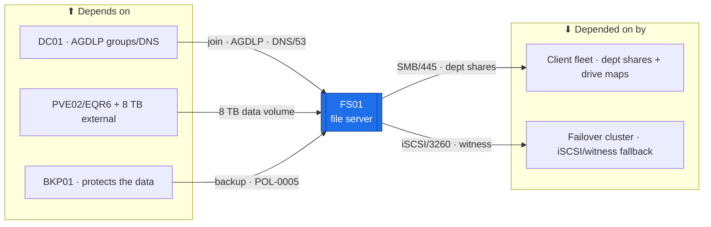

# FS01 — File Services (SMB · DFS · FSRM)  ·  folder front-door

> **How to read this folder.** Front door: *what this host is*, *what it connects to*, *which doc answers which question*. Live status: **`Roadmap.md`** (build path) + **`Build-Checklist.md`** (line-item, dated, evidence-backed). Nothing here duplicates them.

| Item | Value |
|---|---|
| Lab / Era | Lab-02 · Cisco-Core — ACTIVE (📋 not built) |
| Host · Role | **FS01** (Windows Server 2025) · **file server** — SMB shares (AGDLP) · DFS namespace + DFSR · FSRM quotas/screening · VSS previous-versions |
| Placement | **PVE02/EQR6** (always-on core, `ADR-0036` v1.2) — **shares live on the 8 TB external**; OS on the NVMe. VLAN 20, **`10.20.0.14`** *(proposed — IP plan owns)*, gw `10.20.0.1`, `OU=Servers,OU=Devices` |
| Proposed sizing 🟡 | 2 vCPU · **4 GB** RAM (→6–8 if dedup/FSRM heavy) · 60 GB OS (NVMe) · **data on the 8 TB** · SMB over the EQR6's 1 GbE. *Proposed — the estate capacity pass (Backlog #20) finalizes it.* |
| Silo | 🟡 Services (data) / 🔴 Security (access control) |
| Status | 📋 **not built** — Wave-B committed. See **`Roadmap.md`** |
| Governs / related | `ADR-0021` (tiered identity → AGDLP ACLs) · `ADR-0036` (placement + the 8 TB) · `ADR-0042` (the client fleet consumes its dept shares) · `ADR-0046` (FS01 = the iSCSI-target + witness-candidate fallback for the cluster) · `POL-0005` (data is only safe once BKP01 backs it up) |

## Role this era

The estate's **Windows file server** — SMB shares with **AGDLP** group ACLs, a **DFS namespace** (`\\atlas.lab\...`) with **DFSR** replication, **FSRM** quotas + file-screening, and **VSS Shadow Copies** for self-service previous-versions. It's the flagship of the **department access-control proof** (`ADR-0042`: **HR→HR ✓ / HR→IT ✗**). It is **not** a DC, **not** the backup target (that's BKP01), and its shares are **not** SYSVOL/NETLOGON DFSR (that lives on the DCs).

> 🔴 **VSS ≠ backup (`POL-0005`).** Shadow Copies give self-service *previous versions*; they are **not** a backup. FS01's data is only safe once **BKP01 backs it up + a restore is tested**. A file server with no restore-tested backup is a Tier-1 risk.

## Connections — what this host touches (the map)

**Depends on (upstream):**
- **DC01** — domain-join, AD-DNS, the **AGDLP groups** (from the OU design), GPO drive-maps. Shares are ACL'd by AD group, so the DC is load-bearing.
- **PVE02/EQR6 + the 8 TB external** — the host + where the shares physically live (`ADR-0036` v1.2). → SW01 → MKT01 (VLAN-20 gw `10.20.0.1`).
- **BKP01** — must protect the data volume before it holds anything real (`POL-0005`).
- Addressing: `../../Architecture/IP-Addressing-Plan-VLSM.md` (`POL-0008`).

**Depended on by (downstream):**
- **The client fleet** (WS-HR01/WS-ENG01/LT-SALES01/WS-IT01, `ADR-0042`) — department shares + GPO drive maps (the **`BATlogin`** logon-script module, Academy).
- **The failover cluster** (`ADR-0046`) — FS01 is the documented **iSCSI-target** (S2D fallback) + **file-share-witness** candidate.
- **Any host needing a file share** (build artifacts, installers, the future WSUS content if co-located — TBD).

**Services provided:** SMB file shares · DFS namespace/replication · FSRM quotas/screening · VSS previous-versions · (fallback) iSCSI target + cluster witness.

## Connections diagram

> 🔴 BKP01 is upstream here as the *protector* (`POL-0005`) — VSS on FS01 is not a backup.

## Services map — what runs here and how it's used

> 🆕 **Services map (Standard v1.7).** What FS01 serves + how each is consumed. Status mirrors `Build-Record.md` (`POL-0001`) — 📋 not built, so every row is ⬜.

| Service | Purpose | Consumed by · port | Depends on | Status |
|---|---|---|---|---|
| **SMB file shares** (AGDLP) | Department shares, group-only ACLs (the HR→HR ✓ / HR→IT ✗ proof) | client fleet · SMB/445 | DC (AGDLP groups) | ⬜ not built |
| **DFS namespace + DFSR** | `\\atlas.lab\<ns>` unified namespace + replication | clients · SMB/445 (DFS referral) | AD DS | ⬜ not built |
| **FSRM** (quotas + file-screening) | Storage quotas + block disallowed file types | the data volume (8 TB) | File Server role | ⬜ not built |
| **VSS previous-versions** | Self-service restore of prior versions (**≠ backup**, `POL-0005`) | clients · SMB | the data volume | ⬜ not built |
| **iSCSI target + cluster witness** (fallback) | S2D iSCSI-target + file-share-witness candidate (`ADR-0046`) | failover cluster · iSCSI/3260 | cluster build (later) | ⬜ not built (fallback) |

## Documents in this folder
- **`Roadmap.md`** — build path + connections + cert alignment + future. *Start here.*
- **`Build-Checklist.md`** — line-item, dated status (`POL-0001`). **`Build-Guide.md`** — the phased/gated rebuild contract.
- **`Considerations.md`** — open risks (VSS≠backup, the 8 TB dependency, witness-independence caveat, sizing).
- **`Build-Record.md`** — as-built (⬜ until built). **`Diagnostics.md`** — verify battery. **`Troubleshooting.md`** — symptom→fix.
- **`Automation/`** — the `ADR-0048` slice (DSC file-server role, shares/ACL-as-code, FSRM-as-code). **`Changes/`** — the `CM-####` ledger.

## Single source
- Estate index: `../../Service-Server-Build-Plan.md`. Tier/AGDLP model: `../DC-Domain-Controllers/Build-Guide/DC01/Tiered-Admin-and-Groups-Build.md`. Addressing: `../../Architecture/IP-Addressing-Plan-VLSM.md`. Sizing/capacity: `00-Atlas-Foundation/VM-and-Services-Inventory.md` + Backlog #20. Drive-mapping: `Atlas-Academy/Concepts/Windows-Logon-Scripts-and-Drive-Mapping.md`.
