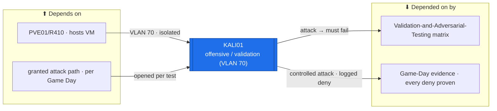

# KALI01 — Offensive / Validation Host (Kali Linux)  ·  folder front-door

> **How to read this folder.** Front door for the estate's **adversarial-testing / attacker** host: what it is, what it connects to, which document answers which question. **Security variant** — foregrounds the offensive toolset, the controlled-attack model, and the validation matrix it drives, not the server template. This is a **new device**: 📋 proposed / ⬜ not built. Live status: **`Roadmap.md`** + **`Build-Checklist.md`**. KALI01 is the **offensive half** of `../../Operations/Validation-and-Adversarial-Testing.md` (control → attack → evidence).

| Item | Value |
|---|---|
| Lab / Era | Lab-02 · Cisco-Core — ACTIVE (📋 proposed — not built) |
| Host · Role | **KALI01** (Kali Linux VM) · **the offensive / validation host** — proves each control by attacking it (the negative test); the J-series pen-test box |
| Placement / reach | 📋 **VM on PVE01/R410 (spin-up, non-critical)** · **VLAN 70 (Testing)** · `10.70.0.x` 📋 proposed. **Isolated by default** (VLAN 70 = internet-only, no lab access) — attack paths are opened **per Game Day**, not standing |
| Silo | 🔴 Security (offensive / validation) |
| Status | **📋 PROPOSED — not built.** Runs alongside every phase (`ADR-0041`) as the negative test for each control. See **`Roadmap.md`** |
| Governs / related | `ADR-0042` (client fleet / VLAN 70 neighbour) · `ADR-0011` (Game Days) · `ADR-0041` (test-gated — prove each control as built) · `../../Operations/Validation-and-Adversarial-Testing.md` (the matrix it drives) · J-series (Security+/PenTest+) |

## Role this era

KALI01 is the estate's **offensive / validation host** — the box that **proves a control works by attacking it** (the negative half of every acceptance gate). It is the executable engine of `../../Operations/Validation-and-Adversarial-Testing.md`: for each control (tier-deny, east-west/IPS, L2/switch, PKI/ESC), KALI01 runs the **attack** and the evidence is *that the attack failed*. It lives on **VLAN 70 (Testing)** — **isolated by default** (internet-only, no lab access, already enforced) so an attacker box can't accidentally pop the lab; **attack paths are opened per Game Day** (`ADR-0011`), tested, then closed.

> 🔴 **Controlled-attack model.** KALI01 is **not** a standing threat with free lab access — that would undercut the very segmentation it tests. It is isolated on VLAN 70; to attack a zone it is either **moved to that zone** (the `ADR-0042` movable-client pattern) or a **specific test path is opened for the Game Day** and closed after. Never break production to test it — availability + safety first.

## Connections — what this host touches (the map)

**Depends on (upstream — must be healthy first):**
- **PVE01/R410** (hosts the VM) → **SW01** → **MKT01** (VLAN-70 gateway `10.70.0.1`).
- **A granted attack path** per Game Day (`ADR-0011`) — the zone/service under test, opened deliberately, then closed.
- **Internet** (VLAN 70 is internet-only) — tool + exploit-DB updates.

**Depended on by (downstream — these are *proven* by KALI01):**
- **`../../Operations/Validation-and-Adversarial-Testing.md`** — every control's **negative test**: the deny is only real once KALI01 tries it and is refused (+ the deny is logged).
- **The Game-Day evidence** (`ADR-0011`) — MKT01 E-W deny, PFSENSE01/FGT IPS drop, SW01 DAI/port-security, the tier-deny GPOs, PKI ESC — each proven by an attack that fails.

**Services this host provides:** the offensive toolset (recon · credential-capture · AD attack-path mapping · exploitation/C2 · L2 attacks · web-app testing) — run **against** the estate, under control (see the Services map).

## Connections diagram

> KALI01 is isolated on VLAN 70; the attack edges are **opened per Game Day**, not standing. Every edge is a control being *proven* by an attack that should fail.

## Services map — what runs here and how it's used

> 🆕 **Services map (Standard v1.7).** What runs on this box + how each service is actually used. For an attacker host this *is* the point: each tool proves a specific control. Paths are opened **per Game Day** (`ADR-0011`), never standing (`POL-0001`: evidence = the attack's result, not the tool's presence).

| Tool / service | Purpose (what it proves) | Used against · how | Depends on | Status |
|---|---|---|---|---|
| **nmap / scanning** | recon; a denied zone shows **no open services** | the zone under test · granted path | VLAN 70 + a Game-Day path | 📋 |
| **Responder / LLMNR-NBNS** | credential capture — proves name-poisoning is mitigated | client/server VLAN (test) | a test path | 📋 |
| **BloodHound / AD recon** | AD attack-path mapping — proves tiering limits blast radius | DC/AD (test) | domain reach (test) | 📋 |
| **Metasploit / exploit + C2** | exploitation / callback — proves **FGT UTM + PFSENSE01 IPS drop** it | targets behind the N-S edge | N-S test path | 📋 |
| **arpspoof / yersinia (L2)** | ARP/L2 attack — proves **SW01 DAI + port-security** drop it | an SW01 access port (test) | access-port (test) | 📋 |
| **certipy / ESC tooling** | AD CS abuse (ESC1-8) — proves the PKI templates are safe | ICA01/AD CS (test, Phase 8) | PKI reach (test) | 📋 |
| **web-app testing (OWASP)** | web/app testing (future) — Backlog #17 | VLAN 30 web app (when one exists) | a web app | 📋 |

## Documents in this folder (what answers what)
- **`Roadmap.md`** — the build path (VM → VLAN-70 isolation → toolset → wire into the validation matrix) + cert alignment. *Start here.*
- **`Build-Checklist.md`** — line-item, all ⬜; opens on the isolation/safety gate.
- **`Build-Guide.md`** — the designed gated stub (`ADR-0043`): VM build + the controlled-attack model; per-attack detail with each Game Day.
- **`Considerations.md`** — the controlled-attack model + risks (isolation, blast radius, legal/scope, the movable-client pattern).
- **`Build-Record.md`** — the as-built state (⬜ until built).
- **`Diagnostics.md`** — the 📋 verify battery (isolation holds by default; a granted path works then closes).
- **`Troubleshooting.md`** — attacker-host symptoms → fixes (path left open; tool DB stale; VLAN-70 leakage).
- **`Automation/`** — the `ADR-0048` slice: the box as **code** (rebuildable Kali + tool config); the *attacks* stay hand-run.
- **`Changes/`** — the `CM-####` ledger.

## Single source
- The validation matrix (owner): `../../Operations/Validation-and-Adversarial-Testing.md`. Estate index: `../../Service-Server-Build-Plan.md`. Addressing (VLAN 70): `../../Architecture/IP-Addressing-Plan-VLSM.md`. Flows (Testing zone): `../../Architecture/Atlas-East-West-Allowed-Flows-Matrix.md`. Build order: `../../Operations/Build-Order-and-Dependencies.md`. Game Days: `ADR-0011`. Decisions: `00-Atlas-Foundation/Decisions/ADR-Index.md`.
