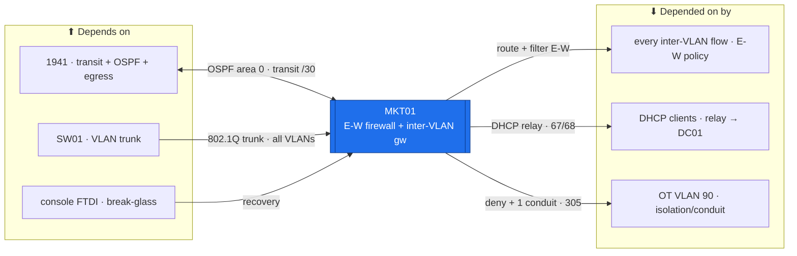

# MKT01 — East-West Firewall + Inter-VLAN Gateway (RouterOS)  ·  folder front-door

> **How to read this folder.** Front door for the estate's **east-west firewall + inter-VLAN gateway**: what it is, what it connects to, which doc answers which question. **Networking variant** — foregrounds VLAN gateways / OSPF / the default-deny E-W policy / `print` verification, not the server template. Live status: **`Roadmap.md`** + **`Build-Checklist.md`** + the `print`-read-backs in **`Diagnostics.md`** (`POL-0001`). The E-W **policy** is owned by the flows matrix; the **rebuild/verification** by the two worksheets in this folder.

| Item | Value |
|---|---|
| Lab / Era | Lab-02 · Cisco-Core — ACTIVE (Pass-1 + gateway/OSPF ✅ device-verified; E-W policy still permissive) |
| Host · Role | **MKT01** (MikroTik RB1100AHx4, RouterOS 7.23.1) · **the east-west firewall + inter-VLAN gateway** (`ADR-0023` Option B) — every VLAN's gateway lives here; it routes **and** filters east-west |
| Placement / reach | Physical rack device · VLAN gateways **`10.<vlan>.0.1`** (9 VLANs) · loopback **`10.255.0.2`** (OSPF RID) · transit **`10.255.255.6`** → 1941 `.5`. Managed on VLAN 10; **console (FTDI) break-glass** is the recovery path |
| Silo | 🔴 Security (E-W policy) / 🔵 Network (inter-VLAN routing) |
| Status | **Pass-1 + inter-VLAN gateway + OSPF ✅ device-verified** (07-21/07-22) · **E-W policy PERMISSIVE** (default-deny is Phase 7, from evidence) · Pass-2 RADIUS ⬜ gated · rsyslog→MON01 📋 Phase 6. See **`Roadmap.md`** |
| Governs / related | `ADR-0023` (Option B: MKT01 = inter-VLAN gw + E-W FW) · `ADR-0030` (DHCP relay → DC01) · `ADR-0029` (admin auth → RADIUS/NPS01) · `ADR-0020` (NTP) · Section K **K4** (E-W matrix depth) · `CIS-Hardening-MKT01` · `305` (OT segmentation) |

## Role this era

MKT01 is where the estate's **segmentation** lives (`ADR-0023` Option B). It is **the inter-VLAN gateway** — every VLAN's default gateway (`10.<vlan>.0.1`) is a RouterOS VLAN interface on the `bridge-trunk` — **and** the **east-west firewall** that decides which VLAN may talk to which, on which port. It peers **OSPF** with the 1941 (advertising the VLAN routes northbound, learning the default), relays **DHCP** per served VLAN to **DC01** (`ADR-0030`), and enforces the **Tier-0 identity micro-zone** (flows #9) and the **OT VLAN 90 isolation + single IT→OT conduit** (`305`; flows #11–#13).

> 🔴 **The sequencing rule that governs this box (Build-Order Phase 2 → 6 → 7):** the network comes up **permissive**, you make flows **visible** (MON01/NetFlow, Phase 6), then you write **default-deny east-west *from that evidence*** (Phase 7) — you never turn on default-deny during bring-up. The E-W **policy is owned by `../../Architecture/Atlas-East-West-Allowed-Flows-Matrix.md`**; MKT01 *renders* it. 🔴 **Console (FTDI) break-glass must be proven before Phase 7** — a bad rule here can lock everyone out.

## Connections — what this host touches (the map)

**Depends on (upstream — must be healthy first):**
- **1941** — the transit /30 (`10.255.255.4/30`; MKT `.6`, 1941 `.5`) + the **OSPF adjacency** (learns the default; advertises the VLANs) + the **N-S path to egress** (`ADR-0005`).
- **SW01** — the 802.1Q trunk delivering every VLAN to the `bridge-trunk`.
- **Console (FTDI) + power** — the break-glass recovery path (a Phase-1 gate for Phase 7). Later: **NTP/DC01**, **NPS01** (RADIUS Pass-2), **MON01/NetFlow** (the Phase-7 evidence).

**Depended on by (downstream — these break if MKT01 is down or mis-ruled):**
- **Every inter-VLAN flow + every VLAN's path to the internet** — MKT01 is the gateway *and* the filter; it is in-path by construction (`ADR-0023` Option B).
- **DHCP clients on the served VLANs** — the per-VLAN relay to DC01 (`ADR-0030`).
- **The estate segmentation posture** — the Tier-0 micro-zone (#9), client/server/web scoping (#3/#4), OT isolation (#11–#13, `305`).

**Services this host provides:** inter-VLAN routing (9 VLAN SVIs) · OSPF (peer 1941) · east-west firewall policy (permissive → default-deny+log) · DHCP relay → DC01 · SSH/WinBox mgmt (scoped).

## Connections diagram

> MKT01 is in-path by construction (it *is* the inter-VLAN gateway). The E-W edges render the flows matrix; the OT edge enforces `305`'s Purdue isolation (availability first).

## Services map — what runs here and how it's used

> 🆕 **Services map (Standard v1.7), networking variant.** MKT01's "services" are its **routing / firewall / gateway functions**, so the "Consumed by" cell names the **consumer + interface/port**. The E-W **policy** is owned by the flows matrix (MKT01 renders it). Status mirrors `Build-Record.md` (`POL-0001`).

| Service | Purpose | Consumed by · port/interface | Depends on | Status |
|---|---|---|---|---|
| **Inter-VLAN routing** (9 VLAN gateways) | Every VLAN's default gateway `10.<vlan>.0.1` on `bridge-trunk` | all VLAN hosts · VLAN interfaces | SW01 trunk up | ✅ gateway (07-21/22); SVI 🟡 read-back |
| **OSPF area 0** | Advertises VLAN routes north; learns the default from the 1941 | 1941 · transit /30 (adjacency FULL) | 1941 up | ✅ FULL with 1941 (07-21) |
| **East-west firewall policy** | The segmentation decision — permissive now → default-deny + log at Phase 7, from evidence | every inter-VLAN flow · filter chain | flows matrix + MON01 evidence (Ph 6) | 🟡 permissive (default-deny Ph 7) |
| **OT VLAN 90 isolation + single conduit** | Purdue isolation per `305` (availability-first); one IT→OT conduit | OT VLAN 90 · conduit rule (flows #11–13) | E-W policy | 🟡 carried; deny at Ph 7 |
| **DHCP relay → DC01** | Per-VLAN relay to the DC01 scope (`ADR-0030`) | DHCP clients · UDP 67/68 → DC01 | DC01 (Phase 3h) | 📋 Phase 3h |
| **SSH / WinBox management** | Scoped admin plane | admins / PAW · VLAN 10 · ssh + winbox | mgmt reachability | ✅ scoped (07-22) |
| **NTP client** | Time sync (source DC01) | DC01 · UDP 123 | DC01 | ✅ (07-22) |
| **RADIUS admin auth** (Pass-2) | AD-backed admin login | NPS01 · UDP 1812 (flow #14) | NPS01 + AD CS | ⬜ gated (`ADR-0029`) |
| **rsyslog / NetFlow → MON01** | Flow visibility — the Phase-7 default-deny evidence source | MON01 · syslog / NetFlow | MON01 (Phase 6) | 📋 Phase 6 |

## Documents in this folder (what answers what)

**Config path & status**
- **`Roadmap.md`** — the config path (base+hardening → VLAN gateways → OSPF → DHCP relay → **permissive → default-deny E-W** → mgmt telemetry), Needs/Unblocks + cert alignment. *Start here.*
- **`Build-Checklist.md`** *(existing)* — the line-item design/why + failure modes.

**Build & E-W-policy execution (existing, referenced)**
- **`Build-Guide.md`** *(existing, v0.8)* — the RouterOS build (VLAN SVIs, OSPF, DHCP relay, base filter).
- **`Firewall-Rebuild-and-Per-Rule-Verification-Plan.md`** *(existing)* — the Phase-7 rebuild + **per-rule verification** plan.
- **`Incremental-East-West-Firewall-Build-Worksheet.md`** *(existing)* — the one-scoped-rule-at-a-time worksheet (`ADR-0041`).

**Verify & fix**
- **`Diagnostics.md`** *(existing)* — the `print detail`/`print stats` battery (services/addresses/OSPF/policy counters), ✅ where read back.
- **`Troubleshooting.md`** *(existing)* — RouterOS gotchas (RTL8367 offload trap, `print`-vs-`print detail`, OSPF interop) → fixes.
- **`Build-Record.md`** — the verified as-built state (records outrank guides, `POL-0001`).
- **`Considerations.md`** — open risks & decisions (Phase-7 default-deny gate + console break-glass; the offload trap; Section K K4; OT/`305`; Pass-2).
- **`Automation/`** — the `ADR-0048` slice: Oxidized config-backup + Ansible (E-W rules rendered from the flows matrix / NetBox); **not** DSC.
- **`Changes/`** — the `CM-####` ledger.

**Hardening:** central — `../../Architecture/CIS-Hardening-MKT01.md` (Pass-1 ✅) + `../../Operations/Device-Hardening-Standard.md`.

## Single source
- E-W **policy** (the owner): `../../Architecture/Atlas-East-West-Allowed-Flows-Matrix.md`. Estate index: `../../Service-Server-Build-Plan.md`. Addressing (VLAN gws + transit + loopback): `../../Architecture/IP-Addressing-Plan-VLSM.md`. Cabling: `../../Architecture/Cabling-and-Port-Map.md`. Build order: `../../Operations/Build-Order-and-Dependencies.md` (Phase 2 → 6 → 7). Validation: `../../Operations/Validation-and-Adversarial-Testing.md`. OT requirements: `00-Atlas-Foundation/Company-Profile/305-Atlas-Industrial-Security-Requirements.md`. Decisions: `00-Atlas-Foundation/Decisions/ADR-Index.md`. Cert maps: `Atlas-Academy/Atlas-Certification-Lab-Map.md` (CCNA) · `Atlas-Academy/Atlas-CCNP-Lab-Map.md`.
