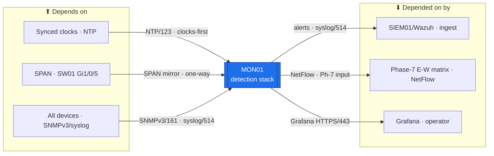

# MON01 — Monitoring & Visibility (the estate's Detect layer)  ·  folder front-door

> **How to read this folder.** This README is the front door: *what this host is*, *what it connects to*, and *which document answers which question*. Start here, then follow the one link you need. Live status lives in exactly two places — **`Roadmap.md`** (the build path) and **`Build-Checklist.md`** (line-item, dated, evidence-backed). Nothing here duplicates them; it points to them.

| Item | Value |
|---|---|
| Lab / Era | Lab-02 · Cisco-Core — ACTIVE (📋 not built) |
| Host · Role | **MON01** (Debian) · **the visibility + network-detection stack** — rsyslog · SNMPv3→LibreNMS · NetFlow · **Suricata IDS** (SPAN) · Grafana · Uptime-Kuma |
| Placement | 🔀 **SPLIT (`ADR-0036` v1.2, operator 2026-07-29):** light always-on probe (**Uptime-Kuma + minimal syslog/health**) on **PVE02/EQR6** to watch the always-on tier; the **heavy stack** (LibreNMS · NetFlow · full Suricata · Grafana) on **PVE01/R410** (spin-up). VLAN 40 · gw `10.40.0.1` · LibreNMS `10.40.0.20` · Grafana `10.40.0.30` |
| Silo | 🔴 Security (detection) / 🟡 Services |
| Status | 📋 **not built** — Phase 6 (visibility) · the Phase-6 gate for Phase-7 segmentation. See **`Roadmap.md`** |
| Governs / related | `ADR-0032` (diagnostics + the Suricata monitoring architecture) · `ADR-0038`/`ADR-0047` (the N-S/E-W detection-vs-prevention division of labor) · `ADR-0020` (time — clocks-first) · `ADR-0023` (SPAN mirrors the MKT01 trunk) · `ADR-0036` (split placement) · `ADR-0048` (automation) |

## Role this era

MON01 is the estate's **Detect** layer (NIST CSF). It answers *"is everything up, what is each device doing, and did we catch it?"* — collecting **logs** (rsyslog), **metrics + topology** (SNMPv3 → LibreNMS, which auto-draws the LLDP map), **flows** (NetFlow — the evidence the Phase-7 east-west matrix is built from), and **network intrusion alerts** (**Suricata** on the `SW01 Gi1/0/5` SPAN — a passive copy of the MKT01 inter-VLAN trunk), surfaced on **Grafana** + **Uptime-Kuma**.

In the estate's security division of labor (`ADR-0038`/`ADR-0047`): **FGT01 UTM = licensed N-S content inspection · pfSense = free N-S inline IPS · MKT01 = E-W prevention · MON01 Suricata-on-SPAN = network *detection* · Wazuh/SIEM01 = host detection/SIEM.** MON01 is **detection, not prevention** — it sees a mirror and *alerts*, it cannot drop. Its alerts feed **SIEM01/Wazuh** for one-pane correlation.

> 🔴 **The design rule — monitoring is one-directional.** MON01 **polls out** to agents/devices; **nothing initiates a session back into monitoring** (east-west matrix flow #2). If MON01 is compromised it can only read; a compromised server **cannot pivot into your telemetry**. Enforced in the MKT01 policy at Phase 7.

## Connections — what this host touches (the map)

**Depends on (upstream — must be healthy first):**
- **PVE02/EQR6** (the always-on probe) + **PVE01/R410** (the heavy stack) → **SW01** (L2) → **MKT01** (VLAN-40 gateway `10.40.0.1`) for reachability.
- 🔴 **Synced clocks** (`ADR-0020`, `CM-0030`) — logs on a wrong clock are worthless for correlation. **Clocks-first is a hard gate.**
- 🔴 **The SPAN cabled** — `SW01 Gi1/0/5` mirrors the MKT01 trunk into the Suricata sensor (`ADR-0023`).
- **SNMPv3 + syslog turned on at every device** (the deferred "Phase 6" items across the CIS docs) — MON01 is only as useful as the sources feeding it.
- **DC01** (DNS/time) for name resolution; addressing source of truth: `../../Architecture/IP-Addressing-Plan-VLSM.md` → NetBox.

**Depended on by (downstream — these lose visibility if MON01 is down):**
- **SIEM01/Wazuh** — ingests MON01's Suricata alerts + syslog for host+network correlation (`ADR-0032`).
- **The Phase-7 east-west allowed-flows matrix** — built from MON01's **NetFlow** evidence (this is why MON01 gates Phase 7 / segmentation).
- **The operator** — Grafana dashboards + Uptime-Kuma up/down; the "did we catch it?" answer for the Validation pass.

**Services this host provides:** rsyslog collection · SNMPv3 polling + LLDP topology (LibreNMS) · NetFlow collection · network IDS alerts (Suricata) · dashboards (Grafana) · uptime (Uptime-Kuma).

## Connections diagram

> 🔴 One-directional: MON01 **polls out**; nothing sessions back in (matrix flow #2). The graph edges are the *dependency* direction, not session-initiation.

## Services map — what runs here and how it's used

> 🆕 **Services map (Standard v1.7).** MON01 is a multi-service `Roles/` host — one row per role, matching `Roles/`. Status mirrors `Build-Record.md` (`POL-0001`) — 📋 not built (Phase 6), so every row is ⬜.

| Service | Purpose | Consumed by · port | Depends on | Status |
|---|---|---|---|---|
| **rsyslog collector** | Central log collection from every device | all devices → MON01 · syslog/514 | clocks synced (`ADR-0020`) | ⬜ not built |
| **SNMPv3 → LibreNMS** | Metrics + auto-drawn LLDP topology map | MON01 polls devices · SNMPv3/161 | SNMPv3 enabled on devices | ⬜ not built (SW01 re-point off `.52` pending) |
| **NetFlow collector** | Flow evidence — the Phase-7 E-W matrix input | devices export → MON01 · NetFlow/2055 | devices exporting flows | ⬜ not built |
| **Suricata IDS** (SPAN) | Network intrusion *detection* on the MKT01-trunk mirror (detect, not drop) | SW01 `Gi1/0/5` SPAN → sensor | SPAN cabled | ⬜ not built |
| **Grafana + Uptime-Kuma** | Dashboards + up/down; the "did we catch it?" pane | operator · HTTPS/443 | the stack up (probe on EQR6) | ⬜ not built |
| **Alert/log feed → SIEM01** | Ship detection + logs for host+network correlation (`ADR-0032`) | SIEM01/Wazuh · syslog/514 | SIEM01 up | ⬜ not built |

## Documents in this folder (what answers what)

**Roadmap & status**
- **`Roadmap.md`** — the per-role build path + the connections above, sequenced with what each role needs/unblocks. *Start here for "what's next and why."*
- **`Build-Checklist.md`** — the line-item, **dated, evidence-backed** checklist (`POL-0001`). *The authoritative status.*

**Build (the rebuild contract)**
- **`Build-Guide/MON01-Build-Guide.md`** — the phased, gated executable spine (mirrors the Roadmap; `ADR-0043`), pointing into the per-service `Roles/` builds.

**Roles (multi-service host — one build unit per service, `Roles/` pattern)**
- `Roles/Suricata-IDS/` · `Roles/LibreNMS/` · `Roles/NetFlow/` · `Roles/rsyslog/` · `Roles/Grafana-UptimeKuma/` — each its own Build-Checklist now, + Build-Guide/Diagnostics as it's built. See `Roles/README.md`.

**Automation (`ADR-0048`)**
- `Automation/` — the device's automation slice + how-tos (Ansible deploy of the stack, SNMP/syslog enablement, dashboards-as-code), authored *after* the manual first pass.

**Verify & fix**
- `Diagnostics.md` — the read-only "is it built + is data actually arriving?" battery (links up into Academy `Command-Library/Linux`).
- `Troubleshooting.md` — symptom → cause → fix.
- `Build-Record.md` — the **verified as-built state** (records outrank guides, `POL-0001`; mostly ⬜ until built).
- `Considerations.md` — the open risks & decisions live on this host (incl. the split-placement rationale + the SW01-SNMP-mistarget bug).
- `Changes/` — the `CM-####` change ledger.

## Single source
- Estate index (all devices + status): `../../Service-Server-Build-Plan.md`. Role/silo catalog: `../../Architecture/Lab-02-Device-Role-Assignments.md`. Addressing: `../../Architecture/IP-Addressing-Plan-VLSM.md` / NetBox (`POL-0008`). Detection division of labor: `00-Atlas-Foundation/Atlas-Firewall-Architecture.md` + `ADR-0038`/`ADR-0047`.
