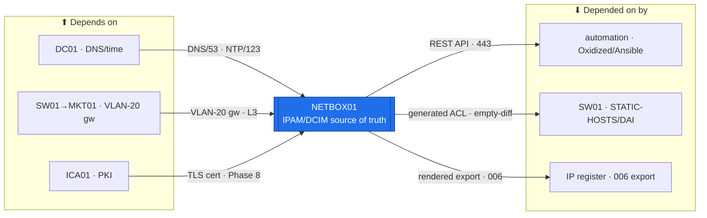

# NETBOX01 — Source of Truth (IPAM / DCIM)  ·  folder front-door

> **How to read this folder.** This README is the front door: *what this host is*, *what it connects to*, and *which document answers which question*. Start here, then follow the one link you need. Live status lives in exactly two places — **`Roadmap.md`** (the build path) and **`Build-Checklist.md`** (line-item, dated, evidence-backed). Nothing here duplicates them; it points to them. Addresses/decisions/flows are **linked, never restated** (`POL-0008`).

| Item | Value |
|---|---|
| Lab / Era | Lab-02 · Cisco-Core — ACTIVE (📋 service not built; net bring-up 🟡 reported reachable) |
| Host | **NETBOX01** · **Ubuntu Server 26.04 LTS** (clone of `TPL-UBUNTU2604`) · not domain-joined day one |
| Role | **The estate source of truth (IPAM / DCIM)** — NetBox **v4.6.5** (pinned) + PostgreSQL 16 + Redis 7 + gunicorn + nginx HTTPS; every downstream config renders **from** its API (`POL-0004`) |
| Placement | **PVE01 / R410 (spin-up tier)** per `ADR-0036` v1.2 — **KEPT on R410** this pass (operator 2026-07-30); not user-facing, nothing *running* breaks if it's down (only automation/rendering pauses). Sizing → **Backlog #20** |
| Silo | ⚪ Platform |
| Status | 📋 **service not built** — **Phase 4 (Source of truth)** per the build-order owner. See **`Roadmap.md`** |
| Governs / related | `ADR-0037` (doc standard — everything renders from here) · `POL-0004` (generate-don't-type) · `ADR-0048` (automation reads NetBox) · `ADR-0036` (placement) · `POL-0008` (one home per fact) · `POL-0001` (device is truth) |

## Role this era

NETBOX01 is the estate's **source of truth** — the one place a fact about the network *lives*, from which every downstream artifact is **generated, not hand-typed** (`POL-0004`). It answers *"what is the authoritative model of the estate?"* via **IPAM** (prefixes, VLANs, addresses) and **DCIM** (devices, interfaces, cables), exposed over a **REST API**. Automation reads that API to render configs; documentation exports render from it too.

- Addressing (owner = the IP plan — linked, not restated): `10.20.0.11`, **VLAN 20 (Servers)**, /26, gw `10.20.0.1`, DNS `10.20.0.2`, status 📋. **Why VLAN 20 not 10** → the IP plan's *"Management vs Servers"* note: it's a service reached by clients/automation, not a device management interface → `../../Architecture/IP-Addressing-Plan-VLSM.md`.
- It's the structural fix for Atlas's most-repeated defect class — the `006` hand-typed-and-wrong table; **Pi01 silently dropped from SW01's hand-typed `STATIC-HOSTS`/DAI ACL**. NetBox makes those a **rendered export**.

> 🔴 **"Source of truth" is aspirational until the empty-diff proof passes.** The load-bearing acceptance test is a **NetBox-*generated* SW01 `STATIC-HOSTS`/DAI ACL that diffs *empty* against the live device**. Until that diff is clean, NetBox is *documentation*, not a source of truth. (Also open: self-signed nginx cert → replace with ICA01 cert at **Phase 8**; LDAPS-to-AD auth is a later enhancement; sizing → **Backlog #20**.)

## Connections — what this host touches (the map)

**Depends on (upstream — must be healthy first):**
- **PVE01/R410 → SW01 (L2) → MKT01** (VLAN-20 gateway `10.20.0.1`) for reachability; **`TPL-UBUNTU2604`** golden image it's cloned from.
- **DC01** — DNS (`atlas.lab`) + time; **later** LDAPS-to-AD auth (an enhancement, not day one).
- **ICA01** — the TLS cert that replaces the self-signed nginx cert (**Phase 8**).

**Depended on by (downstream — these render FROM NetBox):**
- **Automation** — Oxidized/Ansible render device configs **from the NetBox API** (Phase 10, `ADR-0048`).
- **SW01** — its `STATIC-HOSTS`/DAI list becomes **generated** (fixes the "Pi01 silently dropped by hand-typed ACL" defect).
- **The IP register + the Lab-01-style `006` table** — become **rendered exports** (`POL-0004`).

**Services this host provides:** IPAM (prefixes/VLANs/addresses) · DCIM (devices/interfaces/cables) · a REST API automation reads · rendered config/documentation exports.

## Connections diagram

> Edges are the *dependency* direction. NetBox is read *by* automation over its API; automation initiates the pull (Phase 10).

## Services map — what runs here and how it's used

> 🆕 **Services map (Standard v1.7).** A multi-service `Roles/` host — one row per service. Status mirrors `Build-Record.md` (`POL-0001`) — 📋 service not built (net 🟡 reachable), so rows are ⬜.

| Service | Purpose | Consumed by · port | Depends on | Status |
|---|---|---|---|---|
| **NetBox** (IPAM/DCIM) | The estate source of truth — the model everything renders from | automation / docs · HTTPS/443 (API) | PostgreSQL + Redis | ⬜ service not built (net 🟡) |
| **PostgreSQL 16** | NetBox's database backend | NetBox (local) · 5432 | host up | ⬜ not built |
| **Redis 7** | NetBox cache / task queue | NetBox (local) · 6379 | host up | ⬜ not built |
| **REST API** (nginx HTTPS) | The config-render + doc-export source (`POL-0004`) | Oxidized / Ansible · HTTPS/443 | NetBox + nginx | ⬜ not built (self-signed → ICA01 Ph 8) |
| **Rendered exports** (SW01 DAI · `006`) | Generated ACLs / IP register — the empty-diff proof | SW01 · generated ACL | NetBox data loaded | ⬜ not built |

## Documents in this folder (what answers what)

**Roadmap & status**
- **`Roadmap.md`** — the per-service build path (host → PostgreSQL → Redis → NetBox/gunicorn/nginx → data load → cert → auth → automation) + connections, cert alignment, gated futures. *Start here for "what's next and why."*
- **`Build-Checklist.md`** *(existing, v1.1)* — the line-item build checklist; the executable companion. *Authoritative action list.*

**Build (existing guides — referenced, not re-created here)**
- **`Networking-Build-Guide.md`** *(existing)* — the network bring-up (VLAN 20, `10.20.0.11`), reported reachable 2026-07-24.
- **`Build-Guide.md`** *(existing)* — the native NetBox service install (Postgres/Redis/gunicorn/nginx).
- **`NetBox-Data-Load-Prep.md`** *(existing)* — import-ready seed data from the IP plan + cabling map.

**Roles (multi-service host — one build unit per service, `Roles/` pattern)**
- `Roles/NetBox/` · `Roles/PostgreSQL/` · `Roles/Redis/` — each its own `Build-Checklist.md`. See `Roles/README.md`.

**Automation (`ADR-0048`)**
- `Automation/` — the device's automation slice: NetBox *is what* automation reads; planned Ansible stack deploy + config-render-from-NetBox how-tos.

**Verify & fix**
- `Diagnostics.md` — the read-only "is it built + does it serve?" battery (links up into Academy `Command-Library/Linux`).
- `Troubleshooting.md` — symptom → cause → fix.
- `Build-Record.md` — the **verified as-built state** (records outrank guides, `POL-0001`; mostly ⬜/🟡 until built).
- `Considerations.md` — the open gates/risks/decisions on this host (OS-drift reconcile, the empty-diff proof, cert, auth, sizing, the Phase-3-vs-4 doc discrepancy).
- `Changes/` — the `CM-####` change ledger.

## Single source
- Estate index (all devices + status): `../../Service-Server-Build-Plan.md`. Addressing: `../../Architecture/IP-Addressing-Plan-VLSM.md` (`POL-0008`). Decisions: `00-Atlas-Foundation/Decisions/ADR-Index.md`. East-west flows: `../../Architecture/Atlas-East-West-Allowed-Flows-Matrix.md`. Build order: `../../Operations/Build-Order-and-Dependencies.md` (owner: NETBOX01 = **Phase 4**).
