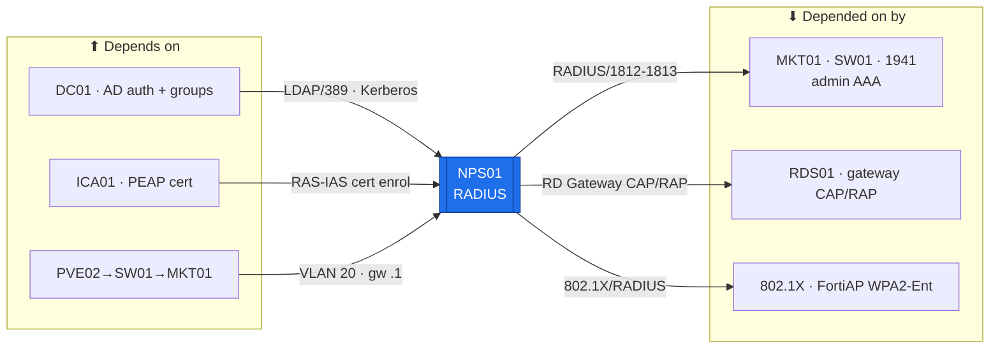

# NPS01 — Network Policy Server (RADIUS)  ·  folder front-door

> **How to read this folder.** This README is the front door: *what this host is*, *what it connects to*, and *which document answers which question*. Start here, then follow the one link you need. Live status lives in exactly two places — **`Roadmap.md`** (the build path) and **`Build-Checklist.md`** (line-item, dated, evidence-backed). Nothing here duplicates them; it points to them.

| Item | Value |
|---|---|
| Lab / Era | Lab-02 · Cisco-Core — ACTIVE (📋 not built) |
| Host · Role | **NPS01** (Windows Server 2025, Desktop Experience) · **RADIUS** — network-device admin AAA vs AD (`ADR-0029`) |
| Placement | **PVE02/EQR6** (always-on core, `ADR-0036` v1.2) · VLAN 20 (Servers) · **`10.20.0.12`** *(proposed — IP plan owns)* · gw `10.20.0.1` · `OU=Servers,OU=Devices` |
| Silo | 🔴 Security (authentication) |
| Status | 📋 **not built** — domain-join → NPS role → RADIUS clients → policies → server cert. See **`Roadmap.md`** |
| Governs / related | `ADR-0029` (drop FreeRADIUS → NPS; **D7: dedicated member server, not the DC**) · `ADR-0004` (base NPS decision) · `ADR-0021` (tiered identity) · `ADR-0027` (ICA01 = the server-cert source) · `ADR-0028` (FGT01 uses LDAPS, **not** this RADIUS) |

## Role this era

NPS01 is the estate's **RADIUS** server — it authenticates **admin logins to the network devices that can't join the domain** (MKT01, SW01, 1941). Each device is a RADIUS **client/NAS**: an operator logs in, the device forwards the credential to NPS01, and NPS01 validates it against **AD** and returns the admin privilege level **by AD group membership**. It is **authentication, not PKI** — the CAs (RCA01 offline root + ICA01 issuing) are a separate role in `Devices/RCA01-ICA01-ADCS/`; NPS01 only *consumes* a server cert from ICA01 (for PEAP).

- **In scope:** admin AAA (RADIUS) for MKT01 / SW01 / 1941; later 802.1X + the RDS01 Gateway CAP/RAP + WPA2-Enterprise wireless (K6).
- **Out of scope:** FGT01 (**direct LDAPS**, `ADR-0028`); certificate issuance (ICA01); DHCP/DNS/NTP (other hosts).

> 🔵 **Why a member server, not on the DC (`ADR-0029` D7).** Microsoft's perf guidance says put NPS on a DC; we deliberately don't — NPS holds the network devices' RADIUS shared secrets and gates admin access to the core, so keeping it off the DC preserves role separation and shrinks the DC's blast radius (the same rule the CAs follow, `ADR-0027`). Lab-scale perf cost is nil.

> 🔴 **Break-glass / availability.** Network-device admin auth now depends on **NPS01 (RADIUS) *and* the DC (AD)** both being reachable — a two-host chain. Every network device MUST keep its **local break-glass admin** so a NPS/DC outage never locks you out. A 2nd NPS + DC is the later fault-tolerance fix (Microsoft recommends ≥2 NPS).

## Connections — what this host touches (the map)

**Depends on (upstream — must be healthy first):**
- **PVE02/EQR6** (the VM runs here; VLAN-20 tag) → **SW01** → **MKT01** (VLAN-20 gateway `10.20.0.1`) for reachability.
- **DC01** — AD is what NPS validates credentials against + reads group membership from; NPS registers into the **RAS and IAS Servers** group.
- **ICA01** (AD CS) — issues NPS01's **RAS-and-IAS-Server** cert (for **PEAP/EAP-TLS**; password RADIUS works without it). *Gated on the AD CS ceremony.*
- Addressing: `../../Architecture/IP-Addressing-Plan-VLSM.md` → NetBox (`POL-0008`).

**Depended on by (downstream — these lose admin auth if NPS01 is down):**
- **MKT01 · SW01 · 1941** — network-device admin login (RADIUS) → falls back to **local break-glass** if NPS/DC are down.
- **RDS01** (later) — RD Gateway CAP/RAP via NPS.
- **802.1X supplicants** + **FortiAP WPA2-Enterprise** (later, K6) — wired/wireless auth vs RADIUS.

**Services this host provides:** RADIUS (auth/authorization/accounting) for network-device admin, RD Gateway policy, and 802.1X.

## Connections diagram

> 🔴 Two-host auth chain: a login needs **NPS01 + DC** both up → keep local break-glass on every RADIUS client. (FGT01 is **not** here — it uses LDAPS, `ADR-0028`.)

## Services map — what runs here and how it's used

> 🆕 **Services map (Standard v1.7).** What NPS01 runs + how each policy is consumed. Status mirrors `Build-Record.md` (`POL-0001`) — the host is 📋 not built, so every row is ⬜/📋.

| Service | Purpose | Consumed by · port | Depends on | Status |
|---|---|---|---|---|
| **RADIUS admin AAA** | Network-device admin login vs AD; privilege by AD group; deny-by-default | MKT01 · SW01 · 1941 · UDP 1812/1813 | DC (AD) + NPS role | ⬜ not built |
| **RD Gateway policy** (CAP/RAP) | Authorize RDS01 gateway connections | RDS01 · RADIUS | RDS01 (later) | ⬜ not built |
| **802.1X / WPA2-Enterprise** (K6) | Wired/wireless port auth vs RADIUS (PEAP server cert from ICA01) | 802.1X supplicants · FortiAP · RADIUS | switch/AP config + ICA01 PEAP cert | 📋 later (K6) |

## Documents in this folder (what answers what)

- **`Roadmap.md`** — the build path + connections + cert alignment + future phases. *Start here for "what's next and why."*
- **`Build-Checklist.md`** — the line-item, dated, evidence-backed status (`POL-0001`). *The authoritative status.*
- **`Build-Guide.md`** — the phased, gated rebuild contract (`ADR-0043`): domain-join → NPS role → clients → policies → cert → hardening.
- **`Considerations.md`** — open risks & decisions (the two-host-chain availability, the proposed IP, the LAPS test).
- **`Build-Record.md`** — the verified as-built state (records outrank guides, `POL-0001`; ⬜ until built).
- **`Diagnostics.md`** — the read-only "is it built + does a real login work?" battery (links up to Academy `Command-Library/PowerShell-Tier0`).
- **`Troubleshooting.md`** — symptom → cause → fix.
- **`Automation/`** — the `ADR-0048` automation slice (DSC/PowerShell to install+configure NPS; policy-as-code), after the manual first pass.
- **`Changes/`** — the `CM-####` ledger.

## Single source
- Estate index: `../../Service-Server-Build-Plan.md`. Role/silo: `../../Architecture/Lab-02-Device-Role-Assignments.md`. Addressing: `../../Architecture/IP-Addressing-Plan-VLSM.md`. RADIUS flow: `../../Architecture/Atlas-East-West-Allowed-Flows-Matrix.md` (flow #14). Break-glass: `../../Operations/Device-Hardening-Standard.md`.
