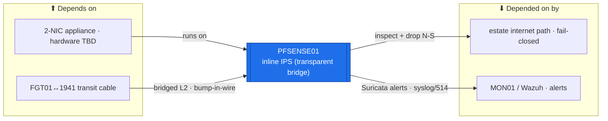

# PFSENSE01 — Inline IPS (transparent bridge, N-S)  ·  folder front-door

> **How to read this folder.** Front door for the estate's **north-south inline intrusion-prevention** device: what it is, what it connects to, which document answers which question. **Networking/security variant** — foregrounds the transparent-bridge data path / Suricata inline mode / fail-closed + break-glass, not the server template. This is a **new device** (`ADR-0038` v1.2): the design is **fully decided**; the **hardware is to acquire** — so everything here is 📋 proposed / ⬜ not built. Live status: **`Roadmap.md`** + **`Build-Checklist.md`**.

| Item | Value |
|---|---|
| Lab / Era | Lab-02 · Cisco-Core — ACTIVE (📋 PROPOSED — not built; hardware to acquire) |
| Host · Role | **PFSENSE01** (pfSense + **Suricata** inline IPS) · **the north-south inline intrusion-prevention layer** — a **transparent bridge** on the FGT01↔1941 transit; **defence-in-depth behind FGT01 UTM** (`ADR-0038` v1.2) |
| Placement / reach | 🔴 **Physical low-power 2-NIC appliance** bridging the FGT01↔1941 /30 transit cable (bump-in-the-wire; **no data-plane IP**, no routing/OSPF). Managed on a **mgmt IP 📋 proposed VLAN 10** |
| Silo | 🔴 Security (N-S prevention) |
| Status | **📋 PROPOSED — not built · gated stub** (`ADR-0038`; hardware pending). **Phase 7** (with the E-W segmentation). See **`Roadmap.md`** |
| Governs / related | `ADR-0038` v1.2 (this device: transparent inline IPS · physical 2-NIC · **fail-closed** · monitor-first · Suricata) · `ADR-0047` (FGT01 UTM it complements) · `ADR-0035` (the gap it originally filled) · `ADR-0023` (topology) · `ADR-0032` (Suricata detection architecture) · Section K **K7** (IPS tuning) · **K8** (Suricata↔Wazuh correlation) |

## Role this era

PFSENSE01 is the estate's **north-south inline intrusion-prevention** layer (`ADR-0038`) — **pfSense running Suricata in inline IPS mode** on a **transparent bridge** across the **FGT01↔1941 transit**. It sits at the single N-S choke point (all internet-bound traffic crosses FGT↔1941) and can **drop** — the *prevention* half the passive Suricata-on-SPAN (MON01) can't do. It is **defence-in-depth behind FGT01's licensed UTM** (`ADR-0047`), *not* the sole dropper, and it doubles as the **free-vs-licensed IPS comparison** for the FCP/NSE track. Division of labor: **FGT01 UTM = licensed N-S content inspection · PFSENSE01 = free/complementary inline IPS on the transit · MKT01 = E-W prevention · MON01 Suricata = network detection · Wazuh = host detection.**

> 🔴 **Transparent bridge = bump-in-the-wire.** PFSENSE01 bridges the transit at **L2** — it takes **no IP in the routed path**, runs **no OSPF**, and changes **no topology**. The 1941 core routing + the FGT↔1941 adjacency are untouched. Only a **management IP** exists (VLAN 10).
> 🔴 **Fail-CLOSED (`ADR-0038` v1.2, operator).** If PFSENSE01 fails, the bridge **blocks** — the estate loses internet until it recovers. The **required break-glass** is a documented **manual transit-bypass**: re-cable the FGT01↔1941 transit **directly** to restore internet fast. Blocking is rolled out **monitor-only first**, then per-category after tuning (`ADR-0041`).

## Connections — what this host touches (the map)

**Depends on (upstream — must be healthy first):**
- 🔴 **The physical 2-NIC appliance** (hardware to acquire) + the **FGT01↔1941 transit cable** it bridges (must exist — Phase 2).
- **DC/NTP + DNS** — for the management plane (VLAN 10). **ICA01** — optional mgmt TLS.
- **Suricata rule sources** — reuse MON01's rule sets + tuning.

**Depended on by (downstream — these are affected if PFSENSE01 is down):**
- 🔴 **The estate's internet path** — under **fail-closed**, PFSENSE01 is *in* the critical path; a fault cuts egress until the manual bypass. (The accepted tradeoff of fail-closed.)
- **N-S prevention (defence-in-depth)** — drops known-bad on the transit, behind FGT01 UTM.
- **MON01 / SIEM01-Wazuh** — PFSENSE01's Suricata **alerts ship there** (one detection pane; Section K **K8** correlation).

**Services this host provides:** transparent-bridge inline IPS (Suricata) on the N-S transit · alert export → MON01/Wazuh · (mgmt-plane only) SSH/GUI on VLAN 10.

## Connections diagram

> The data path is an L2 bridge across the transit (no IP, no OSPF). Under fail-closed, a PFSENSE01 fault blocks the path → the manual transit-bypass break-glass restores internet.

## Services map — what runs here and how it's used

> 🆕 **Services map (Standard v1.7), networking/security variant.** A bump-in-the-wire IPS "provides" its inline drop + alert export; the data-plane row has **no IP** (transparent bridge). Everything is ⬜/📋 — the device is decided-but-not-built (`POL-0001`).

| Service | Purpose | Consumed by · port/interface | Depends on | Status |
|---|---|---|---|---|
| **Transparent-bridge inline IPS** (Suricata) | Drop known-bad N-S on the FGT01↔1941 transit — defence-in-depth behind FGT UTM | estate internet path · L2 bridge (no IP) | 2-NIC appliance + transit cable | ⬜ not built (Phase 7) |
| **Alert export → MON01 / Wazuh** | Ship Suricata alerts to the one detection pane (K8 correlation) | MON01 / SIEM01-Wazuh · syslog/514 | Suricata up; MON01 up | ⬜ not built |
| **Management plane** (SSH / GUI) | Management only — VLAN 10, off the data path | admins / PAW · mgmt IP VLAN 10 | mgmt IP (📋 IP plan) | 📋 proposed |

## Documents in this folder (what answers what)
- **`Roadmap.md`** — the gated build path (acquire hardware → bridge the transit → Suricata monitor-only → tune → enable blocking per category) + cert alignment. *Start here.*
- **`Build-Checklist.md`** — line-item, all ⬜; opens on the "not built — hardware pending" gate.
- **`Build-Guide.md`** — the designed gated stub (`ADR-0043`): the phased path + the transparent-bridge / fail-closed / monitor-first specifics; click-steps when the hardware lands.
- **`Considerations.md`** — the decided design + open risks (the fail-closed tradeoff + break-glass; single-path; tuning; correlation).
- **`Build-Record.md`** — the as-built state (⬜ until built).
- **`Diagnostics.md`** — the 📋 verify battery (bridge up · Suricata mode/alerts · fail-closed behaviour · bypass test).
- **`Troubleshooting.md`** — inline-IPS symptoms → fixes (false-positive drops · bridge/MTU · fail-closed outage → bypass).
- **`Automation/`** — the `ADR-0048` slice: config-backup + Suricata-rules-as-code; **not** DSC.
- **`Changes/`** — the `CM-####` ledger.

## Single source
- Decision: `00-Atlas-Foundation/Decisions/ADR-0038-pfSense-Inline-IPS-North-South.md` (v1.2). Firewall architecture / inspection division of labor: `00-Atlas-Foundation/Atlas-Firewall-Architecture.md` + `ADR-0047`. Estate index: `../../Service-Server-Build-Plan.md`. Addressing (mgmt IP): `../../Architecture/IP-Addressing-Plan-VLSM.md`. Build order: `../../Operations/Build-Order-and-Dependencies.md` (Phase 7). Detection correlation: `../MON01-Monitoring/` + `../SIEM01-Wazuh/`. Cert map: `Atlas-Academy/Atlas-FortiGate-FCP-Lab-Map.md`.
