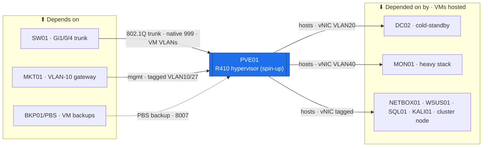

# PVE01 — Hypervisor (Dell R410 · spin-up heavy tier)  ·  folder front-door

> **How to read this folder.** Front door for the estate's **first Proxmox hypervisor**: what it is, what it connects to, which VMs it hosts, and which document answers which question. This is the **hypervisor variant** of the page-set — it foregrounds the host (bridge/VLAN/storage/auth) + the **VMs it runs**, and it **points to the existing device-verified Virtualization records** rather than restating them (`POL-0008`, `ADR-0034`). Deep truth lives in `../../Virtualization/`.

| Item | Value |
|---|---|
| Lab / Era | Lab-02 · Cisco-Core — ACTIVE (host networking ✅ device-verified 2026-07-24) |
| Host · Role | **PVE01** (Dell PowerEdge R410 · Proxmox VE 8.4.19, Debian 12, kernel 6.8.12-32-pve) · **the spin-up heavy-compute hypervisor** — powered on for heavy labs, the HA-cluster exercise, DC02 replication windows (`ADR-0036` v1.2) |
| Placement / reach | Physical rack device · **standalone, not domain-joined** (`pve01.lab`, mgmt plane). Managed on **tagged `vmbr0.10` = `10.10.0.10/27`** (VLAN 10), GUI/API `https://10.10.0.10:8006`, SSH. Uplink `eno1` → **SW01 `Gi1/0/4`** (trunk, native 999) |
| Tier (uptime) | 🔴 **Spin-up / mostly-off heavy tier** (`ADR-0036` v1.2) — the always-on critical tier lives on **PVE02/EQR6**. Nothing always-on may depend on a VM hosted here |
| Silo | 🟣 Virtualization (compute) |
| Status | **Host networking ✅ device-verified** (07-24) · platform (16 logical CPUs, VT-x/KVM, storage) ✅ (07-16) · 🔴 open gaps: `CM-0011` iDRAC shared-LOM + factory creds · `CM-0012` CMOS/RTC dead · no VM backups yet. See **`Roadmap.md`** + `../../Virtualization/Build-Records/` |
| Governs / related | `ADR-0036` (compute topology / tier-by-uptime) · `ADR-0034` (PVE01-networking has one home — the Virtualization Build-Record) · `ADR-0001` (parallel PVE01 work) · `ADR-0020` (time / RTC) · `ADR-0017` (defer CMOS) · `ADR-0046` (on-demand failover cluster) · `ADR-0048` (automation) |

## Role this era

PVE01 is the estate's **original Proxmox hypervisor** — a Dell R410 that has carried every Atlas VM to date. Under the revised compute topology (`ADR-0036` v1.2) it is **re-tiered to the spin-up heavy-compute host**: loud and power-hungry, so it stays **mostly off** and is powered on for the heavy monitoring/matrix stack, big-RAM labs, the `ADR-0046` failover-cluster/S2D exercise, and **DC02** cold-standby replication windows. The quiet, low-power **EQR6 (PVE02)** is the always-on critical tier. Two standalone hosts, **no Proxmox cluster** (`ADR-0036` — quorum fragility + the R410 is mostly off); VMs move by backup-restore or `qm remote-migrate`.

The host's **networking is device-verified** (tagged `vmbr0.10` `/27`, native 999, `bridge-vids 10–90,999`); the authoritative record is **`../../Virtualization/Build-Records/PVE01-Networking.md`** (`ADR-0034`) — this folder is the **front door to it**, not a second copy.

> 🔴 **The one rule that keeps PVE01 correct (`ADR-0034`, `POL-0008`):** PVE01's networking has **one authoritative home** — the Virtualization Build-Record. This device folder **links** to it; it never restates the interface/bridge/VLAN config. Editing PVE01 networking here would recreate the three-competing-homes problem `ADR-0034` closed.

## Connections — what this host touches (the map)

**Depends on (upstream — must be healthy first):**
- **SW01** — the **`Gi1/0/4` 802.1Q trunk** (native VLAN **999**, allowed 10–90,999) delivers host management (tagged VLAN 10) + every VM VLAN. The switch side is owned by the **SW01 page-set** (`../SW01-Access-Switch/`), not here.
- **MKT01** — the **VLAN-10 gateway `10.10.0.1`** for host management reachability.
- **Power + physical console + cabling** (`../../Architecture/Cabling-and-Port-Map.md`). 🔴 **The physical console is the real bootstrap** — iDRAC is shared-LOM (below), not out-of-band. Later: an **NTP source** (`ADR-0020`) + **BKP01/PBS** (VM backups, once built).

**Depended on by (downstream — these VMs stop if PVE01 is powered off):**
- **The spin-up heavy tier it hosts** (`ADR-0036` v1.2): **DC02** (cold-standby replica), **MON01 heavy stack** (LibreNMS/NetFlow/Suricata/Grafana), **NETBOX01**, **WSUS01**, **SQL01**, **KALI01**, the **`ADR-0046` failover-cluster node + S2D**, and big-RAM lab VMs. The **Windows-container slice** of CNT01. *(Roster + placement owned by `../../Service-Server-Build-Plan.md`; see the Services map below.)*
- 🟡 **Currently physically resident** pending the `221` migration: **DC01** (VMID 101), the build archive (100), the templates `TPL-WIN2025` (9000) + `TPL-UBUNTU2604`. DC01's **target host is PVE02/EQR6** (`ADR-0036` v1.2) — it moves off the R410 in the `221` bring-up (no `CM-0012` CMOS risk for the time authority).

**Services this host provides:** KVM/QEMU virtualization (VT-x) · a VLAN-aware `vmbr0` bridge trunking VM VLANs 10–90,999 · `local` + `local-lvm` datastores · the Proxmox web GUI/API (`:8006`) · SSH management plane.

## Connections diagram

> Hypervisor variant (Standard v1.7): the VMs it runs are shown **downstream** (it hosts them). Backup edge is dashed — planned (PBS unbuilt). VLAN tags/addresses are owned by `../../Architecture/IP-Addressing-Plan-VLSM.md`; nodes keep role labels.

## Services map — the VMs this host runs (`POL-0001`: Status = placed/verified, not merely planned)

> A hypervisor's "services" are the **VMs it hosts**. Placement + sizing are owned by **`../../Service-Server-Build-Plan.md`** (the #20 authority) — this table **links** to it, does not restate the roster. Each VM's own build state lives in its `Devices/` folder.

| VM (guest) | Purpose | Tier | vNIC VLAN | Device folder | Status |
|---|---|---|---|---|---|
| **DC02** | Replica DC/GC/DNS (cold-standby; DHCP failover later) | spin-up | 20 (T0) | `../DC-Domain-Controllers/` | 🟡 promoted, read-back pending |
| **MON01** (heavy stack) | LibreNMS · NetFlow · Suricata IDS · Grafana | spin-up | 40 | `../MON01-Monitoring/` | 📋 not built (split placement) |
| **NETBOX01** | IPAM/DCIM source of truth | spin-up | 20 | `../NETBOX01-Source-of-Truth/` | 📋 net up; service unbuilt |
| **WSUS01** | Windows Update Services | spin-up | 20 | `../WSUS01-Patch-Management/` | 📋 not built |
| **SQL01** | SQL Server (AG replica) | spin-up | 20 | `../SQL01-Database/` | 📋 not built |
| **KALI01** | Offensive / validation host | spin-up | 70 | `../KALI01/` | 📋 not built |
| **Failover-cluster node + S2D** | The `ADR-0046` on-demand HA lab (2nd node) | on-demand | 20 | `../DC-Domain-Controllers/` (SQLN pair, `ADR-0046`) | 📋 gated stub |
| **CNT01** (Windows-container slice) | Windows Server containers half of the hybrid host | spin-up | 20 | `../CNT01-Container-Host/` | 📋 gated stub |
| **DC01** *(currently resident → moves to PVE02)* | AD DS/DNS/DHCP/PDCe — **target host EQR6** (`221`) | *(always-on → EQR6)* | 20 (T0) | `../DC-Domain-Controllers/` | 🟡 on R410 pending `221` migration |
| `TPL-WIN2025` (9000) · `TPL-UBUNTU2604` · build-archive (100) | Golden-image templates + archive | — | — | `../../Virtualization/Build-Records/216-Windows-Golden-Image-Historical-Record.md` | ✅ present (07-16) |

## Documents in this folder (what answers what)

**Config path & status**
- **`Roadmap.md`** — the host build path (base → network → storage → auth → backups → automation) as stages, Needs/Unblocks + cert alignment. *Start here.*

**Build (the how — deep home in the Virtualization book, referenced)**
- **`Build-Guide.md`** — a **thin pointer** to the existing procedure: `../../Virtualization/Build-Guides/201`–`214` (R410 prep → Proxmox → networking → storage → auth → Windows VM/template/DC01) + `204-Proxmox-Networking` + the authoritative `PVE01-Networking` record. 🔴 The `2xx` guides are **R410-era carry-over** flagged for the **#22** audit — treat as historical procedure, not current truth.

**Verify & fix**
- **`Diagnostics.md`** — a pointer to the device-verified **`../../Virtualization/Build-Records/PVE01-Diagnostics.md`** (`ADR-0032`; the `pveversion`/`ip -br a`/`bridge vlan show`/`pvesm status` battery, ✅ where read back).
- **`Build-Record.md`** — the as-built **summary** pointing to the four Virtualization Build-Records (Networking · Current-State/`215` · **Storage** · **Authentication**). Records outrank guides (`POL-0001`).
- **`Considerations.md`** — open risks & decisions living on this host (iDRAC shared-LOM + factory creds, CMOS/RTC, no-backups, spin-up-tier dependency rule, standalone-no-cluster, GUI-shell broken).
- **`Automation/`** — the `ADR-0048` slice: Terraform (Proxmox provider) + Ansible; the `221` migration is the IaC exercise.
- **`Changes/`** — the `CM-####` ledger (`CM-0011`/`CM-0012` live here).

## Single source (facts owned elsewhere — link, never restate)
- **Networking (authoritative):** `../../Virtualization/Build-Records/PVE01-Networking.md` (`ADR-0034`). Procedure: `../../Virtualization/Build-Guides/204-Proxmox-Networking.md`.
- **Placement + VM sizing:** `../../Service-Server-Build-Plan.md` (#20 authority). Addressing (mgmt `10.10.0.10/27`, VLAN-10 static map): `../../Architecture/IP-Addressing-Plan-VLSM.md` → NetBox.
- **Cabling / ports:** `../../Architecture/Cabling-and-Port-Map.md`. Migration companion: `../../Virtualization/Build-Guides/221-PVE02-EQR6-Bring-Up-and-VM-Migration.md`. Decisions: `00-Atlas-Foundation/Decisions/ADR-Index.md`. Pack index: `../../Virtualization/VIRTUALIZATION-PACK-MANIFEST.md`.
