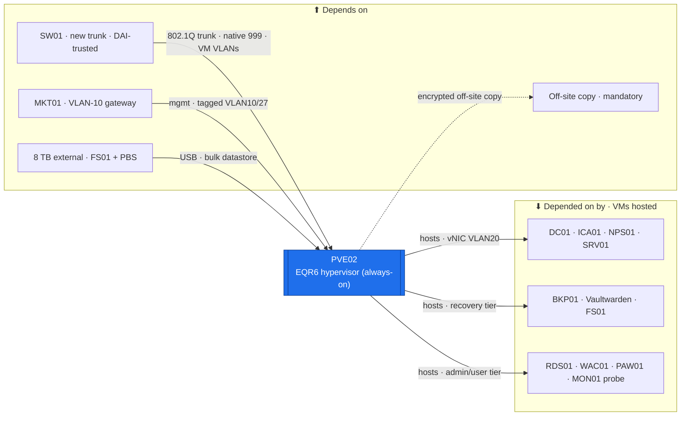

# PVE02 — Hypervisor (Beelink EQR6 · always-on critical tier)  ·  folder front-door

> **How to read this folder.** Front door for the estate's **second Proxmox hypervisor** — the low-power always-on host: what it is, what it will connect to, which VMs it will run, and which document answers which question. 🔴 **PVE02 is acquired but NOT stood up — everything here is target-state (`📋`/`⬜`).** Nothing is `✅` without a device read-back (`POL-0001`). Its bring-up **procedure** is the `221` runbook (below); this folder is its **home page**.

| Item | Value |
|---|---|
| Lab / Era | Lab-02 · Cisco-Core — ACTIVE (📋 **acquired, not stood up**) |
| Host · Role | **PVE02** (Beelink **EQR6** — Ryzen 9 6900HX 8C/16T · target Proxmox VE 8.x) · **the low-power always-on critical-tier hypervisor** (`ADR-0036` v1.2) |
| Placement / reach | Physical mini-PC · **standalone, not domain-joined** (`pve02.lab`, mgmt plane). Target mgmt **tagged `vmbr0.10` = `10.10.0.11/27`** (VLAN 10, 📋 proposed — IP plan owns), GUI/API `https://10.10.0.11:8006`, SSH. Uplink → a **new SW01 trunk port** (native 999, DAI-trusted — mirror `Gi1/0/4`) |
| Tier (uptime) | ⭐ **Always-on critical tier** (`ADR-0036` v1.2) — quiet, low-power, Wake-on-LAN, 24/7. Runs everything that must never be down + bulk storage |
| Status | 📋 **Target-state — all planned.** 🔴 **64 GB RAM is a hard prerequisite** before it carries the always-on stack (ships 32 GB). Bring-up = the `221` runbook. See **`Roadmap.md`** |
| Governs / related | `ADR-0036` (compute topology / tier-by-uptime — the always-on/spin-up split) · `ADR-0034` (mirror PVE01's networking model) · `ADR-0046` (standalone; cluster on-demand only) · `ADR-0020` (time — why the DC leads) · `ADR-0009`/`ADR-0013` (off-site backup independence) · `ADR-0011`/`POL-0005` (restore = the Game Day) · `ADR-0048` (automation) |

## Role this era

PVE02 is the estate's **always-on critical-tier hypervisor** (`ADR-0036` v1.2). The Beelink **EQR6** is quiet, low-power, and has **Wake-on-LAN + Auto-Power-On**, so it stays on 24/7 and hosts everything that must never be down: **DC01, ICA01, NPS01, SRV01, Vaultwarden, BKP01, FS01**, the **MON01 light probe**, plus **RDS01, WAC01, PAW01** (the #20 RAM budget confirms 64 GB holds the full ~44 GB always-on set). The **8 TB external** attached here serves **FS01 shares + the BKP01 datastore**. The loud R410 (**PVE01**) becomes the mostly-off spin-up tier.

The host is **not built yet**. Its bring-up + the migration of the always-on tier off the R410 is the **`221` runbook** (`../../Virtualization/Build-Guides/221-PVE02-EQR6-Bring-Up-and-VM-Migration.md`) — this folder is its front door; the clean device-verified Build-Guides/Records get written **during the fresh install** (`#21` — "document everything").

> 🔴 **The prerequisite that gates everything (`ADR-0036`):** the EQR6 ships with **32 GB**; the always-on stack (~44 GB) **overruns it**. **64 GB (2× 32 GB DDR5-4800 SODIMM) must be installed before PVE02 carries the always-on tier** — it is a prerequisite, not a nicety. Confirm every spec on the live unit at Proxmox install (`POL-0001`) — the product sheet is the plan, the device is the truth.

## Connections — what this host touches (the map)

**Depends on (upstream — must be healthy first, once built):**
- **SW01** — a **new trunk port** (native VLAN **999**, allowed 10–90,999, **DAI-trusted** — mirror `Gi1/0/4`) delivers host management (tagged VLAN 10) + every VM VLAN. 🔴 The switch side is owned by the **SW01 page-set** (`../SW01-Access-Switch/`) — add PVE02's port there, don't duplicate.
- **MKT01** — the **VLAN-10 gateway `10.10.0.1`** for host management reachability.
- **8 TB external drive** — bulk storage for **FS01 shares + the BKP01 (PBS) datastore** (`ADR-0036` v1.2).
- **Off-site backup target** (`ADR-0009`/`ADR-0013`) — 🔴 **mandatory**: because BKP01's datastore is local to this host, the encrypted off-site copy is the real recovery guarantee.
- **Power + HDMI/keyboard console** — 🔴 **no iDRAC** (unlike the R410): the console is HDMI+keyboard at the unit. **WoL + Auto-Power-On** give partial remote power control, but there is **no remote console**.

**Depended on by (downstream — the always-on VMs it will run):**
- **DC01** (AD/DNS/DHCP/PDCe), **ICA01** (issuing CA), **NPS01** (RADIUS), **SRV01** (CRL/AIA), **Vaultwarden** (on BKP01), **BKP01** (PBS), **FS01** (SMB/DFS on the 8 TB), **MON01 light probe** (Uptime-Kuma), **RDS01**, **WAC01**, **PAW01** (🟡 RAM-swing), the **CNT01 Linux git/CI slice**. *(Roster + placement owned by `../../Service-Server-Build-Plan.md`; see the Services map below.)*
- 🔴 **The whole estate's identity + PKI + secrets** effectively depend on this host once the always-on tier lands here — which is exactly why the **off-site backup** (principle 2) is non-negotiable.

**Services this host provides (target):** KVM/QEMU virtualization · a VLAN-aware `vmbr0` bridge trunking VM VLANs 10–90,999 · `local`/`local-lvm` + the 8 TB datastore (PBS + FS01) · the Proxmox web GUI/API (`:8006`) · SSH management plane.

## Connections diagram

> Hypervisor variant (Standard v1.7): VMs shown **downstream**. The off-site edge is dashed + mandatory (the datastore is local, `ADR-0009`). Everything here is target-state until PVE02 is stood up.

## Services map — the VMs this host will run (`POL-0001`: all 📋 target-state)

> A hypervisor's "services" are the **VMs it hosts**. Placement + sizing (incl. the 64 GB RAM budget) are owned by **`../../Service-Server-Build-Plan.md`** (the #20 authority) — this table **links** to it, does not restate. Each VM's build state lives in its own `Devices/` folder.

| VM (guest) | Purpose | Planned RAM | vNIC VLAN | Device folder | Status |
|---|---|---:|---|---|---|
| **DC01** | AD DS · AD-DNS · DHCP · PDCe/NTP authority | 6 GB | 20 (T0) | `../DC-Domain-Controllers/` | 🟡 on R410 → moves here (`221`) |
| **ICA01** | AD CS enterprise issuing CA (+OCSP/KRA) | 4 GB | 20 (T0) | `../RCA01-ICA01-ADCS/` | 📋 CA install next |
| **NPS01** | Windows NPS (RADIUS) for MKT01/SW01/1941 | 3 GB | 20 | `../NPS01-Network-Policy-Server/` | 📋 not built |
| **SRV01** | nginx CRL/AIA · Oxidized · rsyslog · TFTP/SFTP | 2 GB | 20 | `../SRV01-Network-Services/` | 📋 guide authored |
| **BKP01** | Proxmox Backup Server (datastore on the 8 TB) + **Vaultwarden** | 5 GB | 20 | `../BKP01-Backup/` | 📋 not built |
| **Vaultwarden** | secrets vault (rides BKP01; AD CS cert; `ADR-0009`) | (in BKP01) | 20 | `../BKP01-Backup/Roles/Vaultwarden/` | 📋 relocation |
| **FS01** | SMB shares · DFS/DFSR · FSRM · VSS (data on the 8 TB) | 4 GB | 20 | `../FS01-File-Services/` | 📋 not built |
| **MON01** (light probe) | Uptime-Kuma + minimal syslog (watch the always-on tier) | 2 GB | 40 | `../MON01-Monitoring/` | 📋 split placement |
| **RDS01** | RD Session Host/Gateway (NPS01 CAP/RAP, ICA01 TLS) | 6 GB | 20 | `../RDS01-Remote-Desktop/` | 📋 not built |
| **WAC01** | Windows Admin Center gateway (Tier-0 mgmt surface) | 4 GB | 10 (mgmt) | `../WAC01-Windows-Admin-Center/` | 📋 not built |
| **PAW01** | Tier-0 admin workstation (RSAT) | 4 GB | 10 (mgmt) | `../PAW01-Tier0-Admin/` | 📋 🟡 RAM-swing |
| **CNT01** (Linux git/CI slice) | estate self-hosted git/CI (Gitea + runner) | ~4 GB | 20 | `../CNT01-Container-Host/` | 📋 gated (#19) |
| **Full always-on subtotal** | — | **~44 GB** | — | (64 GB holds it, ~20 GB headroom) | `../../Service-Server-Build-Plan.md` |

## Documents in this folder (what answers what)

**Config path & status**
- **`Roadmap.md`** — the host build path (prereqs → install → network → storage → auth → PBS → migrate → automation) as gated stages, Needs/Unblocks + cert alignment. *Start here.*

**Build (the how — the `221` runbook is the home procedure)**
- **`Build-Guide.md`** — a pointer to the **`221` bring-up + migration runbook** (`../../Virtualization/Build-Guides/221-PVE02-EQR6-Bring-Up-and-VM-Migration.md`) — the phased/gated target-state procedure; and the PVE01 networking model it mirrors (`../../Virtualization/Build-Records/PVE01-Networking.md`, `ADR-0034`). Clean device-verified PVE02 records come from the fresh install.

**Verify & fix**
- **`Diagnostics.md`** — 📋 the show/verify battery (mirrors PVE01's; populated at build).
- **`Build-Record.md`** — ⬜ the verified as-built state (empty until stood up; records outrank guides, `POL-0001`).
- **`Considerations.md`** — open risks & decisions (64 GB prereq, single-8 TB SPOF + off-site copy, no-iDRAC console, 1 GbE/S2D, DC USN-rollback trap, standalone-no-cluster).
- **`Automation/`** — the `ADR-0048` slice: Terraform (Proxmox provider) + Ansible; the `221` migration is the IaC exercise.
- **`Changes/`** — the `CM-####` ledger (empty).

## Single source (facts owned elsewhere — link, never restate)
- **Bring-up + migration procedure:** `../../Virtualization/Build-Guides/221-PVE02-EQR6-Bring-Up-and-VM-Migration.md`. Networking model to mirror: `../../Virtualization/Build-Records/PVE01-Networking.md` (`ADR-0034`).
- **Placement + VM sizing (incl. 64 GB budget):** `../../Service-Server-Build-Plan.md`. Addressing (mgmt `10.10.0.11/27` 📋, VLAN-10 static map): `../../Architecture/IP-Addressing-Plan-VLSM.md` → NetBox.
- **Switch-side trunk (add PVE02's port):** `../SW01-Access-Switch/`. Teaching companion: `Atlas-Academy/Concepts/Proxmox-VM-Migration-and-Host-Bring-Up.md` (V1). Decisions: `00-Atlas-Foundation/Decisions/ADR-Index.md`. Pack index: `../../Virtualization/VIRTUALIZATION-PACK-MANIFEST.md`.
