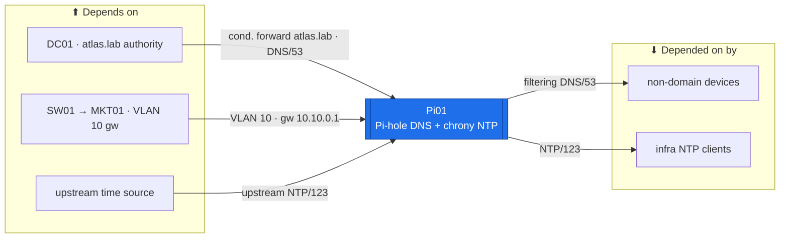

# Pi01 — DNS & NTP (Pi-hole + chrony)  ·  folder front-door

> **How to read this folder.** This README is the front door: *what this host is*, *what it connects to*, and *which document answers which question*. Start here, then follow the one link you need. Live status lives in exactly two places — **`Roadmap.md`** (the build path) and **`Build-Checklist.md`** (line-item, dated, evidence-backed). Nothing here duplicates them; it points to them.

| Item | Value |
|---|---|
| Lab / Era | Lab-02 · Cisco-Core — ACTIVE (📋 rebuild to reduced role) |
| Host · Role | **Pi01** (Raspberry Pi OS Lite 64-bit) · **Pi-hole filtering DNS + chrony NTP** — reduced to two jobs only |
| Placement | **Physical Raspberry Pi (bare-metal, not a VM) · VLAN 10 (Management) · `10.10.0.6` 📋 proposed · gw `10.10.0.1`** |
| Silo | 🟡 Services |
| Status | 📋 **rebuild** — image/harden → VLAN-10 identity → chrony → Pi-hole → migration-off gate. See **`Roadmap.md`** |
| Governs / related | `ADR-0003` (AD-DNS vs OpenSSL — the DNS boundary) · `ADR-0007` (`atlas.lab` suffix) · `ADR-0020` (time authority — chrony under the NTP hierarchy) · `ADR-0009` (SPOF reduction — crown jewels off the Pi) · `ADR-0030` (DHCP on DC01, **not** Pi01) |

## Role this era

Pi01 is a **physical Raspberry Pi** (bare-metal — `ADR-0036` VM placement does **not** apply to it) **reduced to two jobs: Pi-hole filtering DNS + chrony NTP, and nothing else.** This is a **rebuild** to that reduced role.

- **The DNS boundary (`ADR-0003`/`ADR-0007`).** Domain machines use **AD-integrated DNS on the DCs**. Pi01 is the **non-domain filtering forwarder**, and it **conditional-forwards `atlas.lab` → the DCs** so its clients can still resolve domain names. It is not the estate resolver — it is the filtered forwarder for the non-domain side.
- **The NTP hierarchy (`ADR-0020`).** The estate time authority is the **PDCe (DC01)**. Pi01's chrony sits *in* that hierarchy — it syncs up the chain and serves NTP down to non-domain/infra clients.
- **The crown-jewels-removed history (`ADR-0009`).** Pi01 once also ran **FreeRADIUS, Vaultwarden, the Root CA and the Intermediate CA**. All of it has been **migrated off** (RADIUS→NPS01, Vault→Vaultwarden, CA→offline) because one SD-card Pi was a single point of failure for the whole PKI. The reduction **is** the mitigation — do not re-pile services back on.
- **DHCP is NOT here** — it consolidated on **DC01** (`ADR-0030`). Don't add it by reflex.

## Connections — what this host touches (the map)

**Depends on (upstream — must be healthy first):**
- **The physical Pi itself** — SD card + power (bare-metal; no hypervisor line).
- **SW01** (VLAN 10 access) → **MKT01** (VLAN-10 gateway `10.10.0.1`) for reachability.
- **DC01** — the target of the `atlas.lab` **conditional-forward** (and the estate DNS authority for domain names).
- **An upstream time source** — per the `ADR-0020` NTP hierarchy (chrony syncs up the chain).
- Addressing: `../../Architecture/IP-Addressing-Plan-VLSM.md` (`POL-0008` — the owner of the IP fact).

**Depended on by (downstream — these lose DNS/NTP if Pi01 is down):**
- **Non-domain devices** — filtering DNS (`53`) + NTP (`123`).
- **Pi-hole clients** — the `atlas.lab` conditional-forward resolution path (domain-name lookups routed to the DCs).

**Services this host provides:** filtering DNS (Pi-hole, `53`) and NTP (chrony, `123`) to the non-domain/infra side; conditional-forward of `atlas.lab` to the DCs.

## Connections diagram

> 🔴 Bare-metal, one SD-card box (SPOF — reduced, not eliminated). 🔴 DHCP is **not** here (`ADR-0030`). The DNS boundary: AD-DNS for domain, Pi01 for non-domain + `atlas.lab` conditional-forward.

## Services map — what runs here and how it's used

> 🆕 **Services map (Standard v1.7).** Pi01 reduced to two jobs (`ADR-0009`) — nothing else re-piles on. Status mirrors `Build-Record.md` (`POL-0001`) — 📋 rebuild, so rows are ⬜/📋.

| Service | Purpose | Consumed by · port | Depends on | Status |
|---|---|---|---|---|
| **Filtering DNS** (Pi-hole) | Ad/tracker-filtering resolver for the **non-domain** side | non-domain devices · DNS/53 | upstream resolver | ⬜ rebuild (📋) |
| **`atlas.lab` conditional-forward** | Route domain-name lookups to the DCs (the DNS boundary, `ADR-0003`/`ADR-0007`) | Pi-hole clients · DNS/53 → DCs | DC01 (AD-DNS) | ⬜ rebuild (📋) |
| **NTP** (chrony) | Time to the non-domain / infra side, in the `ADR-0020` hierarchy | infra NTP clients · NTP/123 | upstream time source | ⬜ rebuild (📋) |

## Documents in this folder (what answers what)

- **`Roadmap.md`** — the build path + connections + cert alignment. *Start here for "what's next and why."*
- **`Build-Checklist.md`** — the existing line-item, dated checklist that carries the two named scars. *The authoritative status (`POL-0001`).*
- **`Build-Guide.md`** — the phased, gated rebuild contract (`ADR-0043`): OS+identity → chrony → Pi-hole, each behind a 🔴 GATE.
- **`Considerations.md`** — open gates, standing risks (the SPOF, the two traps), and the VLAN-10 ingress placement question.
- **`Build-Record.md`** — the verified as-built state (records outrank guides, `POL-0001`; ⬜/🟡 until built).
- **`Diagnostics.md`** — the read-only "is it built + does it actually resolve/sync?" battery (links to Academy `Command-Library/Linux`).
- **`Troubleshooting.md`** — symptom → cause → fix, foregrounding the two traps.
- **`Automation/`** — the `ADR-0048` slice (cloud-init/Ansible to rebuild the Pi as code), after the manual first pass.
- **`Changes/`** — the `CM-####` ledger.

## Single source
- Estate index: `../../Service-Server-Build-Plan.md`. Addressing: `../../Architecture/IP-Addressing-Plan-VLSM.md`. Flows: `../../Architecture/Atlas-East-West-Allowed-Flows-Matrix.md`. Build order: `../../Operations/Build-Order-and-Dependencies.md`. Decisions: `00-Atlas-Foundation/Decisions/ADR-Index.md`.
