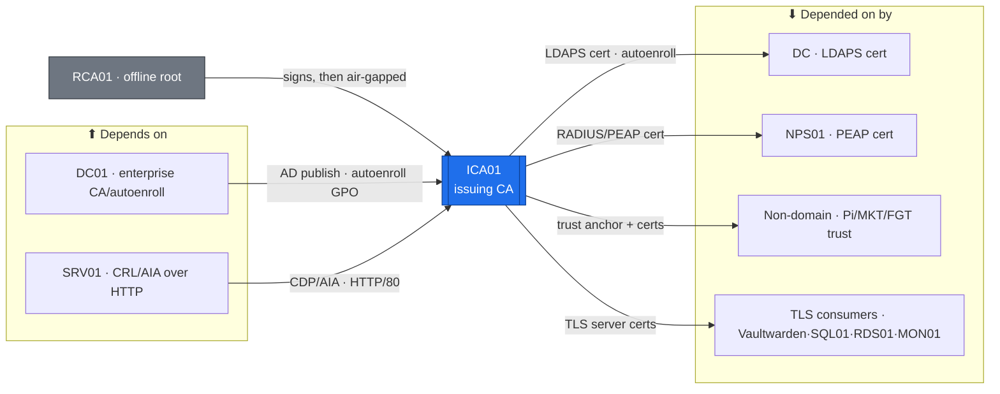

# RCA01 + ICA01 — AD CS Two-Tier PKI (Tier 0)  ·  folder front-door

> **How to read this folder.** Front door for the estate's PKI: what these hosts are, what they connect to, and which doc answers which question. Live status: `Roadmap.md` (build path) · `Build-Checklist.md` (line-item) · `Build-Record.md` (as-built). The *how* is `AD-CS-Two-Tier-Build-Guide.md`.

| Item | Value |
|---|---|
| Lab / Era | Lab-02 · Cisco-Core — ACTIVE (in build) |
| Hosts · Role | **RCA01** (offline standalone **Root CA**, workgroup, air-gapped) + **ICA01** (Enterprise **Issuing/Subordinate CA**, domain-joined) · **the estate's only PKI** |
| Placement | RCA01 = offline (host-agnostic, powered off) · ICA01 = **PVE02/EQR6 (always-on core, `ADR-0036` v1.2)**, `10.20.0.4` /26 gw `10.20.0.1`, VLAN 20 T0 — *a CA that does CRL publishing + autoenroll must stay up, so it lives on the always-on host* |
| Silo | 🔴 Security |
| Status | Authored, **not built** — ICA01 host reachable ✅ (07-22); **RCA01 offline-root ceremony gates the PKI**; sub-CA install next. See `Roadmap.md` |
| Governs | `ADR-0027` (two-tier MS PKI) · `ADR-0031` (retire OpenSSL → AD CS only) · `ADR-0009` (revocation / key custody) · `ADR-0029` (NPS cert) · `ADR-0028` (FGT LDAPS) |

## Role this era

The estate's **single source of trust** — a two-tier Microsoft PKI. **RCA01** is an offline standalone root that signs exactly one thing (the issuing CA's cert) and is then powered off and stored. **ICA01** is the online Enterprise Subordinate CA that issues **every** certificate — LDAPS, RADIUS, TLS, and non-domain devices. The OpenSSL Lab CA is **retired** (`ADR-0031`); this is the only CA. 🔴 **Nothing that needs a certificate works until the offline-root ceremony + sub-CA install are done.**

## Connections — what this touches

**Depends on (upstream):**
- **RCA01 (offline root)** — the trust anchor; signs ICA01's cert, then air-gapped (no runtime deps).
- **DC (AD DS)** — ICA01 is an *Enterprise* CA: domain-joined, publishes to AD, autoenrollment via GPO.
- **SRV01** (`nginx`, `pki.atlas.lab`) — the HTTP **CDP/AIA endpoint** where ICA01 publishes the CRL + root cert. **Revocation checking depends on it.**
- **DNS** — `pki.atlas.lab` A-record on DC01 · **Vaultwarden** — CA passphrase / key custody (`ADR-0009`) · **PVE01** — hosts the ICA01 VM.

**Depended on by (downstream — these need a cert from ICA01):**
- **DC01/DC02** — LDAPS cert (autoenroll) → enables **FGT01 LDAPS** (`ADR-0028`) + secure LDAP.
- **NPS01** — RADIUS server cert (PEAP/EAP-TLS, `ADR-0029`).
- **Non-domain devices** (Pi-hole · MKT01 · FGT01) — trust anchor + issued certs (`ADR-0031`, Part 3B).
- **Vaultwarden · SQL01 · RDS01 · MON01 · SRV01** — TLS certs. **Future:** Exchange, AD FS, Entra Connect, Wazuh.

**Services provided:** two-tier CA (root + issuing) · certificate templates · autoenrollment · **CRL/AIA** (HTTP via SRV01) · **OCSP** (Tier-A A2) · **KRA / key archival** (A2) · revocation.

## Connections diagram

> RCA01 (grey) is the offline trust anchor — it signs ICA01 once, then powers off (no runtime deps). ICA01 (highlighted) is the online issuer everything else depends on.

## Services map — what runs here and how it's used

> 🆕 **Services map (Standard v1.7).** The two tiers of the one PKI + what each provides. Status mirrors `Build-Record.md` (`POL-0001`) — only ICA01 host reachability is ✅; the CA roles + the offline-root ceremony are ⬜.

| Service | Purpose | Consumed by · port | Depends on | Status |
|---|---|---|---|---|
| **Offline Root CA** (RCA01) | The trust anchor — signs ICA01's cert once, then air-gapped | ICA01 (one-time) · offline media | the offline-root ceremony (Part 1) | ⬜ ceremony not run (**gates the PKI**) |
| **Enterprise Issuing CA** (ICA01) | Issues every estate certificate (LDAPS · RADIUS · TLS · non-domain) | all cert consumers · autoenroll / RPC | DC (AD) + RCA01 sub-CA cert | ⬜ role not built (host ✅ 07-22) |
| **Templates + autoenrollment** | Template-driven issuance via GPO (harden ESC1–ESC8 first) | domain members · autoenroll (GPO) | ICA01 + AD | ⬜ not built |
| **CRL / AIA publishing** (via SRV01) | The revocation endpoint over HTTP (`pki.atlas.lab`) | all cert validators · HTTP/80 | SRV01 nginx | ⬜ not built |
| **OCSP + KRA / key archival** (A2) | Online revocation responder + key recovery | validators / recovery · OCSP | ICA01 (later, A2) | ⬜ not built (A2) |

## Documents in this folder

**Roadmap & status:** `Roadmap.md` (build path + connections + cert lens) · `Build-Checklist.md` (line-item, `POL-0001`) · `Build-Record.md` (verified as-built).
**Build (the rebuild contract):** `AD-CS-Two-Tier-Build-Guide.md` (Parts 0–5: RCA01 root · ICA01 sub-CA · templates/ESC/LDAPS · non-domain enrollment · the revocation gate · recovery).
**Verify & fix:** `Diagnostics-RCA01.md` (offline-root verify battery) · `Diagnostics-ICA01.md` (issuing-CA show/verify battery) · `Troubleshooting.md` (symptom→fix) · `Considerations.md` (open risks & decisions).
**Ledger:** `Changes/` (`CM-####` records).
**Automation (`ADR-0048`):** `Automation/` — autoenroll-GPO / templates-as-code / cert-renewal, authored *after* the manual first pass. 🔴 The **offline-root ceremony stays deliberately manual + air-gapped** — a hard "does-NOT-automate" boundary (the trust anchor is signed by hand, offline, by design).

**Structure call (per the DC template):** kept **flat** — RCA01 + ICA01 are the **two tiers of one PKI service**, documented as staged Parts in the Build-Guide, not a `Roles/` split. **Each tier keeps its own verify battery** — `Diagnostics-RCA01.md` (offline root: CA type, root cert, CRL export, air-gap custody) and `Diagnostics-ICA01.md` (online issuing CA) — since the offline-root ceremony and the online issuer verify on entirely different things.

## Single source
- Estate index: `../../Service-Server-Build-Plan.md` · Role/silo: `../../Architecture/Lab-02-Device-Role-Assignments.md` · Addressing: `../../Architecture/IP-Addressing-Plan-VLSM.md` (`POL-0008`).
