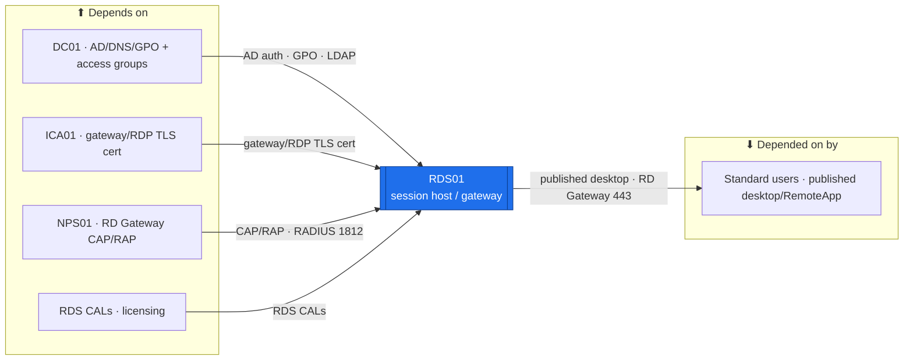

# RDS01 — Remote Desktop Services  ·  folder front-door

> **How to read this folder.** Front door: *what this host is*, *what it connects to*, *which doc answers which question*. Live status: **`Roadmap.md`** + **`Build-Checklist.md`** (`POL-0001`).

| Item | Value |
|---|---|
| Lab / Era | Lab-02 · Cisco-Core — ACTIVE (📋 not built) |
| Host · Role | **RDS01** (Windows Server 2025) · **RD Session Host** — RemoteApp/desktop publishing for standard users; **RD Gateway + Web Access** (TLS, NPS-backed CAP/RAP) + **RD Licensing** *(Gateway/Web included — operator 2026-07-30)* |
| Placement | **PVE02 / EQR6 — always-on** (`ADR-0036` v1.2; operator 2026-07-30 — a user-facing service should stay reachable). VLAN 20 (Servers), **`10.20.0.17`** *(proposed — IP-plan register)*, gw `10.20.0.1`, `OU=Servers,OU=Devices`. 🟡 the session host's RAM adds to the always-on stack → size in the **#20** pass (`64 GB` EQR6 prereq). Address authoritative in `../../Architecture/IP-Addressing-Plan-VLSM.md` / NetBox (`POL-0008`). |
| Proposed sizing 🟡 | 2 vCPU · **4 GB** RAM (per active user, grows) · 60 GB OS · a separate **user-profile / collection vdisk** if profiles grow. *Proposed — capacity pass (#20) finalizes.* |
| Silo | 🟡 Services / 🔴 Security (**remote-access surface**) |
| Status | 📋 **not built** — Wave-B committed (operator decision 2026-07-29). See **`Roadmap.md`** |
| Governs / related | `ADR-0029` (**NPS01** → RD Gateway CAP/RAP) · `ADR-0027` (**ICA01** two-tier PKI → gateway/RDP TLS cert) · `ADR-0021` (tiering — RDS is **not** the Tier-0 path; that is **PAW01**) · `ADR-0037` · `POL-0002` (secrets → Vaultwarden) |

## Role this era

The estate's **published-desktop / RemoteApp** surface for **standard (non-Tier-0) users** — an RD Session Host with a collection, an **RD Gateway + Web Access** fronting it over TLS *(included — operator 2026-07-30)*, and **RD Licensing** (per-user/per-device CALs). Collection access is granted to a **standard-user AD group** (a department role global — `G-Sales`/`G-Finance`/… — or `G-IT-Staff`), **never** `G-Tier0-Admins` (the AGDLP tier model owned by the DC, `ADR-0021`). Authorization is **externalized to NPS01** (RD Gateway **CAP/RAP**, `ADR-0029`); the gateway/RDP TLS cert comes from **ICA01** (`ADR-0027`). It is **not** the Tier-0 admin path (that is **PAW01**, `ADR-0021`), **not** an external-facing service without FGT01 + a hardened gateway, and **not** VDI (single session host this era).

> 🔴 **Security note (why the Security silo).** RDS is a remote-access entry surface. It stays behind deny-by-default authorization (NPS CAP/RAP), tier-separated from T0, and TLS-only — a misbuilt gateway is an exposure, so acceptance explicitly proves *the wrong thing is blocked* (Tier-0 cannot reach T0 systems from RDS).

## Connections — what this host touches (the map)

**Depends on (upstream):**
- **DC01** — domain-join + the **AD access groups** (who may use which collection) + the **session-lockdown / gateway GPOs**. AD group membership drives collection + CAP/RAP access.
- **ICA01** — a **TLS cert** for the RD Gateway / RD Web / RDP listener (`ADR-0027`).
- **NPS01** — the RD Gateway **CAP/RAP** policies live on NPS (`ADR-0029`); RDS is a RADIUS client of NPS.
- **RDS CALs (licensing)** — a license server + CALs installed before the **120-day grace** expires.
- **PVE01** → SW01 → MKT01 (VLAN-20 gw `10.20.0.1`). Addressing: `../../Architecture/IP-Addressing-Plan-VLSM.md` (`POL-0008`).

**Depended on by (downstream):**
- **Standard users** — launch **published desktops / RemoteApps** through the gateway over TLS.

**Services provided:** published desktop + RemoteApp delivery, with gateway-fronted, NPS-authorized, TLS remote access for standard users.

## Connections diagram

> All edges are **intra-estate** (E-W). RDS01 has **no N-S dependency** — it is deliberately not external-facing this era (that would require FGT01 + a hardened, published gateway; see `Considerations.md`).

## Services map — what runs here and how it's used

> 🆕 **Services map (Standard v1.7).** What RDS01 serves + how each is consumed. Status mirrors `Build-Record.md` (`POL-0001`) — 📋 not built, so every row is ⬜.

| Service | Purpose | Consumed by · port | Depends on | Status |
|---|---|---|---|---|
| **RD Session Host + collection** | Published desktop / RemoteApp for **standard users** (never Tier-0) | standard users · RDP/3389 (via gateway) | DC (AD access groups) | ⬜ not built |
| **RD Gateway + Web Access** | TLS-fronted, NPS-authorized remote access (CAP/RAP) | standard users · HTTPS/443 | NPS01 (CAP/RAP) + ICA01 cert | ⬜ not built |
| **RD Licensing** | Per-user/per-device CALs (before the 120-day grace) | the session host · license service | license server + CALs | ⬜ not built |
| **TLS listener** (gateway/RDP) | Encrypted gateway/RDP; ICA01-issued cert | clients · HTTPS/443 · RDP/3389 | ICA01 Server-Auth cert | ⬜ not built |

## Documents in this folder
- **`Roadmap.md`** — build path + connections + cert alignment + staged traffic-flow + future. **`Build-Checklist.md`** — line-item status (`POL-0001`). **`Build-Guide.md`** — phased/gated rebuild contract.
- **`Considerations.md`** — open risks (VLAN placement, CALs before grace, gateway optionality, T0 separation). **`Build-Record.md`** — as-built (⬜). **`Diagnostics.md`** — verify battery. **`Troubleshooting.md`** — symptom→fix.
- **`Automation/`** — the `ADR-0048` slice (DSC RDS role, collection/RemoteApp publishing). **`Changes/`** — the `CM-####` ledger (post-build).

## Single source
- Estate index: `../../Service-Server-Build-Plan.md`. Addressing: `../../Architecture/IP-Addressing-Plan-VLSM.md`. Role/silo catalog: `../../Architecture/Lab-02-Device-Role-Assignments.md`. Sequence: `../../Master-Implementation-Checklist.md`. Hardening: `../../Operations/Device-Hardening-Standard.md` + `Architecture/CIS-Hardening-*`.
