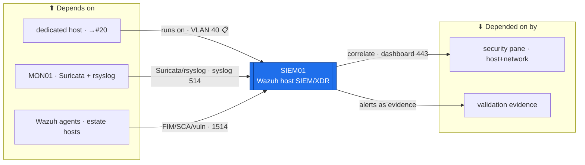

# SIEM01 — Wazuh (host SIEM / XDR)  ·  folder front-door

> **How to read this folder.** Front door for the estate's **host SIEM / XDR**: what it is, what it connects to, which document answers which question. **Security variant** — foregrounds the Wazuh stack, host-agent detection, and network-detection ingest, not the server template. Live status: **`Roadmap.md`** + **`Build-Checklist.md`**. SIEM01 is the **host + correlation** half of the estate's Detect layer; **MON01** is the network half.

| Item | Value |
|---|---|
| Lab / Era | Lab-02 · Cisco-Core — ACTIVE (📋 committed — not built) |
| Host · Role | **SIEM01** (Ubuntu/Debian) · **Wazuh host SIEM / XDR** — manager + indexer + dashboard; agents do FIM · log analysis · SCA/CIS · vuln detection; ingests MON01's Suricata + rsyslog |
| Placement / reach | 🔴 **Dedicated host** (decided 2026-07-30 — *not* co-located on MON01) · **VLAN + physical host → the #20 sizing pass** (📋 proposed **VLAN 40 Monitoring**, `10.40.0.x`) |
| Silo | 🔴 Security (SIEM / correlation) |
| Status | 📋 **committed — not built.** The dedicated-host flag is **resolved**; VLAN + host sizing → **#20**. See **`Roadmap.md`** |
| Governs / related | `ADR-0035` (FGT no-UTM → Suricata SPAN = network IDS; **Wazuh complements it host-side**) · `ADR-0032` (detection architecture) · `ADR-0037` · Section K **K8** (Suricata↔Wazuh correlation) · Backlog **#18** (SCAP) |

## Role this era

SIEM01 is the estate's **host-based SIEM / XDR** (Wazuh) — the **Detect** layer's **host + correlation** half (MON01 is the network half). Wazuh **agents** on the Windows/Linux estate do **file-integrity monitoring (FIM)**, **log analysis**, **SCA/CIS** config checks, and **vulnerability detection**; the **manager + indexer + dashboard** collect + correlate them, and **ingest MON01's Suricata alerts + rsyslog** so host *and* network detection sit in **one security pane** (Section K **K8**). It is **not** MON01 (availability/metrics) and **not** the network IDS (that is Suricata on MON01, `ADR-0035`) — Wazuh *consumes* Suricata; it is host/log-centric.

> 🔴 **Dedicated host — DECIDED (operator 2026-07-30).** Wazuh's indexer (OpenSearch) is resource-heavy and this is the **security** pane — it runs on its **own host**, not co-located on MON01 (which would mix the 🟡 Services availability box with the 🔴 Security SIEM and risk the two starving each other under load). The **VLAN + physical-host sizing** ride the **#20** compute/sizing sweep (📋 proposed VLAN 40, `10.40.0.x`).

## Connections — what this host touches (the map)

**Depends on (upstream — must be healthy first):**
- **A dedicated host** (→ #20 sizing) → **SW01** → **MKT01** (VLAN gateway — 📋 VLAN 40 proposed).
- **MON01** — the **Suricata + rsyslog** feed (network detection to correlate).
- **The Wazuh agents** on the estate hosts (Tier-0 + servers first) — the FIM/SCA/vuln telemetry source.
- **ICA01** (optional agent↔manager TLS) · **DC/NTP/DNS**.

**Depended on by (downstream — these lose the security pane if SIEM01 is down):**
- **The estate security pane** — host + network detection correlated in **one** dashboard (K8); the "did we catch it?" answer.
- **The validation / adversarial pass** — a control's alert (a KALI01 attack, a FIM change, an ESC attempt) surfaces here as evidence (`../../Operations/Validation-and-Adversarial-Testing.md`).

**Services this host provides:** Wazuh manager · indexer (OpenSearch) · dashboard · agent ingest (FIM/SCA/vuln) · Suricata + rsyslog ingest → correlation.

## Connections diagram

> SIEM01 *consumes* MON01's network detection + host-agent events and correlates them into one pane (K8). It complements MON01 (`ADR-0035`); it does not replace the network IDS.

## Services map — what runs here and how it's used

> 🆕 **Services map (Standard v1.7).** What runs on this box + how each service is used. Wazuh is a multi-component stack — this makes the ports + consumers explicit (`POL-0001`: evidence = an agent reporting + an alert firing, not the service being installed).

| Service | Purpose | Consumed by · port | Depends on | Status |
|---|---|---|---|---|
| **Wazuh indexer** (OpenSearch) | store + search security events | the dashboard · 9200 (internal) | the host (RAM-heavy) | 📋 |
| **Wazuh manager** | rules/decoders · agent mgmt · active response | Wazuh agents · **1514/1515** | indexer | 📋 |
| **Wazuh dashboard** | the security pane (host + network correlation) | admins · **HTTPS 443** | manager + indexer | 📋 |
| **Agent ingest** (FIM/SCA/vuln) | host detection on every host | estate agents → SIEM01 · **1514** | agents deployed (GPO/config-mgmt) | 📋 |
| **Suricata + rsyslog ingest** | correlate network detection (K8) | **MON01** → SIEM01 · **syslog 514** | MON01 up | 📋 |

## Documents in this folder (what answers what)
- **`Roadmap.md`** — the build path (dedicated host → Wazuh stack → agent rollout → MON01 ingest → correlation/alerting) + cert alignment. *Start here.*
- **`Build-Checklist.md`** — the line-item design/why + acceptance (dedicated-host flag resolved).
- **`Build-Guide.md`** — the designed gated stub (`ADR-0043`): the phased stack build + agent rollout; click-steps at build.
- **`Considerations.md`** — the decided design + open risks (sizing/#20; agent rollout; indexer storage; the MON01 division of labor).
- **`Build-Record.md`** — the as-built state (⬜ until built).
- **`Diagnostics.md`** — the 📋 verify battery (agent reports · FIM fires · SCA score · Suricata ingest visible).
- **`Troubleshooting.md`** — Wazuh symptoms → fixes (agent not reporting · indexer RAM/storage · ingest broken).
- **`Automation/`** — the `ADR-0048` slice: agent rollout (GPO/Ansible) + rules-as-code; not DSC.
- **`Changes/`** — the `CM-####` ledger.

## Single source
- Estate index: `../../Service-Server-Build-Plan.md`. Addressing (VLAN 40 proposed): `../../Architecture/IP-Addressing-Plan-VLSM.md` (`POL-0008`). Detection architecture / division of labor: `../MON01-Monitoring/` + `ADR-0035` + `00-Atlas-Foundation/Atlas-Firewall-Architecture.md`. Validation: `../../Operations/Validation-and-Adversarial-Testing.md`. Build order: `../../Operations/Build-Order-and-Dependencies.md`. Decisions: `00-Atlas-Foundation/Decisions/ADR-Index.md`.
