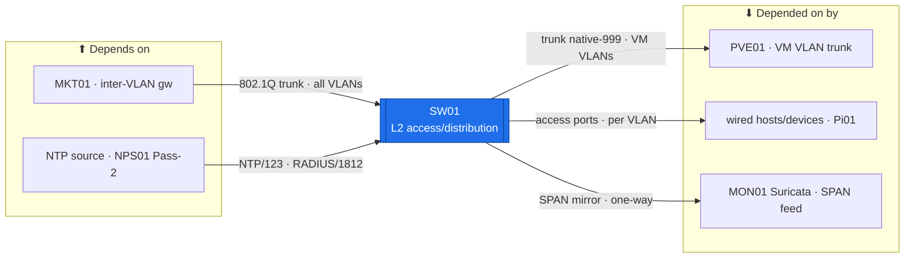

# SW01 — Access / Distribution Switch (L2)  ·  folder front-door

> **How to read this folder.** Front door for the estate's **access/distribution switch**: what it is, what it connects to, and which doc answers which question. This is the **networking variant** — it foregrounds VLANs / trunks / STP / SPAN / DAI / port-security + `show`-command verification, not the server template. Live status: **`Roadmap.md`** + **`Build-Checklist.md`** + the `show`-read-backs in **`Diagnostics.md`** (`POL-0001`).

| Item | Value |
|---|---|
| Lab / Era | Lab-02 · Cisco-Core — ACTIVE (Pass-1 + core L2 ✅ device-verified) |
| Host · Role | **SW01** (Cisco Catalyst 2960X, IOS 15.x) · **the L2 access/distribution switch** — carries every VLAN to MKT01; **pure L2, does not route** (`ADR-0023`) |
| Placement / reach | Physical rack device · managed on **`Vlan10` SVI `10.10.0.2`** (VLAN 1 admin-down). Trunks: **Gi1/0/1 → MKT01**, **Gi1/0/4 → PVE01** (native 999); **SPAN Gi1/0/5 → MON01**; Gi1/0/7 = Pi01 |
| Silo | 🔵 Network (L2 access) |
| Status | **Pass-1 hardening + core L2 ✅ device-verified** (07-22) · VLANs/trunks/SPAN/DAI 🟡 read-back pending · Pass-2 RADIUS ⬜ gated · SNMPv3/syslog→MON01 + DAI-from-NetBox 📋 Phase 4/6. See **`Roadmap.md`** |
| Governs / related | `ADR-0023` (L2 only; MKT01 routes) · `ADR-0029` (admin auth → RADIUS/NPS01) · `ADR-0020` (NTP) · `ADR-0032` (SPAN → MON01 IDS) · `CIS-Hardening-SW01` · `SW01-PVE01-Native-VLAN-Options` |

## Role this era

SW01 is the estate's **Layer-2 access/distribution switch** (`ADR-0023`): it defines the **VLANs (10–90 + native 999)**, presents **access ports** to hosts/devices, and **trunks** every VLAN up to **MKT01** (the inter-VLAN gateway + E-W firewall). It is **pure L2 — no `ip routing`; the only SVI is the `Vlan10` management interface** (`10.10.0.2`). It also carries the **SPAN** (`Gi1/0/5`) that mirrors the MKT01 inter-VLAN trunk into **MON01's Suricata** sensor — the estate's network-detection tap (`ADR-0032`) — and enforces **access-layer L2 security**: DHCP snooping + Dynamic ARP Inspection, port security, unused ports shut, DTP off.

> 🔴 **The design boundary (`ADR-0023`):** SW01 **switches**, it does not route. Inter-VLAN routing + east-west filtering live on **MKT01**. The only L3 on SW01 is the `Vlan10` management SVI.

## Connections — what this host touches (the map)

**Depends on (upstream — must be healthy first):**
- **MKT01** — the **Gi1/0/1 802.1Q trunk** carries every VLAN to the inter-VLAN gateway; without it the VLANs are islands.
- **Power + console + cabling** (`../../Architecture/Cabling-and-Port-Map.md`). Later: an **NTP source** (`ADR-0020`) + **NPS01** (RADIUS admin auth, Pass-2).

**Depended on by (downstream — these lose L2 if SW01 is down):**
- **PVE01** — the **Gi1/0/4 trunk** (native VLAN **999**) carries the VM VLANs to the hypervisor bridge (`SW01-PVE01-Native-VLAN-Options`).
- **Every wired host/device** — access ports per VLAN; **Pi01** on `Gi1/0/7` (never shut).
- **MON01 Suricata** — the **SPAN `Gi1/0/5`** mirror of the MKT01 trunk is MON01's network-detection feed (`ADR-0032`; Phase 6). One-directional: MON01 sees a copy, it cannot inject.

**Services this host provides:** L2 switching (VLANs 10–90 + native 999) · 802.1Q trunks (MKT01, PVE01) · SPAN → MON01 · DHCP snooping + DAI · port security · SSHv2 mgmt (`Vlan10` SVI).

## Connections diagram

> The SPAN edge is a one-way mirror (MON01 detects, cannot inject). SW01 trunks up to MKT01 (which routes/filters) and down to PVE01 + the access ports.

## Services map — what runs here and how it's used

> 🆕 **Services map (Standard v1.7), networking variant.** A switch's "services" are its **interface-bound data/management-plane functions**, so the "Consumed by" cell names the **peer + interface** (not a TCP port). Status mirrors `Build-Record.md` (`POL-0001`: device-verified vs read-back-pending vs gated, never merely "configured").

| Service | Purpose | Consumed by · port/interface | Depends on | Status |
|---|---|---|---|---|
| **L2 switching** (VLANs 10–90 + native 999) | Access-layer segmentation; presents access ports per VLAN | wired hosts/devices · access ports | base config | ✅ core (07-22); per-VLAN 🟡 read-back |
| **802.1Q trunk → MKT01** | Carries every VLAN up to the inter-VLAN gateway + E-W firewall | MKT01 · `Gi1/0/1` (all VLANs) | MKT01 up | ✅ (07-22); trunk 🟡 `show` |
| **802.1Q trunk → PVE01** | Carries the VM VLANs to the hypervisor bridge | PVE01 · `Gi1/0/4` (native 999) | PVE01 bridge | 🟡 read-back pending |
| **SPAN mirror → MON01** | One-way mirror of the MKT01 inter-VLAN trunk to the Suricata IDS (`ADR-0032`) | MON01 Suricata · `Gi1/0/5` (one-way) | MON01 (Phase 6) | 📋 Phase 6 |
| **DHCP snooping + DAI** | Access-layer L2 security (rogue-DHCP + ARP-spoof) | access VLANs · `STATIC-HOSTS` list | binding list → NetBox Ph 4 (`POL-0004`) | 🟡 applied, read-back pending |
| **Port security** | MAC limits; unused ports shut; DTP off | access ports | `CIS-Hardening-SW01` | 🟡 read-back pending |
| **SSHv2 management** | Admin/management plane on the mgmt SVI | admins / PAW · `Vlan10` `10.10.0.2`:22 | `Vlan10` SVI | ✅ (07-22) |
| **NTP client** | Time sync, stratum-3 (SW01 consumes) | NTP source · UDP 123 | `ADR-0020` source | ✅ stratum-3 (07-22) |
| **RADIUS admin auth** (Pass-2) | AD-backed admin login | NPS01 · UDP 1812 | NPS01 + AD CS | ⬜ gated (`ADR-0029`) |

## Documents in this folder (what answers what)

**Config path & status**
- **`Roadmap.md`** — the **config path** (base+hardening → VLANs/access → trunks → STP → SPAN → L2 security → mgmt telemetry) as stages, Needs/Unblocks + cert alignment. *Start here.*
- **`Build-Checklist.md`** *(existing)* — the line-item design/why + failure modes.

**Build (the how — existing, referenced)**
- **`Build-Guide.md`** *(existing)* — the executable, staged CLI procedure (VLANs/trunks/SPAN/DAI/port-security).

**Verify & fix**
- **`Diagnostics.md`** *(existing)* — the `show`-command battery (SSH/SVI/VLANs/trunks/NTP/DAI), ✅ where read back.
- **`Troubleshooting.md`** *(existing)* — trunk/native-VLAN/DAI/STP symptoms → fixes.
- **`Build-Record.md`** — the verified as-built state (records outrank guides, `POL-0001`).
- **`Considerations.md`** — open risks & decisions (Pass-2 gate; native-VLAN 999; the hand-typed DAI "Pi01 mystery" → NetBox; STP hardening; OT VLAN 90 per 305).
- **`Automation/`** — the `ADR-0048` slice: Oxidized config-backup + Ansible (VLAN/port config from NetBox); **not** DSC.
- **`Changes/`** — the `CM-####` ledger.

**Hardening:** central — `../../Architecture/CIS-Hardening-SW01.md` (Pass-1 ✅) + `../../Operations/Device-Hardening-Standard.md`.

## Single source
- Estate index: `../../Service-Server-Build-Plan.md`. Addressing (`Vlan10` SVI `10.10.0.2`): `../../Architecture/IP-Addressing-Plan-VLSM.md`. Cabling / ports: `../../Architecture/Cabling-and-Port-Map.md`. Native VLAN: `../../Architecture/SW01-PVE01-Native-VLAN-Options.md`. Build order: `../../Operations/Build-Order-and-Dependencies.md` (Phase 2). Flows/SPAN rationale: `../../Architecture/Atlas-East-West-Allowed-Flows-Matrix.md`. Decisions: `00-Atlas-Foundation/Decisions/ADR-Index.md`. Cert maps: `Atlas-Academy/Atlas-Certification-Lab-Map.md` (CCNA) · `Atlas-Academy/Atlas-CCNP-Lab-Map.md`.
