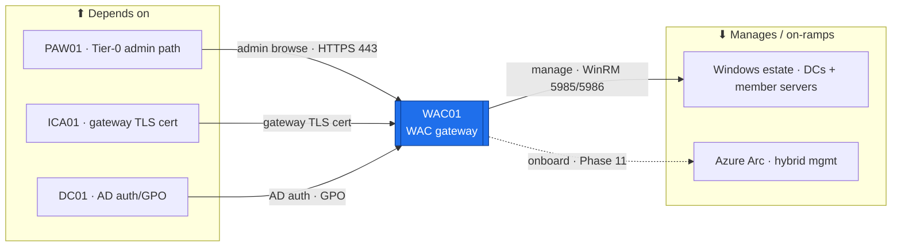

# WAC01 — Windows Admin Center (gateway)  ·  folder front-door

> **How to read this folder.** Front door: *what this host is*, *what it connects to*, *which doc answers which question*. Live status: **`Roadmap.md`** + **`Build-Checklist.md`** (`POL-0001`).

| Item | Value |
|---|---|
| Lab / Era | Lab-02 · Cisco-Core — ACTIVE (📋 not built) |
| Host · Role | **WAC01** (Windows Server 2025) · **Windows Admin Center — gateway mode** (`ADR-0045`): the central hybrid-management surface for the Windows estate + the **Azure Arc** on-ramp |
| Placement | **PVE02 / EQR6 — always-on** (`ADR-0036` v1.2; operator 2026-07-30 — a management surface must stay reachable; supersedes `ADR-0045`'s PVE01 note). **VLAN 10 (Management)**, **`10.10.0.5`** *(proposed — IP-plan register; deconflict)*, gw `10.10.0.1`, DNS `10.20.0.2`, `OU=Servers,OU=Devices`. 🟡 RAM adds to the always-on stack → size in the **#20** pass. |
| Proposed sizing 🟡 | 2 vCPU · **4 GB** RAM · 60 GB OS. *Proposed — #20 capacity pass finalizes (WAC gateway is light).* |
| Silo | 🔴 **Security / Tier-0 management surface** — it administers the DCs, so it is itself Tier-0. |
| Status | 📋 **not built** — `ADR-0045` (AZ-800/801 sweep). See **`Roadmap.md`** |
| Governs / related | `ADR-0045` (WAC/container/RODC additions) · `ADR-0036` v1.2 (placement) · `ADR-0027` (**ICA01** → gateway HTTPS cert) · `ADR-0021` (tiering — WAC is Tier-0, PAW-only) · `ADR-0037` · `POL-0002` (secrets → Vaultwarden) |

## Role this era

The estate's **single management gateway** — a browser-based console (gateway-mode WAC, **not** a desktop install, `ADR-0045`) that centralizes administration of the **Windows estate**: DC01/DC02, the member servers (NPS01 · FS01 · WSUS01 · SQL01 · RDS01 …), Hyper-V, and the future failover cluster (`ADR-0046`). It is the on-ramp to **Azure Arc / hybrid management** (Phase 11 — a **gated stub** this era, `ADR-0043`). Because it manages **Tier-0** (the DCs), WAC01 is **itself a Tier-0 management surface**: administered **only from PAW01** (`ADR-0021`), hardened, HTTPS with a cert from **ICA01** (`ADR-0027`), and **never broadly exposed**. It is **not** a workstation (that's PAW01), **not** a Proxmox manager (WAC manages Windows/Hyper-V, not the hypervisor host), and **not** a public service.

> 🔴 **Why the Security/Tier-0 silo.** A gateway that can reach every DC and member server is a top-value target. Access is deny-by-default from everywhere except **PAW01**; the gateway TLS cert is ICA01-issued; and it lives on the **management plane (VLAN 10)** — the smallest, most-isolated network.

## Connections — what this host touches (the map)

**Depends on (upstream):**
- **PAW01** — the **only** admin path in (Tier-0 workstation; browse the WAC console over HTTPS). `ADR-0021`.
- **ICA01** — the **gateway HTTPS/TLS cert** (`ADR-0027`).
- **DC01** — domain-join + **AD auth** (Tier-0 admin groups) + management **GPOs**.
- **PVE02/EQR6** → the mgmt VLAN 10 (`10.10.0.1` gw on MKT01). Addressing: `../../Architecture/IP-Addressing-Plan-VLSM.md` (`POL-0008`).

**Manages / on-ramps to (downstream):**
- **The Windows estate** — DC01/DC02 + the member servers + Hyper-V + the future cluster, reached over **WinRM 5985/5986** (WAC's management protocol).
- **Azure Arc** — hybrid management (Phase 11; gated stub now).

**Services provided:** one hardened, PAW-only, TLS console to administer, monitor, and (later) Arc-onboard the Windows estate.

## Connections diagram

> WAC01 sits on the **management plane (VLAN 10)** and reaches the VLAN-20 estate as the admin control plane (flows-matrix **flow #1**, scoped to WAC's ports — see the new **flow #16**). The **Arc** edge is dashed = future (Phase 11).

## Services map — what runs here and how it's used

> 🆕 **Services map (Standard v1.7).** What WAC01 runs + how each is consumed. Status mirrors `Build-Record.md` (`POL-0001`) — 📋 not built, so every row is ⬜.

| Service | Purpose | Consumed by · port | Depends on | Status |
|---|---|---|---|---|
| **WAC gateway console** | One hardened browser console to administer the Windows estate (**PAW-only**) | admin via PAW01 · HTTPS/443 | DC (AD auth) + ICA01 cert | ⬜ not built |
| **Estate management** (WinRM) | Manage DCs + member servers + Hyper-V + the future cluster | WAC → estate · WinRM 5985/5986 | managed nodes up | ⬜ not built |
| **Azure Arc on-ramp** (Phase 11) | Hybrid-management onboarding | Azure Arc · onboarding | tenant (Phase 11) | ⬜ gated stub |

## Documents in this folder
- **`Roadmap.md`** — build path + connections + cert alignment + staged traffic-flow + the Arc future phase. **`Build-Checklist.md`** — line-item status (`POL-0001`). **`Build-Guide.md`** — phased/gated rebuild contract.
- **`Considerations.md`** — open risks (VLAN-10-vs-20 tension + the PAW-VLAN drift, Tier-0 exposure, gateway-vs-desktop). **`Build-Record.md`** — as-built (⬜). **`Diagnostics.md`** — verify battery. **`Troubleshooting.md`** — symptom→fix.
- **`Automation/`** — the `ADR-0048` slice (DSC WAC install, extension config). **`Changes/`** — the `CM-####` ledger.

## Single source
- Estate index: `../../Service-Server-Build-Plan.md`. Addressing: `../../Architecture/IP-Addressing-Plan-VLSM.md`. Decision: `../../../../00-Atlas-Foundation/Decisions/ADR-0045-AZ800-801-Compute-Additions-WAC-Container-RODC.md`. Cert map: `../../../../Atlas-Academy/AZ-800-801-Windows-Server-Hybrid-Lab-Map.md`. Hardening: `../../Operations/Device-Hardening-Standard.md`.
