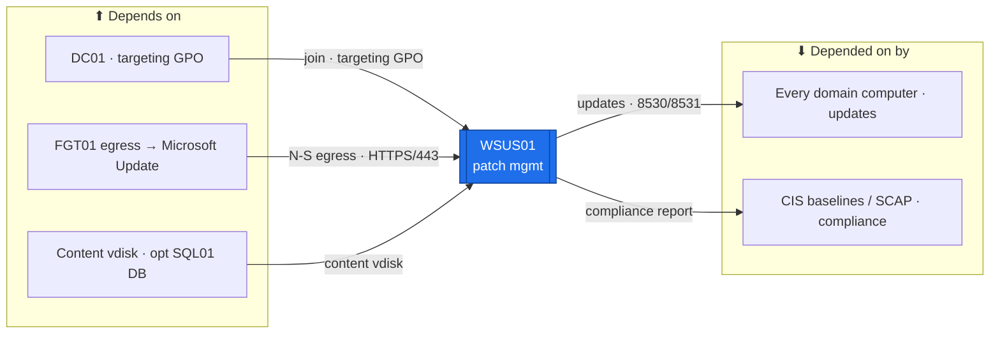

# WSUS01 — Patch Management (Windows Update Services)  ·  folder front-door

> **How to read this folder.** Front door: *what this host is*, *what it connects to*, *which doc answers which question*. Live status: **`Roadmap.md`** + **`Build-Checklist.md`** (`POL-0001`).

| Item | Value |
|---|---|
| Lab / Era | Lab-02 · Cisco-Core — ACTIVE (📋 not built) |
| Host · Role | **WSUS01** (Windows Server 2025) · **WSUS** — approve + deploy Windows updates to the domain; target groups; approval rings; compliance reporting |
| Placement | **PVE01/R410** (spin-up heavy tier, `ADR-0036` v1.2) — storage-heavy (the update content store) + patching isn't uptime-critical, so it rides the mostly-off host and runs during patch cycles/lab sessions. VLAN 20, **`10.20.0.15`** *(proposed)*, gw `10.20.0.1`, `OU=Servers,OU=Devices`. 🟡 placement is a Backlog #20 candidate. |
| Proposed sizing 🟡 | 2 vCPU · **4 GB** RAM (WID) · 60 GB OS · **a separate content-store vdisk (100 GB+)** on the R410. *Proposed — capacity pass (#20) finalizes.* |
| Silo | 🟡 Services / 🔴 Security (patching = vulnerability management) |
| Status | 📋 **not built** — Wave-B committed. See **`Roadmap.md`** |
| Governs / related | the `Architecture/CIS-Hardening-*` baselines (patch cadence) · `ADR-0037` · `POL-0007` (hardening) · Backlog #18 (SCAP compliance — WSUS delivers what SCAP verifies) · Phase H2 Intune (co-management — later) |

## Role this era

The estate's **patch authority** — WSUS syncs updates from Microsoft, sorts domain computers into **target groups** (by OU via GPO), and stages **approval rings** (pilot → broad) with **compliance reporting**. It **delivers the patches the CIS baselines assume** (`POL-0007`); it does not replace hardening. **Not** SCCM/Intune (that's the cloud co-management story, Phase H2), **not** third-party app patching.

> 🟡 **Uptime note (the tiering rationale).** WSUS is deliberately on the **mostly-off R410** — if WSUS is down, clients simply don't pull updates that window (no outage). Patch cycles run when the R410 is up. This is the flip side of the always-on rule: *non-uptime-critical + storage-heavy → the spin-up host* (`ADR-0036` v1.2). If continuous patching becomes desired, revisit in the #20 capacity pass.

## Connections — what this host touches (the map)

**Depends on (upstream):**
- **DC01** — domain-join + the **GPO** that points clients at WSUS (WUServer + target-group by OU). AD OU membership drives the target groups.
- **FGT01 egress** — to the Microsoft Update endpoints for the initial + ongoing sync (this N-S traffic will cross FGT UTM once licensed, `ADR-0047` — a throughput consideration for the big first sync; Backlog #20).
- **A content-store vdisk** on the R410 (updates are large); optionally **SQL01** as the DB backend instead of WID at scale.
- **PVE01/R410** → SW01 → MKT01 (VLAN-20 gw `10.20.0.1`). Addressing: `../../Architecture/IP-Addressing-Plan-VLSM.md` (`POL-0008`).

**Depended on by (downstream):**
- **Every domain computer** — DC/member servers/clients pull approved updates from WSUS (via GPO). Their patch compliance is reported here.
- **The CIS baselines / SCAP (#18)** — WSUS is how the "keep it patched" control is actually delivered + measured.

**Services provided:** update sync + approval + target-group deployment + compliance reporting for the domain.

## Connections diagram

> The `ms` edge is the only **N-S** dependency (crosses FGT — UTM-inspected once `ADR-0047`); the rest is intra-estate.

## Services map — what runs here and how it's used

> 🆕 **Services map (Standard v1.7).** What WSUS01 runs + how each is consumed. Status mirrors `Build-Record.md` (`POL-0001`) — 📋 not built, so every row is ⬜.

| Service | Purpose | Consumed by · port | Depends on | Status |
|---|---|---|---|---|
| **Update sync** (Microsoft Update) | Pull products/classifications from MS Update (the one N-S dependency) | WSUS ← MS Update · HTTPS/443 | FGT egress | ⬜ not built |
| **Approval + target-group deployment** | Approval rings (pilot → broad) to OU-driven groups | every domain computer · WSUS 8530/8531 | DC (targeting GPO) | ⬜ not built |
| **Compliance reporting** | Patch-state reporting (delivers what CIS/SCAP #18 verifies) | operator / SCAP · WSUS console | update DB (WID or SQL01) | ⬜ not built |

## Documents in this folder
- **`Roadmap.md`** — build path + connections + cert alignment + future. **`Build-Checklist.md`** — line-item status (`POL-0001`). **`Build-Guide.md`** — phased/gated rebuild contract.
- **`Considerations.md`** — open risks (uptime tradeoff, content-store storage, WID-vs-SQL, first-sync egress). **`Build-Record.md`** — as-built (⬜). **`Diagnostics.md`** — verify battery. **`Troubleshooting.md`** — symptom→fix.
- **`Automation/`** — the `ADR-0048` slice (DSC WSUS role, approval-automation). **`Changes/`** — the `CM-####` ledger.

## Single source
- Estate index: `../../Service-Server-Build-Plan.md`. Addressing: `../../Architecture/IP-Addressing-Plan-VLSM.md`. Hardening/patch cadence: `../../Operations/Device-Hardening-Standard.md` + `Architecture/CIS-Hardening-*`. Sizing: `00-Atlas-Foundation/VM-and-Services-Inventory.md` + Backlog #20.
