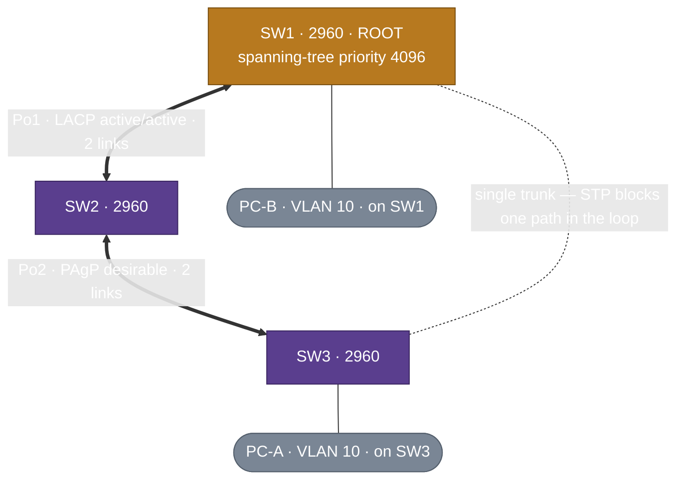

# Packet-Tracer STP + EtherChannel Sandbox

<!-- provenance -->
> **Lab-02 · Cisco-Core (ACTIVE).** The full [twin](./Packet-Tracer-Twin-Build-Spec.md) demonstrates STP and EtherChannel *in context* (alongside OSPF, HSRP, ACLs). This sandbox is the opposite: a **pure switching lab** with **no Layer-3 switches** — three L2 access switches, redundant links, and bundles — so you can drill root election, blocked ports, and every EtherChannel negotiation mode (including deliberate mismatches) without the routing/HSRP machinery in the way. Break it freely; it's a scratch file.

> 🔴 **Simulator status (`ADR-0022`).** Teaching + evidence-of-behaviour only. A ✅ earned here is **🖥️ sim-verified**, distinct from a hardware ✅.

## 1. Why a separate file (not the main twin)

EtherChannel and STP fight for the same links: once you bundle a redundant pair into a port-channel, STP sees **one logical link** and stops blocking there. In the main twin that tension is *managed* (bundles on their own links, STP on others). Here it's the **whole point** — you want to bundle, un-bundle, and watch STP recompute the blocked port. No L3 switches keeps every device a pure bridge, so nothing distracts from BID / path-cost / port-role behaviour.

## 2. Topology — a 3-switch triangle, all Layer-2

- **SW1 / SW2 / SW3** — Catalyst **2960** (or 2950), Layer-2 only. One VLAN (10) is enough; add more to watch per-VLAN (Rapid-PVST+) roots.
- **Three inter-switch paths forming one loop:** `Po1` (SW1↔SW2, 2 links, **LACP**), `Po2` (SW2↔SW3, 2 links, **PAgP**), and a **single trunk** SW1↔SW3. All trunks.
- **PC-A on SW3, PC-B on SW1**, same VLAN — the end-to-end reachability + failover test.
- The bundles deliberately use **different negotiation protocols** (LACP on Po1, PAgP on Po2) so both are exercised; a third static `on` example can be layered on any pair.

## 3. What it drills

| Objective | Reverse-index home | Drill |
|---|---|---|
| **2.4** STP concepts — BID, root election, path cost, port roles/states | [`Vol1 Ch09`](../../../Atlas-Academy/Certification/CCNA/Vol1/Ch09-Spanning-Tree-Protocol-Concepts.md) | Set SW1 root via `spanning-tree vlan 10 priority 4096`; read `show spanning-tree` — root bridge, root/designated/blocked ports, which link is blocked and **why** (cost + BID tiebreak). |
| **2.5** RSTP roles/states, PortFast, BPDU guard, convergence | [`Vol1 Ch09`](../../../Atlas-Academy/Certification/CCNA/Vol1/Ch09-Spanning-Tree-Protocol-Concepts.md) · [`Ch10`](../../../Atlas-Academy/Certification/CCNA/Vol1/Ch10-RSTP-and-EtherChannel-Configuration.md) | Rapid-PVST+ edge ports (`spanning-tree portfast` + `bpduguard enable` on the PC ports), root-guard on a chosen link; disable the forwarding path and watch RSTP reconverge (ping loss window). |
| **2.6** EtherChannel — LACP/PAgP/static, modes, load-balance, verify | [`Vol1 Ch10`](../../../Atlas-Academy/Certification/CCNA/Vol1/Ch10-RSTP-and-EtherChannel-Configuration.md) | Build `Po1` (LACP `active`/`active`) and `Po2` (PAgP `desirable`/`desirable`); read `show etherchannel summary` (P = in-Po, flags); set `port-channel load-balance`; then the mismatch drills below. |
| **The interaction (why this file exists)** | Ch09 + Ch10 | Bundle a pair → STP path cost drops → **the blocked port moves**; un-bundle → it moves back. Prove it with `show spanning-tree` before/after. |

## 4. The mismatch / troubleshooting drills (the muscle memory)

- **LACP:** `active`/`active` ✅ · `active`/`passive` ✅ · `passive`/`passive` ❌ (neither initiates) → read `show etherchannel summary` flags stuck.
- **PAgP:** `desirable`/`desirable` ✅ · `desirable`/`auto` ✅ · `auto`/`auto` ❌.
- **Cross-protocol / static:** LACP↔PAgP ❌; `on`/`on` ✅ (no negotiation) but `on`/`active` ❌ (one negotiates, one doesn't) — the classic "it won't come up" trap.
- **Config-consistency:** mismatch a **trunk/allowed-VLAN or speed/duplex** on one member → the port is suspended from the bundle; `show etherchannel summary` + `show interfaces status` reveal it.

Each of these becomes one of the seeded Playbooks (below), written from the real `show`-output the sandbox produces.

## 5. Deliverables when built

- [ ] The `.pkt` committed under `Labs/Lab-02-Cisco-Core/Packet-Tracer/` (a `sandboxes/` subfolder) with a one-paragraph README (topology + the VLAN/port map).
- [ ] Screenshots of: root election (`show spanning-tree`), both bundles up (`show etherchannel summary`), the blocked port moving when a bundle forms, and at least two mismatch failures.
- [ ] Playbooks seeded in the `ADR-0053` §5 mold — **`Diagnose-an-EtherChannel-That-Wont-Bundle`** (the mode-mismatch matrix) and **`Read-the-STP-Topology-and-Find-the-Blocked-Port`** — both also referenced by the main twin's 2.6/2.4-2.5 rows.
- [ ] Reverse-index Ch09/Ch10 rows note the sandbox as a 🖥️ evidence source; `Directory-Map` lists the subfolder.

## Related

- Parent: [`Packet-Tracer-Twin-Build-Spec`](./Packet-Tracer-Twin-Build-Spec.md) (§1.2 keeps EtherChannel and STP on separate links; this sandbox is where the negotiation-mode + mismatch drills live).
- Cert homes: [`Vol1 Ch09 STP`](../../../Atlas-Academy/Certification/CCNA/Vol1/Ch09-Spanning-Tree-Protocol-Concepts.md) · [`Ch10 RSTP + EtherChannel`](../../../Atlas-Academy/Certification/CCNA/Vol1/Ch10-RSTP-and-EtherChannel-Configuration.md) · commands: [`Cisco-IOS`](../../../Atlas-Academy/Command-Library/Cisco-IOS.md).
- Governance: `ADR-0022` (simulator precedence) · `ADR-0053` (Playbook standard).

## Change Log
| Version | Date | Change |
|---|---|---|
| 0.1 | 2026-08-05 | Created (Track B, operator ask). A separate **Layer-2-only** STP + EtherChannel sandbox: a 3× 2960 triangle (Po1 LACP + Po2 PAgP + a single trunk forming one loop), two PCs for the reachability/failover test. Drills root election, blocked-port behaviour, RSTP convergence, and the full EtherChannel mode/mismatch matrix — including the interaction (bundling moves the STP blocked port). Seeds the EtherChannel-mismatch + STP-blocked-port Playbooks the main twin references. |
