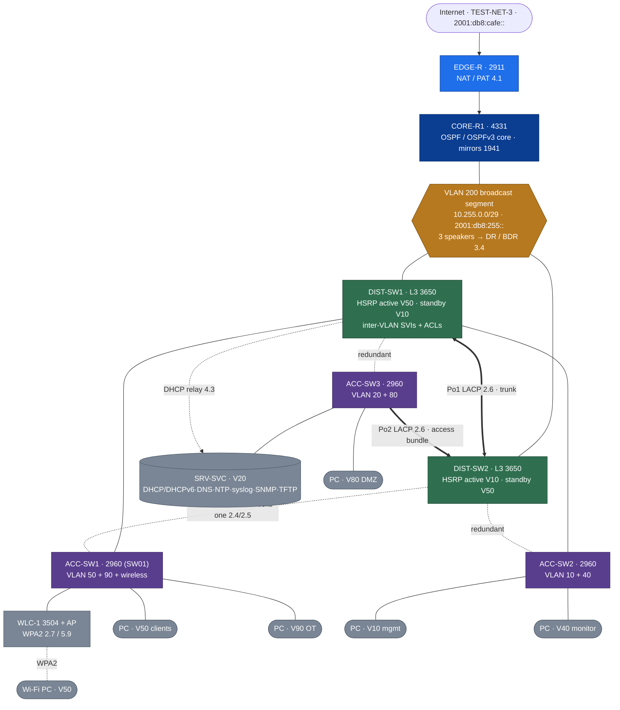

# Packet-Tracer Twin — Build Spec

<!-- provenance -->
> **Lab-02 · Cisco-Core (ACTIVE).** Atlas's physical core is **one 1941 + one 2960X** — enough for trunking, router-on-a-stick, IPv4 ACLs, and a single point-to-point OSPF adjacency, but structurally unable to show anything that needs **3+ devices, a redundant pair, a WLC, or dual-stack depth**. This spec defines a **Packet-Tracer twin**: the same VLAN/addressing plan, *expanded* with the extra gear those objectives require and **dual-stacked (IPv4 + IPv6)** throughout. It is where the reverse-index's remaining **🖥️ build targets** — and the operator's priority breadth topics (**IPv6, ACLs, services, spanning tree, wireless, QoS**) — get demonstrated and turned into Playbooks.

> 🔴 **Simulator status (`ADR-0022`).** The twin is a **teaching + evidence-of-behaviour** artifact, not the estate's source of truth — the **real device beats every doc, and every doc beats the simulator**. A ✅ earned in Packet Tracer is marked **🖥️ (sim-verified)**, distinct from a hardware ✅. Where the real hardware *can* prove something, prefer the hardware (see the [`Hardware-Evidence-Run-Sheet`](./Hardware-Evidence-Run-Sheet-CCNA-Overlay.md)).

## 1. Design — mirror the estate, expand for CCNA, dual-stack throughout

**Decided with the operator (2026-08-05).** The twin keeps Atlas's VLAN/IP plan identical and the spine recognizable, adds only the gear the objectives need, and is **dual-stacked from the start**. IPv6, ACLs, IP services, wireless, deep STP, and QoS are first-class here because the one-router/one-switch hardware can't show them at depth. This is the **v0.3 starting roster — it grows as the `.pkt` is built** — with a **host PC in every segmented VLAN (10·20·40·50·80·90)** so ACLs can be tested on any inter-VLAN flow.

> **EtherChannel vs STP — on different links so they don't cancel out.** `Po1` (DIST-SW1↔DIST-SW2) and `Po2` (ACC-SW3↔DIST-SW2, two bundled links) are the EtherChannel demos; **ACC-SW1/ACC-SW2 keep separate redundant uplinks** so STP still has a port to block (bundling a pair removes the blocked port). CORE-R1 + the DIST pair share **VLAN 200** as one broadcast domain → a real DR/BDR election. **A host sits in every VLAN**, so an ACL on any DIST SVI can permit/deny any east-west flow, proven by match counts.

### 1.1 Device roster (starting set — L3-switch distribution, edge NAT, +wireless)

| Node | PT model | Role | Mirrors | Key objectives it carries |
|---|---|---|---|---|
| **EDGE-R** | 2911 | Internet edge — static default + NAT/PAT; IPv6 default | FGT01/pfSense (collapsed) | 4.1 NAT/PAT · default routing · IPv6 edge |
| **CORE-R1** | 4331 | OSPF / OSPFv3 routed core | 1941 | 3.4 OSPF(v2/v3) · 3.1–3.3 routing · ACLs · QoS |
| **DIST-SW1 / DIST-SW2** | 3650 (L3) | inter-VLAN SVIs (dual-stack) · HSRP pair · OSPFv3 · EtherChannel · DHCP relay · IPv6 ACLs · QoS | MKT01 gateway (redundant) | 3.5 HSRP · 3.4 DR/BDR · 2.6 EtherChannel · 4.3 relay |
| **ACC-SW1 / ACC-SW2 / ACC-SW3** | 2960 | L2 access — trunks · STP/RSTP · port-security · DHCP-snoop/DAI · QoS trust · PoE. **ACC-SW1/2 dual-homed to both DIST (STP blocks one); ACC-SW3 EtherChannel-bundled to DIST-SW2 (`Po2`).** ACC-SW1 = VLAN 50+90 + wireless · ACC-SW2 = VLAN 10+40 · ACC-SW3 = VLAN 20+80 | SW01 (+ 2 added) | 2.1–2.6 · 5.7 · QoS |
| **WLC-1 + AP-1** | 3504 WLC + lightweight AP | WLAN controller + LAP; WPA2/WPA2-Ent SSID on a client VLAN | (the "cheap WLC" — free in PT) | 2.7 WLC/AP · 5.9/5.10 WLAN security |
| **SRV-SVC** | Server | DHCP + DHCPv6 · DNS · NTP · syslog · SNMP · TFTP | DC01 (DHCP) + MON01 (collector) | 4.2–4.5 services · 4.9 TFTP |
| **Host PC per VLAN (10·20·40·50·80·90) + 1 Wi-Fi** | PCs / laptop | a dual-stack host in **every** segmented VLAN so ACLs can be tested on **any** inter-VLAN flow (mirrors the real [east-west flows matrix](../Architecture/Atlas-East-West-Allowed-Flows-Matrix.md)); Wi-Fi client on VLAN 50 | client fleet | **5.6 ACL matrix** · addressing · relay · HSRP · WLAN |

### 1.2 Link + segment plan (what makes each objective demonstrable)

- **OSPF broadcast segment (the one deliberate divergence):** a dedicated transit VLAN 200 (`10.255.0.0/29` · `2001:db8:255::/64`) shared by CORE-R1 + DIST-SW1 + DIST-SW2 as **`broadcast`-type** OSPF/OSPFv3 neighbors → three speakers → real **DR/BDR/DROTHER** election. (Normal P2P core↔dist links elect no DR — this segment is *why* 3.4 works.)
- **HSRP with load-sharing (3.5):** two groups split the active role across the pair — **VLAN 50** DIST-SW1 active / DIST-SW2 standby (vIP `10.50.0.1`), **VLAN 10** DIST-SW2 active / DIST-SW1 standby (vIP `10.10.0.1`). Each distribution switch forwards for one client VLAN; fail either and its VLAN cuts over. IPv6 uses the paired FHRP on the same groups.
- **Spanning tree, deep (2.4/2.5):** **ACC-SW1 & ACC-SW2 keep separate redundant uplinks** to both DIST → Rapid-PVST+ root election (DIST-SW1 root for even VLANs, DIST-SW2 for odd — pairs with the HSRP split), a **blocked port on each**, a TCN, plus edge protections (PortFast + BPDU-guard on access, root-guard on distribution).
- **EtherChannel (2.6) — on its own links so it doesn't erase the STP demo:** `Po1` = DIST-SW1↔DIST-SW2 (LACP); `Po2` = ACC-SW3↔DIST-SW2 (two bundled links, the access-layer EtherChannel). Bundling makes two links one logical port, so STP no longer blocks there — which is exactly *why* ACC-SW1/ACC-SW2 stay un-bundled above. `channel-group` mode + trunk/allowed-VLANs must match on both ends. *(Deep negotiation-mode + mismatch drills live in the separate [STP/EtherChannel sandbox](./Packet-Tracer-STP-EtherChannel-Sandbox-Spec.md).)*
- **DHCP relay (4.3):** VLAN-50 PCs lease from SRV-SVC in VLAN 20 via `ip helper-address`; IPv6 via `ipv6 dhcp relay`.
- **Wireless (2.7):** AP-1 (PoE off ACC-SW1) joins WLC-1; a WPA2 SSID maps to a client VLAN; a Wi-Fi client associates and leases via the same relay path.
- **ACL test fabric (5.6, IPv4 + IPv6):** with a host in **every** VLAN (10/20/40/50/80/90), an ACL on any DIST SVI can permit/deny any east-west flow and be proved with `show access-lists` match counts — the twin becomes a live model of the real [East-West Allowed-Flows-Matrix](../Architecture/Atlas-East-West-Allowed-Flows-Matrix.md).

### 1.3 Dual-stack + publish-safe addressing

- **IPv4:** VLAN subnets/gateways come straight from [`IP-Addressing-Plan-VLSM`](../Architecture/IP-Addressing-Plan-VLSM.md) (unchanged — one home per fact, `POL-0004`); twin-only transits use the `10.255.255.x/30` style, the OSPF segment `10.255.0.0/29`.
- **IPv6 (new — a first-class dimension):** dual-stack every VLAN from the **documentation prefix `2001:db8:<vlan>::/64`** (RFC 3849, reserved for docs — safe to publish), with **SLAAC + stateless/stateful DHCPv6**, **EUI-64**, **OSPFv3**, and **IPv6 traffic-filter ACLs**. This is where the CCNA IPv6 objectives the hardware overlay marks 📘 get built.
- **Edge:** EDGE-R outside = `203.0.113.2/30` (TEST-NET-3) + `2001:db8:cafe::/64` — documentation ranges, so nothing publish-sensitive rides in the `.pkt`.

> **Roles, not secrets (`ADR-0022`).** Every node is labelled by role; no real management IP, location-bearing hostname, or credential goes in the `.pkt`. The twin is 🖥️ evidence-of-behaviour, never a source of truth.

## 2. Objective coverage — what the twin demonstrates

Grouped by theme. Multi-device rows are the original 🖥️ gap-fillers; the breadth rows (IPv6, ACLs, services, wireless, QoS) are the operator's priority topics the single-purpose hardware overlay can't reach.

### Multi-device routing & switching
| Objective | Reverse-index home | Twin demonstrates | Becomes |
|---|---|---|---|
| **3.4** OSPF network types, **DR/BDR** | [`Vol1 Ch21`](../../../Atlas-Academy/Certification/CCNA/Vol1/Ch21-OSPF-Network-Types-and-Neighbors.md) | 3 speakers on VLAN 200; priority/router-id election; `show ip ospf neighbor` DR/BDR/DROTHER | 🖥️ + a **DR/BDR-election** drill |
| **3.5** first-hop redundancy (**HSRP**) | [`Vol2 Ch16`](../../../Atlas-Academy/Certification/CCNA/Vol2/Ch16-First-Hop-Redundancy-Protocols.md) | active/standby vIP; fail active → failover; `show standby brief` | 🖥️ + an **HSRP-failover** drill |
| **2.4/2.5** STP / RSTP, root, blocked port, TCN | [`Vol1 Ch09`](../../../Atlas-Academy/Certification/CCNA/Vol1/Ch09-Spanning-Tree-Protocol-Concepts.md) | RPVST+ root election, blocked port, PortFast/BPDU-guard/root-guard; `show spanning-tree` | 🖥️ + a **root-election / TCN** drill |
| **2.6** EtherChannel (LACP/PAgP) | [`Vol1 Ch10`](../../../Atlas-Academy/Certification/CCNA/Vol1/Ch10-RSTP-and-EtherChannel-Configuration.md) | `Po1` DIST↔DIST + `Po2` ACC-SW3↔DIST-SW2; `show etherchannel summary`. Mode/mismatch drills → the [L2 sandbox](./Packet-Tracer-STP-EtherChannel-Sandbox-Spec.md) | 🖥️ sim-verified |

### IPv6 & routing (a priority — 📘 build gap on hardware)
| Objective | Reverse-index home | Twin demonstrates | Becomes |
|---|---|---|---|
| **1.8/1.9** IPv6 addressing, SLAAC, EUI-64, DHCPv6 | 📘 *no sub-page yet — the twin seeds it* | dual-stack VLANs; SLAAC vs stateful DHCPv6; `show ipv6 interface` | 🖥️ + an **IPv6-addressing** Playbook + a new cert sub-page |
| **3.x** OSPFv3 | [`Vol1 Ch19–21`](../../../Atlas-Academy/Certification/CCNA/Vol1/Ch19-Understanding-OSPF-Concepts.md) | OSPFv3 over the same topology; `show ipv6 ospf neighbor` | 🖥️ sim-verified |

### ACLs (a priority — v4 depth + v6, which hardware can't)
| Objective | Reverse-index home | Twin demonstrates | Becomes |
|---|---|---|---|
| **5.6** IPv4 standard/extended/named ACLs | [`Vol2 Ch06`](../../../Atlas-Academy/Certification/CCNA/Vol2/Ch06-Basic-IPv4-Access-Control-Lists.md) · [`Ch07`](../../../Atlas-Academy/Certification/CCNA/Vol2/Ch07-Named-and-Extended-IP-ACLs.md) · [`Ch08`](../../../Atlas-Academy/Certification/CCNA/Vol2/Ch08-Applied-IP-ACLs.md) | extend the overlay's ACL work — placement matrix, match-count reads across VLANs | 🖥️ + an **ACL build/verify** drill |
| **IPv6 ACLs** (traffic-filter) | 📘 *twin seeds it* | `ipv6 access-list` + `traffic-filter`; `show ipv6 access-list` match counts | 🖥️ + folds into the IPv6 sub-page |

### IP services (a priority)
| Objective | Reverse-index home | Twin demonstrates | Becomes |
|---|---|---|---|
| **4.3** DHCP + DHCPv6 + relay | [`Vol1 Ch17`](../../../Atlas-Academy/Certification/CCNA/Vol1/Ch17-IP-Routing-in-the-LAN.md) | `ip helper-address` / `ipv6 dhcp relay`; cross-VLAN lease | 🖥️ + a **DHCP-relay trace** drill |
| **4.2 NTP · 4.4 SNMP · 4.5 syslog · DNS · TFTP** | [`Vol2 Ch13`](../../../Atlas-Academy/Certification/CCNA/Vol2/Ch13-Device-Management-Protocols.md) · [`Ch17`](../../../Atlas-Academy/Certification/CCNA/Vol2/Ch17-SNMP.md) | SRV-SVC as NTP/syslog/SNMP/TFTP/DNS; `show ntp assoc` · `show logging` · `show snmp` | 🖥️ sim-verified + service drills |

### Wireless (a priority — the WLC is free in PT)
| Objective | Reverse-index home | Twin demonstrates | Becomes |
|---|---|---|---|
| **2.7** WLC/AP architecture · **5.9/5.10** WLAN security | [`Vol2 Ch02`](../../../Atlas-Academy/Certification/CCNA/Vol2/Ch02-Analyzing-Cisco-Wireless-Architectures.md) · [`Ch04`](../../../Atlas-Academy/Certification/CCNA/Vol2/Ch04-Building-a-Wireless-LAN.md) | WLC-1 + LAP; a WPA2/WPA2-Ent SSID → client VLAN; a Wi-Fi client associates + leases | 🖥️ + a **build-a-WLAN** drill |

### QoS (a priority)
| Objective | Reverse-index home | Twin demonstrates | Becomes |
|---|---|---|---|
| **4.7** QoS — classification, marking, trust, queuing | [`Vol2 Ch15`](../../../Atlas-Academy/Certification/CCNA/Vol2/Ch15-Quality-of-Service.md) | trust boundary at the access edge; DSCP marking; `show mls qos` / policy-map counters | 🖥️ sim-verified + a QoS drill |

> Building the twin flips these rows from planned to demonstrated, and **seeds the two missing cert sub-pages** (IPv6, IPv6 ACLs) the reverse-index currently flags 📘.

## 3. What it does *not* need to do

- **The real firewall / identity / monitoring estate** — FGT01/pfSense/AD/NPS/NetBox live on the real devices; the twin is core routing+switching + IPv6 + ACLs + services + wireless + QoS only. (EDGE-R is a *routing/NAT* stand-in, not the real next-gen firewall.)
- **Be a source of truth** — the twin never feeds NetBox or overrides a device fact (`ADR-0022`). It contributes **behaviour screenshots + Playbooks**, nothing authoritative about the real estate.
- **Carry anything publish-sensitive** — documentation IP ranges only (TEST-NET-3 v4, `2001:db8` v6), roles not real management IPs, no credentials.

## 4. Deliverables when the twin is built

- [ ] The `.pkt` committed under `Labs/Lab-02-Cisco-Core/Packet-Tracer/` with a short README (topology diagram, node roles, dual-stack address table pointing at the IP plan).
- [ ] Each §2 objective captured (screenshot + the `show` read-back) and its reverse-index row flipped to **🖥️ sim-verified** with the capture cited; the **IPv6 / IPv6-ACL** rows that have no sub-page yet **seed** those cert pages.
- [ ] Drill Playbooks seeded in the `ADR-0053` §5 mold: DR/BDR election · HSRP failover · STP root/TCN · EtherChannel bundle · DHCP-relay trace · IPv6-addressing · ACL build/verify · build-a-WLAN · QoS trust/mark.
- [ ] `SESSION-HANDOFF` + backlog updated; `Directory-Map` lists the new `Packet-Tracer/` subfolder.
- [ ] **Roster grows as built** — update §1.1/§1.2 as devices/links are added (operator, 2026-08-05).

## Related

- Reverse-index homes: [`Vol1 Ch09`](../../../Atlas-Academy/Certification/CCNA/Vol1/Ch09-Spanning-Tree-Protocol-Concepts.md) · [`Ch10`](../../../Atlas-Academy/Certification/CCNA/Vol1/Ch10-RSTP-and-EtherChannel-Configuration.md) · [`Ch19–21 OSPF`](../../../Atlas-Academy/Certification/CCNA/Vol1/Ch21-OSPF-Network-Types-and-Neighbors.md) · [`Vol2 Ch06–08 ACLs`](../../../Atlas-Academy/Certification/CCNA/Vol2/Ch06-Basic-IPv4-Access-Control-Lists.md) · [`Ch13 services`](../../../Atlas-Academy/Certification/CCNA/Vol2/Ch13-Device-Management-Protocols.md) · [`Ch15 QoS`](../../../Atlas-Academy/Certification/CCNA/Vol2/Ch15-Quality-of-Service.md) · [`Ch16 HSRP`](../../../Atlas-Academy/Certification/CCNA/Vol2/Ch16-First-Hop-Redundancy-Protocols.md) · [`Ch02/Ch04 wireless`](../../../Atlas-Academy/Certification/CCNA/Vol2/Ch04-Building-a-Wireless-LAN.md).
- Facts to twin: [`IP-Addressing-Plan-VLSM`](../Architecture/IP-Addressing-Plan-VLSM.md) · [`Cabling-and-Port-Map`](../Architecture/Cabling-and-Port-Map.md) · commands: [`Cisco-IOS`](../../../Atlas-Academy/Command-Library/Cisco-IOS.md).
- Sibling tracks: [`Hardware-Evidence-Run-Sheet-CCNA-Overlay`](./Hardware-Evidence-Run-Sheet-CCNA-Overlay.md) · session brief `Session-35-...-Prompt`.
- Governance: `ADR-0022` (frozen-lab / simulator precedence) · `ADR-0053` (Academy + Playbook standard).

## Change Log
| Version | Date | Change |
|---|---|---|
| 0.4 | 2026-08-05 | Made the **EtherChannel vs STP link split** explicit so they don't cancel out: `Po1` (DIST↔DIST) + `Po2` (ACC-SW3↔DIST-SW2) are the bundles; ACC-SW1/ACC-SW2 keep separate redundant uplinks for STP to block. Updated the Mermaid, §1.1/§1.2, §2. Spun off a separate **L2 STP/EtherChannel sandbox** ([spec](./Packet-Tracer-STP-EtherChannel-Sandbox-Spec.md)) for the negotiation-mode + mismatch drills. |
| 0.3 | 2026-08-05 | Embedded an inline **Mermaid topology** in §1 (renders on GitHub). Grew to **three access switches** (each dual-homed → richer STP), **HSRP load-sharing** (V50 active on DIST-SW1, V10 on DIST-SW2), and a **host PC in every segmented VLAN (10/20/40/50/80/90)** so ACLs test on any inter-VLAN flow (mirrors the East-West Allowed-Flows-Matrix). Companion PT-canvas layout delivered as an artifact. |
| 0.2 | 2026-08-05 | **Device roster + link plan decided with the operator** (L3-switch distribution, edge NAT, minimal-complete + wireless). Added §1.1 roster, §1.2 link/segment plan (the deliberate OSPF broadcast segment for DR/BDR), §1.3 dual-stack + publish-safe addressing (IPv6 `2001:db8:<vlan>::/64`, TEST-NET-3 edge). Broadened §2 from the 5 multi-device rows to the operator's priority breadth: **IPv6/OSPFv3, IPv4+IPv6 ACLs, IP services (NTP/SNMP/syslog/DNS/TFTP), wireless (WLC+AP), QoS, deep STP**. Marked the twin as the seed for the missing IPv6 / IPv6-ACL cert sub-pages. Roster grows as the `.pkt` is built. |
| 0.1 | 2026-08-05 | Created (#44 → expansion phase). Spec for the Packet-Tracer expanded twin: same VLAN/IP plan + the extra routers/switches the multi-device objectives need. Objective-coverage table (DR/BDR 3.4, HSRP 3.5, STP/RSTP 2.4/2.5, EtherChannel 2.6, DHCP relay 4.3) mapped to the 🖥️ reverse-index rows they close and the drill Playbooks they seed. Simulator precedence per `ADR-0022` — sim-verified (🖥️) is distinct from a hardware ✅. |
