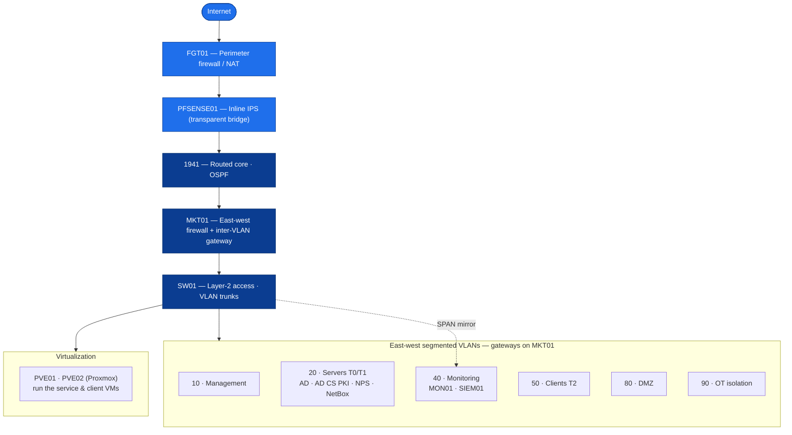

# Atlas Engineering Repository

**Atlas is a self-built, ~150-person enterprise IT environment** — real cross-vendor network gear, Windows/AD infrastructure, virtualization, and PKI — documented and version-controlled the way a working engineering team documents production systems.

## Atlas at a glance


<details>
<summary>Architecture diagram — Mermaid source (click to expand)</summary>



</details>

*A layered north-south security chain into an east-west-segmented enterprise, virtualized on two hypervisors. Every box is a real, documented device — browse them all in [`INDEX.md`](INDEX.md).*

> 🧭 **This is the front door — and the engineer's index to the whole repository:** what Atlas is, and where every part lives (use the "start here by what you need" table below).
>
> 👔 **Recruiter or hiring manager?** Start with the highlights-first showcase → **[`PORTFOLIO.md`](PORTFOLIO.md)**. Want the live build state? → the [Lab-02 handoff](Labs/Lab-02-Cisco-Core/SESSION-HANDOFF.md). Unfamiliar term? → **[`GLOSSARY.md`](GLOSSARY.md)**.
>
> 📂 **Want the full folder-by-folder directory?** → **[`INDEX.md`](INDEX.md)** describes what's in every folder. (Tip: on GitHub you can **click any folder or file name to open and read it** — nothing needs downloading.)

> ⚠️ **This is a personal learning & portfolio project.** *Atlas Industrial* is a fictional ~150-person company, invented to give the lab realistic enterprise requirements — it is **not** a real business, and nothing here represents a real organization's systems, data, or security posture. The environment is built and run by one person on personal hardware for skills development and to demonstrate engineering practice. All IP addresses, hostnames, and configurations are lab values. Licensed under [CC BY 4.0](LICENSE); third-party product names and trademarks belong to their respective owners. Certification objectives referenced here are **paraphrased from the public exam blueprints** (e.g. the Cisco CCNA 200-301 blueprint); **no copyrighted study-guide text is reproduced** (Charter Rule 16).

## Source of truth — one home per fact

Atlas runs on a strict **source-of-truth discipline**: every fact has exactly **one authoritative home**, and everything else *links* to it rather than restating it (`POL-0004` / `POL-0008`). Two artifacts anchor it:

- 📍 **[`Atlas-Source-of-Truth`](00-Atlas-Foundation/Governance/Atlas-Source-of-Truth.md) — the router.** "You're doing something in Atlas and need the *one doc that governs it* — here it is." It **points, it never copies**; if a link and its target disagree, **the target wins**. Paired with [`Atlas-Workflow`](00-Atlas-Foundation/Governance/Atlas-Workflow.md) (how work gets done and verified).
- 🗄️ **[NetBox](Labs/Lab-02-Cisco-Core/Devices/NETBOX01-Source-of-Truth/) — the infrastructure source of truth (IPAM/DCIM).** The authoritative inventory of devices, IPs, and VLANs, loaded from **device-verified** captures via the [`SoT-Evidence-Run-Sheet`](Labs/Lab-02-Cisco-Core/Operations/SoT-Evidence-Run-Sheet.md).

**Why it matters:** two homes for one fact is treated as a **defect**, not redundancy — nearly every recurring documentation bug is a source-of-truth failure. And facts are settled by **evidence**: the **device beats every doc** (`POL-0001`), and a doc is authoritative only where it is the designated owner.

## Start here — by what you need

| I want to… | Go to |
|---|---|
| **See the highlights** (reviewer/employer view) | [`PORTFOLIO.md`](PORTFOLIO.md) |
| **Know where the build is right now** | [`Labs/Lab-02-Cisco-Core/SESSION-HANDOFF.md`](Labs/Lab-02-Cisco-Core/SESSION-HANDOFF.md) — the single "where we are" owner |
| **Find the rule / decision that governs your situation** | [`00-Atlas-Foundation/README.md`](00-Atlas-Foundation/README.md) — the Foundation front door: **pick your situation or role** → the governing doc (Charter, `POL-####`, `STD-####`, `ADR-####`) |
| **Find the one authoritative home for a fact** (where does X live?) | [`Atlas-Source-of-Truth`](00-Atlas-Foundation/Governance/Atlas-Source-of-Truth.md) — the source-of-truth router (points, never restates) |
| **See what's being built and in what order** | [`00-Atlas-Foundation/Roadmap/Atlas-Roadmap.md`](00-Atlas-Foundation/Roadmap/Atlas-Roadmap.md) (phases) + [`Labs/Lab-02-Cisco-Core/Architecture/Master-Build-Order.md`](Labs/Lab-02-Cisco-Core/Architecture/Master-Build-Order.md) (the active build order) |
| **Build it — the sequenced, decision-free bench list** | [`Labs/Lab-02-Cisco-Core/Master-Implementation-Checklist.md`](Labs/Lab-02-Cisco-Core/Master-Implementation-Checklist.md) |
| **Build or verify a specific device** | [`Labs/Lab-02-Cisco-Core/Devices/`](Labs/Lab-02-Cisco-Core/Devices/) — each device's Build-Guide / Build-Checklist / `Diagnostics.md`; hardening baselines in [`…/Architecture/`](Labs/Lab-02-Cisco-Core/Architecture/) (`CIS-Hardening-*`) |
| **Plan the service servers** | [`Labs/Lab-02-Cisco-Core/Service-Server-Build-Plan.md`](Labs/Lab-02-Cisco-Core/Service-Server-Build-Plan.md) |
| **Follow the active lab's execution log** | [`Labs/Lab-02-Cisco-Core/Build-Progress-Tracker.md`](Labs/Lab-02-Cisco-Core/Build-Progress-Tracker.md) |
| **Understand *why* something works** (concepts) | [`Atlas-Academy/Concepts/`](Atlas-Academy/Concepts/) |
| **Know *how to verify* a device/service** (commands) | [`Atlas-Academy/Command-Library/`](Atlas-Academy/Command-Library/) + each device's `Diagnostics.md` |
| **Fix or operate something** (it's broken / how do I run it?) | [`Atlas-Academy/Playbooks/`](Atlas-Academy/Playbooks/) — problem-named, ticket-ready scenario docs |
| **Browse the whole repository** (every folder, described) | [`INDEX.md`](INDEX.md) |
| **Decode an acronym or Atlas term** | [`GLOSSARY.md`](GLOSSARY.md) |

## Repository map

| Path | What's in it |
|---|---|
| **`00-Atlas-Foundation/`** | Everything that spans labs: the Charter, the Policy → Standard → ADR hierarchy, governance & security programs, the Roadmap, and the templates. Start at its [`README.md`](00-Atlas-Foundation/README.md). |
| **`Labs/Lab-01-Mikrotik-Core/`** | 🔒 **Frozen** (`ADR-0022`, at `a03458f`). The first lab — network core, PVE01 hypervisor, Pi01 services. Historical; not current guidance where it disagrees with an active doc. |
| **`Labs/Lab-02-Cisco-Core/`** | 🟢 **Active.** The current build — networking, Windows/AD, AD CS PKI, virtualization, device hardening, east-west segmentation. Device docs, build guides/records, `Diagnostics.md`/`Troubleshooting.md`, the tracker, and the handoff live here. |
| **`Atlas-Academy/`** | The estate's **learning layer** (adopted — `ADR-0053`): `Concepts/` (*why* it works), the `Command-Library/` (*how* to verify), `Playbooks/` (*what to do* when it breaks), the certification maps, and the house style. Start at its [`README.md`](Atlas-Academy/README.md) / [`Academy-Vision-and-Scope.md`](Atlas-Academy/Academy-Vision-and-Scope.md). |
| **`99-Archive/`** | Retired material. **Never** current guidance. |
| **`tools/`** | Git and publishing scripts. |

## Plans & build guides (the build surface)

- **The plan, three levels:** [`Atlas-Roadmap`](00-Atlas-Foundation/Roadmap/Atlas-Roadmap.md) (phases) → [`Master-Build-Order`](Labs/Lab-02-Cisco-Core/Architecture/Master-Build-Order.md) (the active order) → [`Master-Implementation-Checklist`](Labs/Lab-02-Cisco-Core/Master-Implementation-Checklist.md) (the sequenced, decision-free bench list). The service tier is planned per host in [`Service-Server-Build-Plan`](Labs/Lab-02-Cisco-Core/Service-Server-Build-Plan.md).
- **Device configs & build guides:** [`Labs/Lab-02-Cisco-Core/Devices/`](Labs/Lab-02-Cisco-Core/Devices/) — each device has a **Build-Guide / Build-Checklist** (how to build it), a **`Diagnostics.md`** (show/verify commands), and a **`Troubleshooting.md`**. Hardening baselines are `CIS-Hardening-*` in [`…/Architecture/`](Labs/Lab-02-Cisco-Core/Architecture/).
- **Decisions:** [`ADR-Index`](00-Atlas-Foundation/Decisions/ADR-Index.md) — every architecture decision (`ADR-####`), by scope + status.
- **Source of truth:** the [`SoT-Evidence-Run-Sheet`](Labs/Lab-02-Cisco-Core/Operations/SoT-Evidence-Run-Sheet.md) (capture commands) feeds [`NetBox-Data-Load-Prep`](Labs/Lab-02-Cisco-Core/Devices/NETBOX01-Source-of-Truth/NetBox-Data-Load-Prep.md) → NetBox (IPAM/DCIM).

## Conventions (so every doc reads the same way)

- **Evidence over intent (`POL-0001`):** a checked box needs the **command and its output**, read from the *runtime* view — never the config file. If you can't paste the output, it stays unchecked.
- **One home per fact (`POL-0008`):** every fact has a single authoritative owner; other docs link to it, they don't restate it. (See `ADR-0034` for how a frozen doc becomes a pointer.)
- **Status markers (`ADR-0032`):** ✅ device-verified · 🟡 operator-reported / lab-unverified · ⏳ in build · 📋 planned. Nothing is ✅ without a read-back.
- **IDs:** `POL-####` policies · `STD-####` standards · `ADR-####` architecture decisions (indexed in [`00-Atlas-Foundation/Decisions/ADR-Index.md`](00-Atlas-Foundation/Decisions/ADR-Index.md)) · `CM-####`/`MC-####` change records.

## The front-door hierarchy (which "start here" is which)

Atlas has a few entry points on purpose — each has one job:

- **This root `README.md`** — the **repo front door** (you are here): what Atlas is + where to go.
- **[`PORTFOLIO.md`](PORTFOLIO.md)** — the **reviewer/hiring-manager showcase**: highlights + real diagnostic work, evidence-linked.
- **[`00-Atlas-Foundation/README.md`](00-Atlas-Foundation/README.md)** — the **Foundation section index** (the process/governance docs).
- **[`Atlas-Blueprint.md`](Atlas-Blueprint.md)** — a **historical planning snapshot** (~2026-07-13). Not the front door and not the current plan — kept for its session-sequencing reasoning.

## Repository status

- **Lab-01 (Network core):** 🔒 frozen (`ADR-0022`).
- **Lab-02 (Cisco-Core):** 🟢 active — networking + Pass-1 hardening done; DC01 promoted (`atlas.lab`); AD CS in build. The docs reconciliation, the learnability layer, and the full **planning package** (implementation checklist, service-server plan, compute topology `ADR-0036`, no-UTM `ADR-0035`, per-device `Diagnostics.md`) are current. The live state is always in the [handoff](Labs/Lab-02-Cisco-Core/SESSION-HANDOFF.md).

## Working rules (short version)

1. Work one pack at a time; write/update one page; verify against live config or captured evidence; save it in its permanent home.
2. Don't redesign Atlas mid-execution — record the idea, defer it (`ADR-0001`).
3. The Markdown here is the working source; Confluence is the published human-facing copy.

## Git quick start

From PowerShell in the repository root:

```powershell
# one-time setup
.\tools\scripts\Initialize-Atlas-Git.ps1   # if present; otherwise a normal git clone works

# commit completed, verified work (scope the message to the pack)
git add <the specific files you changed>
git commit -m "Lab-02: <what changed>"
git push
```

> New to the repo? Read [`00-Atlas-Foundation/Contributing-Adding-Docs.md`](00-Atlas-Foundation/Documentation/Contributing-Adding-Docs.md) before creating or moving a file — it's authoritative for *where a doc goes*.
